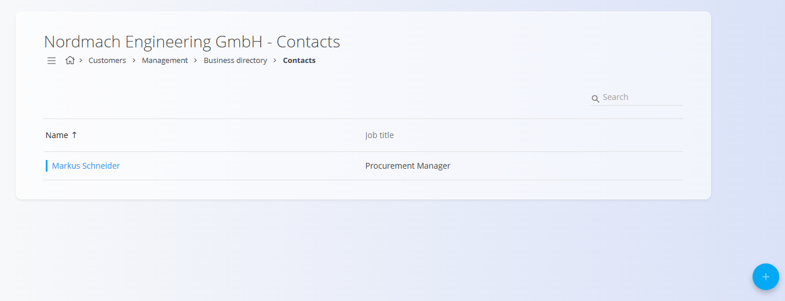

# Contacts

Contacts belong to a specific **customer** or **vendor** and are managed inside the [**Business directory**](BusinessDirectory.md). They store the people associated with the company — such as account managers, procurement contacts, technicians, or billing representatives.

Each contact includes a **Job title**, selected from the predefined [**Job titles**](JobTitles.md) code list.

### Accessing contacts

Contacts appear as a tag inside each Business directory entry:

 

## Schema

| Field | Description |
|-------|-------------|
| **First name** | Contact’s given name (mandatory). |
| **Last name** | Contact’s family name (mandatory). |
| **Job title** | Role or position, selected from the [**Job titles**](JobTitles.md) code list. |
| **E-mail** | Primary email address. |
| **Phone** | Landline or office number. |
| **Mobile phone** | Mobile or direct number. |
| **Fax** | Optional fax number. |
| **Tags** | Classification tags used to group or filter contacts. |
| **Active** | Indicates whether the contact can be selected in documents. |

## List view

The Contacts list displays all contacts linked to the selected Business directory entry.

Use the filters on the left (**Enabled / Disabled**) to show only active or inactive contacts.

## Creating a new contact

To add a new contact, click on the [**action button**](../UI/ActionButton.md) in the bottom-right corner.

Fill in the following fields:

- **First name**  
- **Last name**  
- **Job title** — selected from [**Job titles**](JobTitles.md)  
- **E-mail**  
- **Phone** / **Mobile phone** / **Fax** (optional)  
- **Tags** (optional)  
- **Active**

Click **Add** to save the new contact.

## Editing an existing contact

1. Open the Business directory entry.  
2. Click the **Contacts** tag.  
3. Select a contact from the list.  
4. Update any field (name, email, phone, job title, tags, etc.).  
5. Click **Save**.

## Deletion

A contact can be deleted in the Edit page, but only if it is not referenced in other documents.

> [!NOTE]  
> Deleting a contact does **not** delete the Business directory entry it belongs to.
