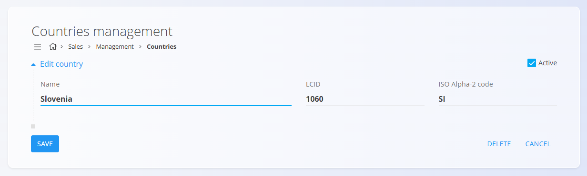

# Countries

Countries represent the basic political and geographical units used in many of the system's 
digital content. They are a fundamental reference in business, as they are linked to partners, 
addresses, deliveries, postal codes and many other entities. Each country has its own unique 
identification, which allows for uniform and unambiguous use.

To access **Countries** go to **Sales/Management/Countries**.

## Guide

| Field | Description 
|:-------|:------|
| **Name** | Country name. For example, Slovenia or **Austria**. |
| **LCID** | Localization identifier used to set the language and regional specifics of the country. |
| **ISO Alpha-2 code** | International standard country code. For example, **SI** for Slovenia or **AT** for Austria. |
| **Active** | Indicates whether the country is active. Inactive countries cannot be used for new entries, but they remain visible in the history. |

## Management

### List of countries
 
The user interface contains a list of countries. If no record exists yet, the list is empty. 
Each country has a status in the form of a color to the left of the country name, blue means the country is active and gray means it is inactive.

Countries can be searched using the search bar on top of the page.
To access and edit a particular country, click on the country name.

The **Postal codes** button is displayed under the country name. Click the button, to manage
[Postal codes](\PostalCodes.md) linked to the relevant country.

## Actions

Click on the [**Action Button**](..) to carry out one of these actions:

### Import

Use the **Import** action to upload or update a list of countries from an existing CSV file. 
In this way, the system enables a mass data import.

### New

Click on **New** to manually add a new country. An input screen, where you can fill in the appropriate [fields](#guide) for the new country.

Once you have entered the information, click **ADD** to create the new country and
return to the list of countries. Click **CANCEL** to return to the list without saving the data.

## Editing a country

To edit a country, click on its name in the list. An input mask opens with the data already filled in.

After changing the fields, click **SAVE** to update the data and return to the list. 
Click **CANCEL** to return to the list without saving the data.

## Deleting a country

You can delete a country only if it does not appear in any dependent record. 
To delete a country, you first enter edit mode. In edit mode, click **DELETE**. A confirmation window opens with the message *Are you sure you want to delete the record?*.

- Click **YES** to permanently delete the country and remove it from the list.
- Click **NO** to return to edit mode. The country remains in the system.

## Edit Postal Codes

Below the country name, you'll see the **Postal codes** button.

Click on the button to manage the postal codes tied to the selected country.

