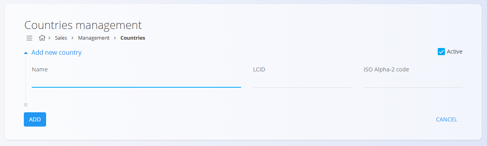

# Countries

Represents the Code List of countries used across the digital contents of the system.  
Each country defines localization parameters, such as the LCID and ISO code, which ensure correct language, regional settings, and compliance with international standards.

---

## Schema

The Code List has the following schema:

| Field | Description |
|-------|--------------|
| **Name** | Country name. For example, Slovenia or **Austria**. |
| **LCID** | Localization identifier used to set the language and regional specifics of the country. |
| **ISO Alpha-2 code** | International standard country code. For example, **SI** for Slovenia or **AT** for Austria. |
| **Active** | Indicates whether the country is active. Inactive countries cannot be used for new entries, but they remain visible in the history. |

---

## Management

To access the **Countries** Code List, go to **Sales/Management/Countries** in the [navigation](../../Common/UI/Sitemap.md).

### List of Countries

The user interface contains a list of countries.  
If no record exists yet, the list is empty.  
Each country has a status in the form of a color to the left of the country name — **blue** means the country is active, and **gray** means it is inactive.

Each record includes a tag labeled **Postal Codes**, which represents the related Code List of postal codes for that country.  
Clicking the tag opens the interface for managing [Postal Codes](PostalCode.md) linked to the selected country.

On the right side of the list, the **LCID** value represents the localization identifier assigned to each country.

---

## Actions

Click on the [action button](../../Common/UI/ActionButton.md) to display the following actions:

- Import  
- New  

### Import

The **Import** action allows bulk creation or updating of country entries.  
Prepare a `CSV` file containing the required data and upload it.  
The system automatically creates new records or updates existing ones based on the file contents.

### New

Click **New** to open the input form for adding a new country.  

Fill in the required fields such as **Name**, **LCID**, and **ISO Alpha-2 code**.  
Click **Add** to create the record or **Cancel** to return to the list view without saving.

---

## Editing

To edit an existing country, click the country’s **Name** in the list.  
The interface switches to edit mode, displaying the existing values for modification.  
Click **Save** to confirm changes or **Cancel** to discard them.

---

## Deletion

A country can be deleted only if it is not referenced by dependent records (for example, addresses or documents).  
Click **Delete** to open a confirmation dialog:  
**Are you sure you want to delete this record?**  
If confirmed, the record is permanently removed.  
If not confirmed, the interface remains in edit mode without any changes.

---

## Editing Postal Codes

Under each country name, the tag **Postal Codes** is displayed.  
Clicking this tag opens the interface for managing [Postal Codes](PostalCode.md) related to the selected country.

