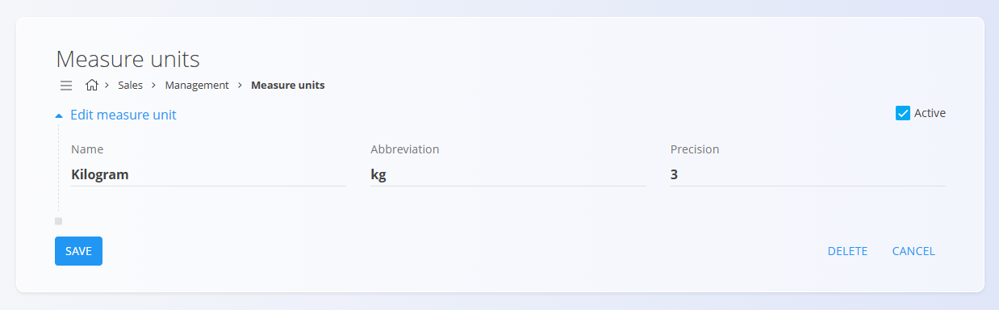

# Measure units

Measure units are how you count or measure items (for example: piece, kilogram, meter, liter). They make quantities consistent across documents, stock, and calculations and control rounding/formatting (e.g., 2 pcs, 1.75 kg, 3.000 m).

Examples:
- Finished products: Chairs in pieces (pcs), no decimals
- Raw materials: Paint in liters with 2 decimals (e.g., 1.25 L)
- Components: Cable in meters with 3 decimals (e.g., 12.375 m)

> [!TIP]
> For a full demonstration, see the **[Measure units](https://www.youtube.com/watch?v=8swl8Vex6y4)** video tutorial.

## Schema

| Field | Description |
|-------|-------------|
| **Name** | Name of the measure unit used in lists and documents. For example **Kilogram** or **Meter** (mandatory). |
| **Abbreviation** | Short form of the measure unit displayed throughout the system. For example **kg** or **m** (mandatory). |
| **Precision** | Default number of decimal places used for values in this measure unit. For example **3** for **1.255**, or **1** for **2.5**. |
| **Active** | Indicates whether the measure unit is available for use in new documents. Inactive units cannot be selected in new entries, but remain visible in history. |

## Management

You can access the **Measure units** code list from different domains in the [navigation](../UI/Navigation.md). In all cases you are working with the same shared data.

To open the list, go to the **Management** section of the following domains:

- **Assets**
- **Logistics**
- **Maintenance**
- **Productions**
- **Sales**
- **Supply**

### List of measure units

The user interface contains a list of measure units. If no record exists yet, the list is empty.

Each record includes a status indicator to the left of its name:
- **Blue** indicates the measure unit is active
- **Gray** indicates the measure unit is inactive

The list displays each measure unit's name, abbreviation, and precision.

## Actions

Click on the [**action button**](../UI/ActionButton.md) to add a new measure unit.

The form includes the following fields:
- **Name**
- **Abbreviation**
- **Precision**
- **Active**

After entering the required information, click **Add** to save the measure unit or **Cancel** to return to the list view.

## Editing

To edit an existing measure unit, click the unit's **Name** in the list. The interface switches to edit mode, displaying the existing values for modification. 

Click **Save** to confirm changes or **Cancel** to discard them.

## Deletion

Click **Delete** on the edit screen to open a confirmation dialog: 

**Are you sure you want to delete this record?**  

If confirmed, the entry is permanently removed; otherwise, the system keeps the record unchanged.

> [!NOTE]
>A **measure unit** can be deleted only if it is not used in any dependent records, such as materials or stock transactions.

---
