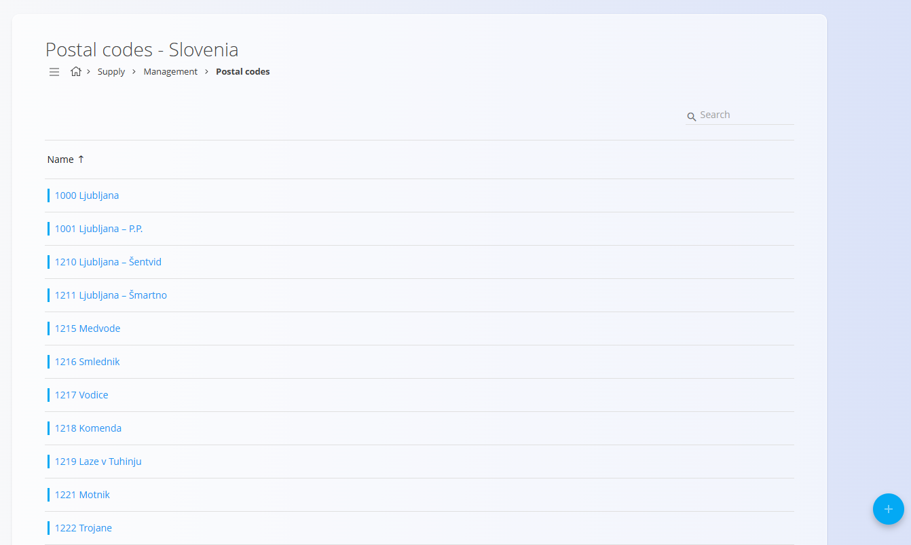
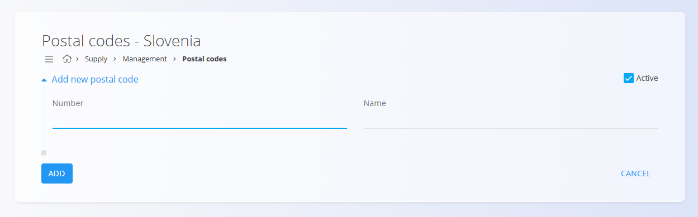

# Postal codes

Postal codes belong to a specific **country** and are managed inside the [**Countries**](Countries.md) code list. They define the available postal areas used when entering addresses in the Business directory or logistics documents.

## Accessing postal codes

Postal codes appear as a tag inside each Country entry:

## Schema

| Field | Description |
|-------|-------------|
| **Number** | The postal code value (e.g., 1000). |
| **Name** | The corresponding city, town, or postal area name. |
| **Active** | Indicates whether the postal code is available for selection in addresses. |

## List view

The Postal codes list displays all codes defined for the selected country.

Use the **Enabled / Disabled** filters on the left to show active or inactive postal codes.

## Creating a new postal code

To add a new postal code, click on the [**action button**](../UI/ActionButton.md) in the bottom-right corner and choose **New**.

Fill in the following fields:

- **Number** – The postal code  
- **Name** – The corresponding city or area  
- **Active** – Determines whether the code can be used  

Click **Add** to save the new postal code.

## Importing postal codes

The action button also includes an **Import** option, allowing bulk upload of postal codes from a CSV file.  This is useful when setting up a new country with many postal code entries.

## Editing an existing postal code

1. Open the Country entry.  
2. Click the **Postal codes** tag.  
3. Select a postal code from the list.  
4. Update the Number, Name, or Active status.  
5. Click **Save**.

## Deletion

Postal codes can be deleted from the Edit page, but only if they are not referenced in other records (such as customer or vendor addresses).

> [!NOTE]  
> Deleting a postal code does **not** delete the associated Country entry.
