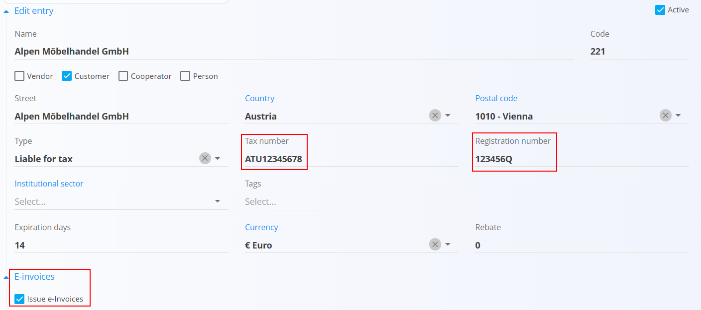
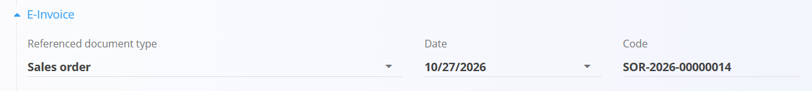
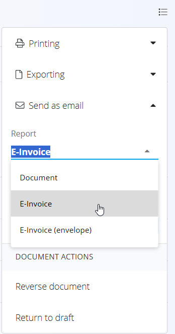

<!-- app_route: /management/contacts/companies -->
<!-- app_label: Business directory -->
<!-- canonical_source_url: https://tom-pit.github.io/Connected.Docs/en/Common/Concepts/E-Invoices/ -->
<!-- canonical_source_title: E-invoices -->

# E-invoices

An **e-invoice** is a structured electronic version of an invoice that the customer's system can process automatically. In Connected, e-invoices are generated in the Slovenian **eSLOG** XML format and can be exported from the document menu of a published document.

E-invoices are generated by the Tom PIT e-invoice service, not by the application itself. The service must be set up for your organization before e-invoices can be exported.

## Supported documents

E-invoices can be issued from the following documents:

- [**Issued invoices**](../../Domains/Sales/Documents/IssuedInvoices.md)
- [**Credit notes**](../../Domains/Sales/Documents/CreditNotes.md)

## Prerequisites

### Organization

| Requirement | Description |
|-------------|-------------|
| **E-invoice service** | The e-invoice service is set up for your organization. This is configured by Tom PIT. If the export returns a configuration error, contact Tom PIT support. |
| **Registration number** and **Tax number** | Entered in the [**Organization**](../../Domains/System/Settings/Configuration.md#organization) settings. |
| [**Organization bank account**](../../Domains/Sales/Management/OrganizationBankAccounts.md) | Selected on the document. Used as the account for receiving the payment. |

### Customer

The following data must be entered for the customer in the [**Business directory**](../Management/BusinessDirectory.md):

| Requirement | Description |
|-------------|-------------|
| **E-invoices** | The **Issue e-invoices** checkbox must be selected in the [**E-invoices**](../Management/BusinessDirectory.md#e-invoices) section. |
| **Tax number** | The customer's VAT identification number. |
| **Registration number** | The customer's company registration number. |
| [**Bank account**](../Management/BankAccounts.md) | At least one bank account of the customer. |

### Document

| Requirement | Description |
|-------------|-------------|
| **E-invoice section** | All fields in the **E-Invoice** section must be filled in (see [Fill in e-invoice data](#fill-in-e-invoice-data)). |
| **Purpose code** | The document must have a purpose code, selected from [External code sets](../../Domains/Sales/Management/ExternalCodeSets.md). The code can have at most 4 characters, for example an ISO 20022 purpose code such as **SUPP** or **GDSV**. |
| **Status** | The document must be published. |

## Fill in e-invoice data

When e-invoices are enabled for the customer, the document contains an additional **E-Invoice** section.

The section holds a reference to a document issued by the customer, for example their purchase order or contract. Enter the data provided by the customer.

| Field | Description |
|-------|-------------|
| **Referenced document type** | Type of the customer's document (mandatory). |
| **Date** | Date of the customer's document (mandatory). |
| **Code** | Number or code of the customer's document (mandatory). |

Available referenced document types:

- Contract
- Credit note
- Delivery note
- Issued invoice
- Object
- Proforma invoice
- Project
- Receive
- Sales order
- Supply order
- Tender

> [!NOTE]
> The document cannot be published until all fields in the **E-Invoice** section are filled in.

> [!TIP]
> If e-invoices were enabled for the customer only after the document was published, or if the e-invoice data was entered incorrectly, select **Return to draft** in the menu, fill in or correct the fields in the **E-Invoice** section and publish the document again.

## Export and send an e-invoice

An e-invoice can be downloaded or sent by email from the [menu](MenuActions.md) of a published document. For both actions, select what to export or send in the **Report** field:

| Report | Content |
|--------|---------|
| **Document** | The PDF version of the document. |
| **E-Invoice** | The e-invoice in eSLOG 2.0 XML format, for example `IIN-2026-00000013.xml`. |
| **E-Invoice (envelope)** | A ZIP file with the complete e-invoice package (see below). |

> [!NOTE]
> The **E-Invoice** and **E-Invoice (envelope)** options are available only for published documents of customers with e-invoices enabled.

### Export an e-invoice

1. Open the published document.
2. Open the **Menu** in the top-right corner and expand **Exporting**.
3. In the **Report** field, select **E-Invoice** or **E-Invoice (envelope)**.
4. Click **Export**.

### Send an e-invoice by email

1. Open the published document.
2. Open the **Menu** in the top-right corner and expand **Send as email**.
3. In the **Report** field, select **E-Invoice** or **E-Invoice (envelope)**.
4. In the **Recipients** field, select one or more recipients. The list shows the customer's contacts: the primary contact from the [Business directory](../Management/BusinessDirectory.md) and contacts from the [Contacts](../Management/Contacts.md) code list.
5. Click **Send**.

The selected file is sent as an email attachment, named after the document code (for example `IIN-2026-00000014`).

### Envelope contents

The ZIP file exported or sent with **E-Invoice (envelope)** contains:

| File | Description |
|------|-------------|
| `envelope.env` | Envelope with the sender and recipient data (name, address, VAT ID, bank account and BIC) and payment data. Banks use it to deliver the e-invoice to the recipient. |
| `<document code>.xml` | The e-invoice in eSLOG 2.0 XML format. |
| `<document code>.pdf` | The PDF version of the document. |

The ZIP file is named after the document code, for example `IIN-2026-00000013.zip`.

> [!TIP]
> Use **E-Invoice** when the customer only needs the e-invoice file. Use **E-Invoice (envelope)** when sending the e-invoice through the bank e-invoice exchange, for example via online banking.

## Troubleshooting

If any required data is missing, the export stops and a message names the missing data, for example *Customer does not have a registration number set*. Enter the missing data (see [Prerequisites](#prerequisites)) and export again.

If the document was published before e-invoices were enabled for the customer, it does not contain e-invoice data and cannot be exported as an e-invoice. Select **Return to draft**, fill in the **E-Invoice** section and publish the document again.

Other messages:

| Message | Cause | Solution |
|---------|-------|----------|
| *E-invoice data must be filled in, because e-invoices are issued for this customer.* | The **E-Invoice** section on the document is incomplete. | Fill in all fields in the **E-Invoice** section and publish again. |
| *An invalid request URI was provided. Either the request URI must be an absolute URI or BaseAddress must be set.* | The e-invoice service is not set up for your organization. | Contact Tom PIT support. |