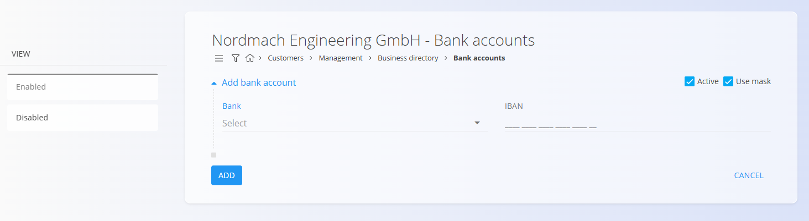

<!-- app_route: /management/contacts/companies -->
<!-- app_label: Business directory -->
<!-- canonical_source_url: https://github.com/Tom-PIT/Connected.Docs/blob/main/en/Common/Management/BankAccounts.md -->
<!-- canonical_source_title: Bank accounts -->

# Bank accounts
<!-- app_route: /management/contacts/companies -->
<!-- app_label: Business directory -->
<!-- canonical_source_url: https://github.com/Tom-PIT/Connected.Docs/blob/main/en/Common/Management/BankAccounts.md -->
<!-- canonical_source_title: Bank accounts -->
Bank accounts belong to a specific **customer** or **vendor** and are managed inside the [**Business directory**](BusinessDirectory.md). They define the financial account information used later in documents such as issued invoices or payments. 

Each account is linked to a **Bank**, selected from the predefined [**Banks**](Banks.md) code list.

### Accessing bank accounts
<!-- app_route: /management/contacts/companies -->
<!-- app_label: Business directory -->
<!-- canonical_source_url: https://github.com/Tom-PIT/Connected.Docs/blob/main/en/Common/Management/BankAccounts.md -->
<!-- canonical_source_title: Bank accounts -->
Bank accounts appear as a tag under each Business directory entry. Click the tag to open the list of bank accounts associated with that company or individual.

## Schema
<!-- app_route: /management/contacts/companies -->
<!-- app_label: Business directory -->
<!-- canonical_source_url: https://github.com/Tom-PIT/Connected.Docs/blob/main/en/Common/Management/BankAccounts.md -->
<!-- canonical_source_title: Bank accounts -->
| Field | Description |
|-------|-------------|
| [**Bank**](Banks.md) | The financial institution providing the account. Selected from the **Banks** code list (mandatory). |
| **IBAN** | Full international bank account number (mandatory). |
| **Active** | Indicates whether the account can be used on documents. |
| **Use mask** | Formats the IBAN visually (spaces and grouping) without changing its value. |

## List view
<!-- app_route: /management/contacts/companies -->
<!-- app_label: Business directory -->
<!-- canonical_source_url: https://github.com/Tom-PIT/Connected.Docs/blob/main/en/Common/Management/BankAccounts.md -->
<!-- canonical_source_title: Bank accounts -->
The Bank accounts list displays all accounts linked to the selected Business directory entry.

Use the filters on the left (Enabled / Disabled) to show only active or inactive accounts.

## Actions
<!-- app_route: /management/contacts/companies -->
<!-- app_label: Business directory -->
<!-- canonical_source_url: https://github.com/Tom-PIT/Connected.Docs/blob/main/en/Common/Management/BankAccounts.md -->
<!-- canonical_source_title: Bank accounts -->
### Creating a new bank account
<!-- app_route: /management/contacts/companies -->
<!-- app_label: Business directory -->
<!-- canonical_source_url: https://github.com/Tom-PIT/Connected.Docs/blob/main/en/Common/Management/BankAccounts.md -->
<!-- canonical_source_title: Bank accounts -->
Click on the [**action button**](../UI/ActionButton.md) to open the form to add a new bank account.

Fill in all required fields. Optional fields can be completed if relevant. For more details on the fields, see the [**Schema**](#schema) section above. 

Click **Add** to save the new account.

### Editing an existing account
<!-- app_route: /management/contacts/companies -->
<!-- app_label: Business directory -->
<!-- canonical_source_url: https://github.com/Tom-PIT/Connected.Docs/blob/main/en/Common/Management/BankAccounts.md -->
<!-- canonical_source_title: Bank accounts -->
1. Open the Business directory entry.  
2. Click the **Bank accounts** tag.  
3. Select an account from the list.  
4. Update the IBAN, activity status, or mask option.  
5. Click **Save**.

### Deletion
<!-- app_route: /management/contacts/companies -->
<!-- app_label: Business directory -->
<!-- canonical_source_url: https://github.com/Tom-PIT/Connected.Docs/blob/main/en/Common/Management/BankAccounts.md -->
<!-- canonical_source_title: Bank accounts -->
A bank account can be deleted in the Edit page, but only if it is not referenced in other documents (e.g., issued invoices or payments).

> [!NOTE]
> Deleting a bank account does **not** delete the Business directory entry it belongs to.

