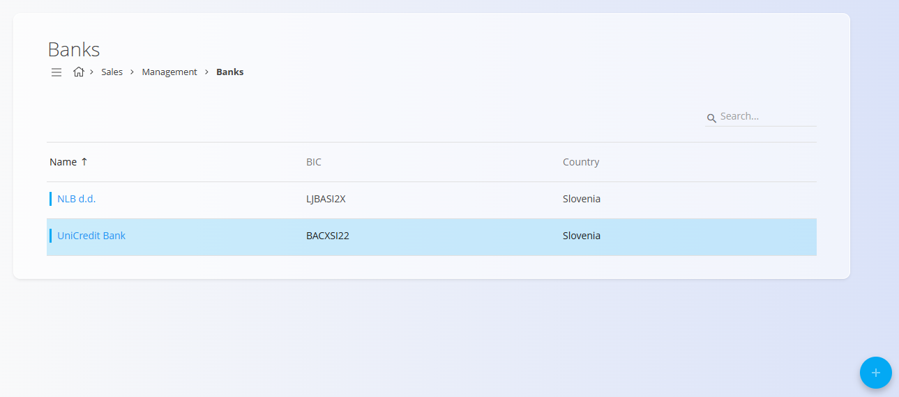
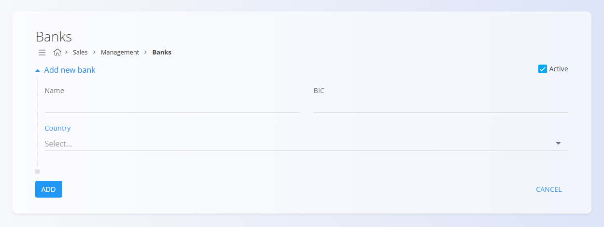

<!-- app_route: /management/common-types/banks -->
<!-- app_label: Banks -->
<!-- canonical_source_url: https://github.com/Tom-PIT/Connected.Docs/blob/main/en/Common/Management/Banks.md -->
<!-- canonical_source_title: Banks -->

# Banks

The **Banks** code list contains financial institutions that can be used across documents such as issued invoices, payments, and organizational bank accounts. Each bank entry stores its name, BIC code, and country, allowing the system to Banks connect with various [business partners](../../Common/Management/BusinessDirectory.md) and their transactions, and correctly reference banking information wherever needed.

To access Banks, go to **Sales / Management / Banks** in the [**navigation**](../../Common/UI/Navigation.md).

> [!NOTE]  
> **Prerequisites**  
> Before managing bank records, ensure that the [**Countries**](../../Common/Management/Countries.md) code list is properly configured.  

## Schema

| Field | Description |
|-------|-------------|
| **Name** | Full name of the bank (mandatory). |
| **BIC** | Bank Identifier Code used for international transactions (mandatory). |
| [**Country**](../../Common/Management/Countries.md) | Country where the bank is registered (mandatory). |
| **Active** | Indicates whether the bank is available for use in documents (selected by default). |

## Management

In this screen you can view, add, and edit banks that are used throughout the system.

### Bank list

The list view displays all recorded banks, including their **name**, **BIC**, and [**country**](../../Common/Management/Countries.md).  

Each record includes a status indicator to the left of its name:
- **Blue** indicates the bank is active
- **Gray** indicates the bank is inactive

You can use the **Search** bar to quickly filter payment methods by their code or name.

## Actions

### Adding a new bank

Click the [Action Button](../../Common/UI/ActionButton.md) to open the form to add a new bank entry.  

Fill in all required fields. Optional fields can be completed if relevant. For more details on the fields, see the [**Schema**](#schema) section above. Click **Add** to save the bank or **Cancel** to return to the list view.

### Editing an existing bank

To edit an existing bank, click on its **Name** in the list. The interface switches to edit mode, displaying the existing values for modification. Click **Save** to apply the changes or **Cancel** to discard them.

### Deletion

Click **Delete** on the edit screen to open a confirmation dialog: 

**Are you sure you want to delete this record?**  

If confirmed, the record is permanently removed; otherwise, the system keeps it unchanged.

> [!NOTE]
>A bank record can be deleted only if it is not referenced by other system entities.

