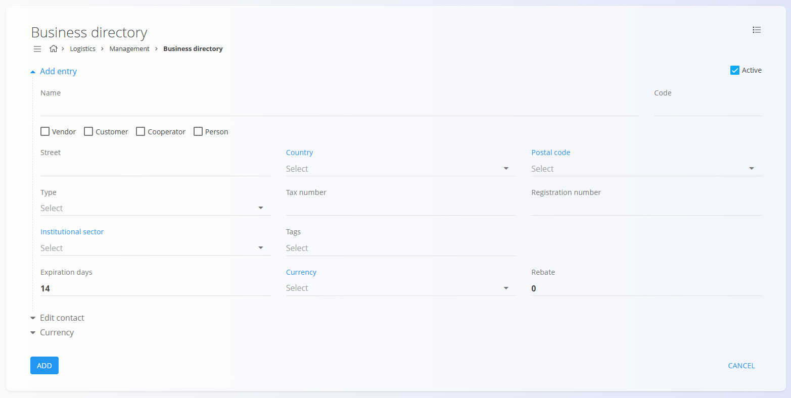

# Business directory

<!-- app_route: /management/contacts/companies -->
<!-- app_label: Business directory -->

The **Business directory** contains all companies and individuals your organization works with. These can include **customers**, **vendors**, **cooperators**, or **internal contacts**. Each entry stores important information such as addresses, tax details, contact persons, and payment preferences. This ensures that the same partner data is used consistently across sales, supply, logistics, and financial documents.

You can access the **Business directory** code list from different domains in the [**navigation**](../UI/Navigation.md). In all cases you are working with the same shared data.

To open the list, go to **Management / Business directory** in one of the following domains:

- **Customers**
- **Logistics**
- **Sales**
- **Supply**

## Schema

| Field | Description |
|-------|--------------|
| **Name** | Full name of the entity, for example **ACME d.o.o.** or **John Smith** (mandatory). |
| **Code** | Internal code that ensures unique identification. For example, you might use **COK** for *Coca-Cola* or **ACM** for *ACME d.o.o.*. |
| **Active** | Indicates whether the entry is active. Inactive entries cannot be used in new documents. |
| **Vendor** | Checkbox indicating whether the entity acts as a vendor. |
| **Customer** | Checkbox indicating whether the entity acts as a customer. |
| **Cooperator** | Checkbox indicating whether the entity acts as a cooperator. |
| **Person** | Checkbox indicating whether the entity is a natural person. |
| **Street** | Entity's street address, for example **Dunajska cesta 10**. |
| [**Country**](Countries.md) | Country where the entity's headquarters are located. |
| [**Postal code**](PostalCodes.md) | Postal code of the entity's headquarters. |
| **Type** | Defines the tax status of the entity (see the list section below). |
| **VAT ID** | VAT identification number, for example **SI12345678**. |
| **Company ID** | Company registration number. |
| [**Institutional sector**](../../Domains/Customers/Management/InstitutionalSectors.md) | Institutional sector to which the entity belongs. |
| **Tags** | Tags that allow categorization of entities. |
| **Payment currency** | Default payment currency used in documents. |
| [**Currency**](Currencies.md) | Currency associated with the entity. |
| **Discount** | Default discount percentage applied to the entity. |
| [**Primary contact**](Contacts.md) | Name and surname of the primary contact person. |
| **Phone** | Phone number of the primary contact. |
| **Email** | Email address of the primary contact. |
| **Use partner currency on documents** | Checkbox defining whether the entity's [currency](Currencies.md) is used in documents. |

## Management

### List of business directory entries

<!-- app_route: /management/contacts/companies -->
<!-- app_label: Business directory -->

The user interface contains a list of entries in the business directory.


Each record displays multiple tags representing **associated data**. Use these pages to add related data to each customer:
- [**Contacts**](Contacts.md)
- [**Bank accounts**](BankAccounts.md)
- [**Business units**](BusinessUnits.md)
- [**Company cards**](../../Domains/Sales/Views/CompanyCards.md)

Filters on the left side allow you to narrow results by **View**, **Relation**, **Type**, and **Country**.

The **Type** field determines the tax status of the entity. The available values are:
- **Liable for tax** – The entity is a VAT-registered business. VAT handling applies on sales/purchase documents according to configured tax rules.
- **Not liable for tax** – The entity does not charge or reclaim VAT (e.g., small taxpayers or exempt entities). Documents typically use non-VAT tax rates or exemptions.
- **Final customer** – A non-business end customer. VAT is typically included in prices and reported accordingly; business-to-consumer rules apply.

## Actions

<!-- app_route: /management/contacts/companies -->
<!-- app_label: Business directory -->

Click on the [**action button**](../../Common/UI/ActionButton.md) to display the available actions:

- **Import by VIES** 
- **Import**  
- **New**  

### Import by VIES

Allows automatic retrieval of data from the VIES database, based on the provided VAT ID.

### Import

<!-- app_route: /management/contacts/companies -->
<!-- app_label: Business directory -->

The **Import** action enables bulk creation or updating of company records.


#### Example CSV structure

```csv
Code,Name,Active,Supplier,Customer,Subcontractor,NaturalPerson,Street,Country,PostalCode,Type,VATID,RegistrationNumber,Tags,PaymentCurrency,DiscountPercent,PrimaryContact,Phone,Email
ACME01,ACME d.o.o.,true,true,true,false,false,Dunajska cesta 10,SI,1000,Liable for tax,SI12345678,1234567-0,wholesale,EUR,5,Janez Novak,+386 1 234 56 78,info@acme.si
CUST01,John Smith,false,false,true,false,true,Glavna ulica 5,SI,2000,Final customer,,,"retail,online",EUR,0,John Smith,+386 31 555 555,john.smith@example.com
```
### New

<!-- app_route: /management/contacts/companies -->
<!-- app_label: Business directory -->

The **New** action opens the input form for creating a new entry. Fill in all required fields. Optional fields can be completed if relevant. For more details on the fields, see the [**Schema**](#schema) section above. 

Click **Add** to save the new record or **Cancel** to return to the list view without saving.



Additional collapsible sections are available:

#### Edit contact

<!-- app_route: /management/contacts/companies -->
<!-- app_label: Business directory -->

This section allows entering the primary contact information for the business partner. You can specify details such as contact name, phone number, and email address. These fields are optional and serve as reference information used across documents.

#### Currency
This section allows you to define whether the business partner uses the **company currency** when appearing on documents. If enabled, all related transactions (such as sales or purchase documents) default to the company's currency instead of the partner's own currency settings.


## Menu

The **Menu** in the top-right corner provides the **Exporting** option, which exports all visible records into a CSV file, allowing further analysis or backup.


### Editing a business directory entry

<!-- app_route: /management/contacts/companies -->
<!-- app_label: Business directory -->

To edit an existing record, click the entry's **Name** in the list. The interface switches to edit mode, displaying the existing data for modification. Click **Save** to confirm changes or **Cancel** to discard them.


### Deletion

<!-- app_route: /management/contacts/companies -->
<!-- app_label: Business directory -->

Click **Delete** on the edit screen to open a confirmation dialog: 

**Are you sure you want to delete this record?**  

If confirmed, the entry is permanently removed; otherwise, the system keeps the record unchanged.

> [!NOTE]
>An entry can be deleted only if it is not referenced in any dependent records (for example, invoices or orders).

