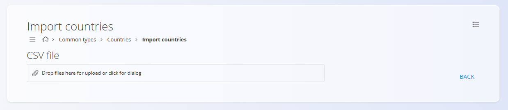

# Countries

<!-- app_route: management/common-types/countries -->
<!-- app_label: Countries -->

This code list represents the countries used across the digital contents of the system. Each country defines localization parameters, such as the LCID and ISO code, which ensure correct language, regional settings, and compliance with international standards.

You can access the **Countries** code list from different domains in the [**navigation**](../UI/Navigation.md). In all cases you are working with the same shared data.

To open the list, go to **Management / Countries** in one of the following domains:

- **Logistics**
- **Sales**
- **Supply**

## Schema

| Field | Description |
|-------|--------------|
| **Name** | Country name. For example, Slovenia or **Austria**. |
| **LCID** | Localization identifier used to set the language and regional specifics of the country. |
| **ISO Alpha-2 code** | International standard country code. For example, **SI** for Slovenia or **AT** for Austria. |
| **Active** | Indicates whether the country is active. Inactive countries cannot be used for new entries, but they remain visible in the history. |

## Management

### List of countries

<!-- app_route: management/common-types/countries -->
<!-- app_label: Countries -->

The user interface contains a list of countries. If no record exists yet, the list is empty.

Each record includes a status indicator to the left of its name:
- **Blue** indicates the country is active
- **Gray** indicates the country is inactive


Each record displays a tag representing **associated data** — [Postal codes](PostalCodes.md).

Clicking this tag opens the interface for managing the related data linked to the selected country.

## Actions

<!-- app_route: management/common-types/countries -->
<!-- app_label: Countries -->

Click on the [action button](../UI/ActionButton.md) to display the following actions:

- Import  
- New  

### Import

<!-- app_route: management/common-types/countries -->
<!-- app_label: Countries -->

The **Import** action enables bulk creation or updating of country records. This function is intended for administrators who need to add or modify multiple countries at once.

When selecting **Import**, the system opens the upload interface:



The import accepts a **CSV file**. Drag and drop the file into the upload area or click to open the file dialog.
The file must contain the required fields in a valid structure. You can download a file example using the menu located on the top-right corner. After the upload is complete, the system processes the file and creates or updates countries based on the CSV content.

Click **Cancel** to return to the country list without importing.

#### Example CSV structure

```csv
Name,LCID,ISOAlpha2Code,Active
Slovenia,1060,SI,true
Austria,3079,AT,true
Italy,1040,IT,false
```

### New

<!-- app_route: management/common-types/countries -->
<!-- app_label: Countries -->

Select **New** to open the input form for adding a new country.  

Fill in all required fields. Optional fields can be completed if relevant. For more details on the fields, see the [**Schema**](#schema) section above. 

Click **Add** to create the record or **Cancel** to return to the list view without saving.


### Editing an existing country

To edit an existing country, click the country's **Name** in the list. The interface switches to edit mode, displaying the existing values for modification. Click **Save** to confirm changes or **Cancel** to discard them.

#### Postal codes

The [**Postal codes**](PostalCodes.md) tag opens the interface for managing postal codes related to the selected country. Each postal code record includes fields such as **Number** and **City**, allowing you to maintain correct geographical and mailing data.  


### Deletion

<!-- app_route: management/common-types/countries -->
<!-- app_label: Countries -->

Click **Delete** in the edit screen to open a confirmation dialog:

**Are you sure you want to delete this record?**  

If confirmed, the entry is permanently removed; otherwise, the system keeps the record unchanged.

> [!NOTE]
>A country can be deleted only if it is not referenced by dependent records (for example, addresses or documents).
