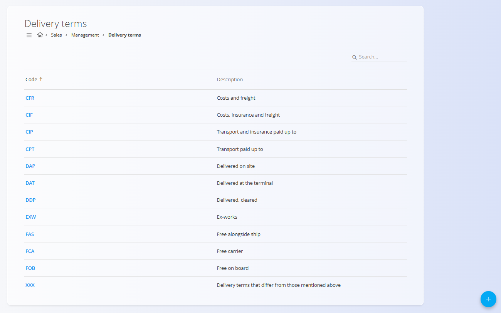
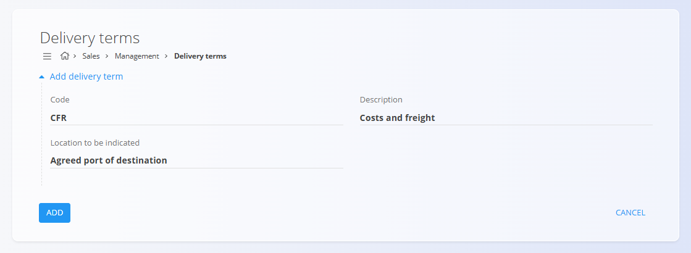

<!-- app_route: /management/common/delivery-terms -->
<!-- app_label: Delivery terms -->
<!-- canonical_source_url: https://github.com/Tom-PIT/Connected.Docs/blob/main/en/Common/Management/DeliveryTerms.md -->
<!-- canonical_source_title: Delivery terms -->

# Delivery terms

Delivery terms define the conditions under which goods are delivered between seller and buyer, including the allocation of costs, risks, and responsibilities during transport.

These terms are commonly used in **sales** documents to clearly specify delivery conditions.

Most delivery terms are based on internationally recognized **Incoterms®** published by the International Chamber of Commerce (ICC), with the possibility to define custom terms if needed.

To access this screen, go to **Accounting / Management / Intrastat / Delivery terms** in the [**navigation**](../../Common/UI/Navigation.md). It appears also under **Management** in the **Sales** domain.

## Schema

| Field | Description |
|-----|------------|
| Code | Short identifier of the delivery term (for example, EXW, DAP, CIF). |
| Description | Description of the delivery condition. |
| Location to be indicated | Optional field used for delivery terms that require a named place (for example, port, terminal, or delivery address). |

## List view

The list view displays all available delivery terms with their codes and descriptions.

Delivery terms are shared across domains and can be referenced in documents such as [sales orders](../../Domains/Sales/Documents/SalesOrders.md) or [delivery notes](../../Domains/Sales/Documents/DeliveryNotes.md).

The list can be searched using the search field in the top-right corner.

## Actions

### Add a new delivery term

To create a new delivery term, follow these steps:

1. Click the [**action button**](../../Common/UI/ActionButton.md) to create a new delivery term.
2. Fill in all required fields. Optional fields can be completed if relevant.
3. Click **Add** to save the new delivery term or **Cancel** to return to the list view.

> [!NOTE]
> For more details on the fields, see the [**Schema**](#schema) section above. 

> [!IMPORTANT]
> Make sure to use standard Incoterms® codes and descriptions when applicable, to ensure clarity and consistency in international trade.

After saving, the delivery term becomes available for selection in documents where delivery conditions are required.

### Edit an existing delivery term

To edit an existing delivery term, follow these steps:

1. Click a delivery term in the list to open it in edit mode.
2. Update the **code**, **description**, or **location to be indicated** as needed.
3. Click **Save** to apply changes or **Cancel** to discard them.

### Delete an existing delivery term

To delete a delivery term, follow these steps:

1. Open a delivery term from the list.
2. Click **Delete**.
3. Confirm the deletion in the dialog.

> [!NOTE]
> A delivery term can be deleted only if it is not referenced in dependent records (e.g., sales or purchase orders).
