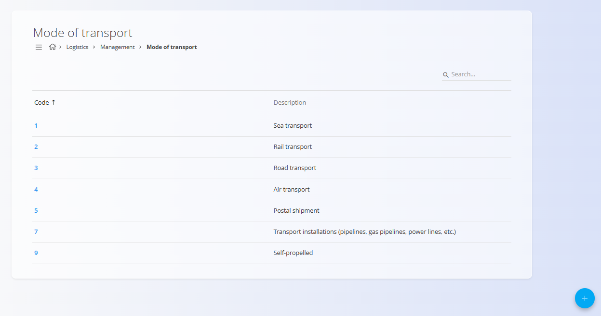
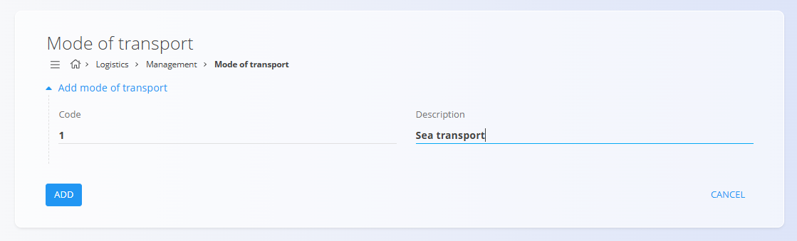

# Mode of transport

This code list defines the **modes of transport** used across the system. Modes of transport are referenced by logistics, sales, supply, and other documents to describe how goods are delivered or transferred.

You can access the **Mode of transport** code list from different domains in the [**navigation**](../UI/Navigation.md). In all cases, you are working with the same shared data.

To open the list, go to **Management / Mode of transport** in one of the following domains:

- **Logistics**
- **Sales**

## Schema

| Field | Description |
|------|-------------|
| **Code** | Numeric identifier of the transport mode. |
| **Description** | Human-readable description of the transport mode. |

## List of transport modes

The screen displays a list of all defined transport modes.

Each row shows:
- **Code**
- **Description**

If no records exist, the list is empty.

Clicking on a row opens the record in edit mode.

## Actions

### Creating a new transport mode

Click on the [action button](../UI/ActionButton.md) to open the form for creating a new transport mode.

The form contains the following fields:
- **Code**
- **Description**

Click **Add** to create the record or **Cancel** to return to the list without saving.

### Editing a transport mode

To edit an existing transport mode, click its **Code** in the list. The screen switches to edit mode, allowing you to update the values.

Click **Save** to apply the changes or **Cancel** to discard them.

### Deletion

Click **Delete** on the edit screen to remove a transport mode and confirm the deletion in the dialog.
> [!NOTE]
> A transport mode can be deleted only if it is not referenced by existing documents.