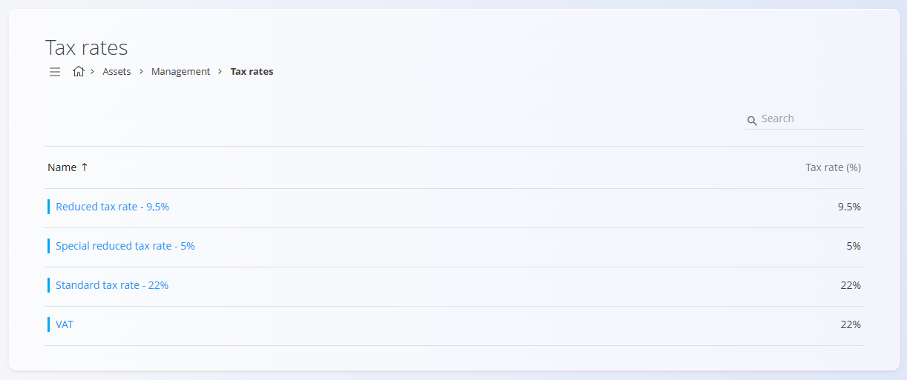

# Tax rates

This code list defines all **tax rates** used across the system. Tax rates determine the percentage of tax applied to products, materials, and services in business documents. Each entry includes a descriptive name and a numeric percentage, ensuring tax is applied consistently throughout the digital contents.

## Schema

| Field | Description |
|-------|-------------|
| **Name** | Descriptive name of the tax rate. For example, Standard tax rate 22 or Reduced tax rate 9.5. |
| **Tax rate (%)** | Numeric tax percentage applied, for example **22** or **9.5**. |
| **Active** | Indicates whether the tax rate is currently in use. Inactive tax rates cannot be selected in new entries, but remain visible in history. |

## Management

You can access the **Tax rates** code list from different domains in the [navigation](../UI/Navigation.md). In all cases you are working with the same shared data.

To open the list, go to the **Management** section of the following domains:

- **Assets**
- **Sales**
- **Supply**

### List of tax rates

The user interface contains a list of tax rates. If no record exists yet, the list is empty.

Each record includes a status indicator to the left of its name:
- **Blue** indicates the tax rate is active
- **Gray** indicates the tax rate is inactive

The list displays each tax rate's name and the applicable percentage. A search field is available in the upper-right corner to help filter the list.

## Actions

Click on the [**action button**](../UI/ActionButton.md) to add a new tax rate.

The form includes the following fields:
- **Name**
- **Tax rate (%)**
- **Active**

After entering the required information, click **Add** to save the tax rate or **Cancel** to return to the list view.

## Editing

To edit an existing tax rate, click the tax rate's **Name** in the list. The interface switches to edit mode, displaying the existing values for modification.

Click **Save** to confirm changes or **Cancel** to discard them.

## Deletion

Click **Delete** on the edit screen to open a confirmation dialog: 

**Are you sure you want to delete this record?**  

If confirmed, the entry is permanently removed; otherwise, the system keeps the record unchanged.

> [!NOTE]
>A tax rate can be deleted only if it is not used in any dependent entries.  

