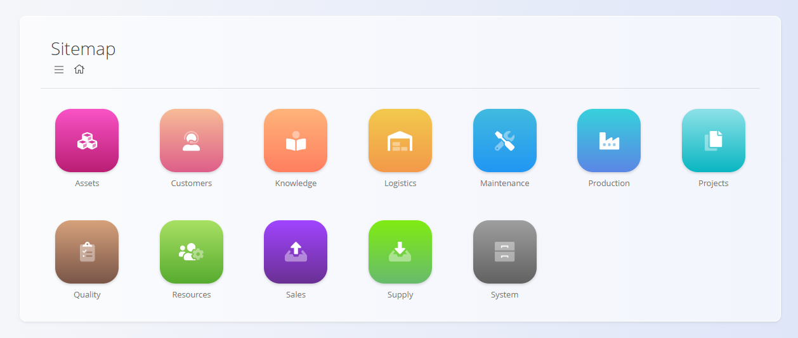
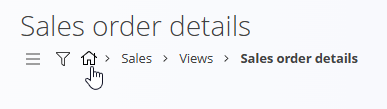

# Navigation

The platform is organized so you can easily find documents, views, and configuration areas based on your daily work. Navigation happens mainly through the **Sitemap**, breadcrumbs, and quick access buttons.

## Sitemap

The **Sitemap** is the main entry point of the platform. It is divided into **domains**, each representing a functional area of the system.

You can always return to the Sitemap by clicking the **house icon** in the breadcrumbs.

### Navigating with breadcrumbs

Breadcrumbs show your current path and allow you to move back by selecting any previous element:

Additionally, on many screens, a **back arrow button** appears in the lower-right corner to return to the previous screen:

### Domains

Each domain contains the tools relevant to a specific business area. Examples include:

- **Sales**  
- **Logistics**  
- **Supply**  
- **Production**  
- **Finance**, etc.

> [!NOTE]
>
>Available domains depend on each company’s configuration and business model. For example, a company that only sells finished goods may not have the **Production** domain.

Inside the domains are different types of sections depending on the field of the domain, the main types are:
- Documents
- Views
- Management

## Documents

Documents are the core of daily operational work. They are used to create, process, and track business transactions such as:

- Sales orders  
- Delivery notes  
- Receives  
- Issues  
- Inter-warehouse transfers  
- Inventories  
- Supply orders  
- And many others

Example — entering the **Sales** domain and opening **Documents**:

Documents typically offer:

- A list of drafts and committed documents  
- A way to create new records  
- Filters to quickly find information  
- Printing and exporting options  

## Views

Views allow you to **analyze and monitor** business information. They do not create transactions — instead, they help you understand the big picture. 

Views typically include:

- Stock overviews  
- Sales order reports  
- Delivery note reports  
- Company cards  
- Material movement summaries  
- Location-based stock views  

Example — **Sales / Views**:

Views are designed for:

- Quick analysis  
- Control and verification  
- Decision-making  
- Reporting  

## Management

The **Management** section contains all master data and code lists that support the platform. These settings ensure documents and processes use consistent, valid data.

Management includes items such as:

- Configuration  
- Business directory  
- Banks & payment methods  
- Countries, currencies, tax rates  
- Predefined texts  
- Measure units  
- Organization bank accounts  
- Other critical code lists  

Example — **Sales / Management**:

Management pages are typically maintained by administrators or users responsible for system configuration.

---
