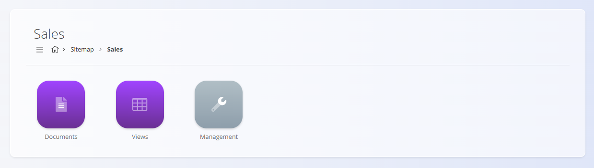
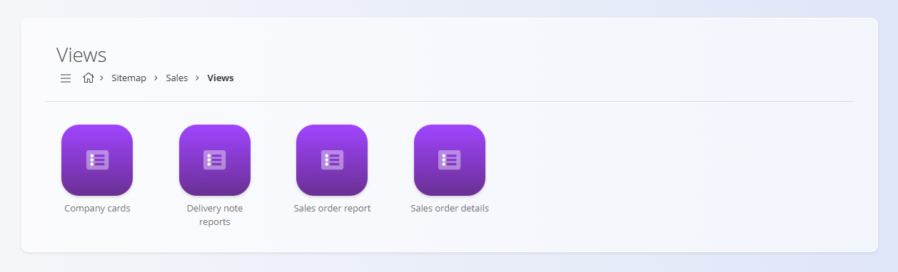

# Navigation

The platform is organized so you can easily find documents, views, and configuration areas based on your daily work. Navigation happens mainly through the **Sitemap**, breadcrumbs, and quick access buttons.

## Sitemap

The **Sitemap** is the main entry point of the platform. It is divided into **domains**, each representing a functional area of the system.

You can always return to the Sitemap by clicking the **house icon** in the breadcrumbs.

### Navigating with breadcrumbs

Breadcrumbs show your current path and allow you to move back by selecting any previous element:

Additionally, on many screens, a **back arrow button** appears in the lower-right corner to return to the previous screen:

### Domains

Each domain contains the tools relevant to a specific business area. Examples include:

- **[Sales](../../Domains/Sales/Domain/SalesDomain.md)**  
- **[Logistics](../../Domains/Logistics/Domain/LogisticsDomain.md)**  
- **[Supply](../../Domains/Supply/Domain/SupplyDomain.md)**  
- **[Production](../../Domains/Production/Domain/ProductionDomain.md)**  

> [!NOTE]
>
>Available domains depend on each company’s configuration and business model. For example, a company that only sells finished goods may not have the **Production** domain.

Inside the domains are different types of sections depending on the field of the domain, the main types are:
- Documents
- Views
- Management

Example - Sections in the **Sales** domain:

## Documents

Documents are the core of daily operational work. They are used to create, process, and track business transactions such as:

- **[Sales orders](../../Domains/Sales/Documents/SalesOrders.md)**  
- **[Delivery notes](../../Domains/Sales/Documents/DeliveryNotes.md)**  
- **[Receives](../../Domains/Logistics/Documents/Receives.md)**  
- **[Issues](../../Domains/Logistics/Documents/Issues.md)**  
- **[Inter-warehouse transfers](../../Domains/Logistics/Documents/InterWarehouse.md)**  
- **[Inventories](../../Domains/Logistics/Documents/Inventories.md)**
- **[Supply orders](../../Domains/Supply/Documents/SupplyOrders.md)**  
- **[Execution](../../Domains/Production/Documents/Execution.md)**
- **[Production orders](../../Domains/Production/Documents/ProductionOrders.md)**
- **[Requirements](../../Domains/Production/Documents/Requirements.md)**
- And many others

Example — entering the **Sales** domain and opening **Documents**:

Documents typically offer:

- A list of drafts and committed documents  
- A way to create new records  
- Filters to quickly find information  
- Printing and exporting options  

## Views

Views allow you to **analyze and monitor** business information. They do not create transactions — instead, they help you understand the big picture. 

Views typically include:

- **[Stock overviews](../../Domains/Logistics/Views/Stock.md)**  
- **[Sales order reports](../../Domains/Sales/Views/SalesOrderDetails.md)**  
- **[Delivery note reports](../../Domains/Sales/Views/DeliveryNoteReports.md)** 
- **[Company cards](../../Domains/Sales/Views/CompanyCards.md)**  
- **[Location-based stock views](../../Domains/Logistics/Views/StockViewByLocation.md)**  
- **[Production KPIs](../../Domains/Production/Analytics/ProductionKPIs.md)**
- **[Loss summary](../../Domains/Production/Analytics/LossSummary.md)**
- **[Downtime summary](../../Domains/Production/Analytics/DowntimeSummary.md)**

Example — **Sales / Views**:

Views are designed for:

- Quick analysis  
- Control and verification  
- Decision-making  
- Reporting  

## Management

The **Management** section contains all master data and code lists that support the platform. These settings ensure documents and processes use consistent, valid data.

> [!TIP]
> Use the [**Management index**](../../ManagementIndex.md) to quickly locate specific articles for master data and code lists.

Management includes items such as:

- Configuration  
- **[Business directory](../Management/BusinessDirectory.md)**  
- **[Banks & payment methods](../../Domains/Sales/Management/PaymentMethods.md)**  
- **[Countries](../Management/Countries.md)**, **[currencies](../Management/Currencies.md)**, **[tax rates](../Management/TaxRates.md)**  
- **[Predefined texts](../Management/PredefinedTexts.md)**  
- **[Measure units](../Management/MeasureUnits.md)**  
- **[Organization bank accounts](../../Domains/Sales/Management/OrganizationBankAccounts.md)**  
- **[Processes](../../Domains/Production/Management/Processes.md)**
- **[Inputs](../../Domains/Production/Management/Inputs.md)**, **[Outputs](../../Domains/Production/Management/Outputs.md)**
- **[Job positions](../../Domains/Production/Management/JobPositions.md)**, **[Human resources](../../Domains/Production/Management/HumanResources.md)**
- Other critical code lists  

Example — **Sales / Management**:

Management pages are typically maintained by administrators or users responsible for system configuration.

