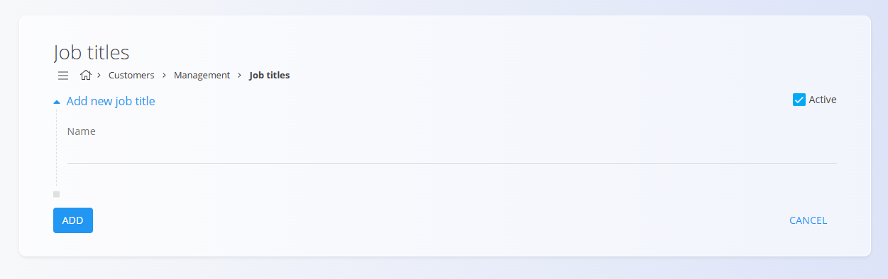

# Job titles

Job titles are part of the **Customer Support** module and define the roles that can be assigned to [contacts](../../Common/CodeLists/Contacts.md) in the [**Business directory**](../../Common/CodeLists/BusinessDirectory.md). They help categorize people such as *Account Manager*, *Procurement Manager*, or *Director*.

To access this page, go to **Customer Support / Management / Job titles** in the [navigation](../../Common/UI/Navigation.md).

## Schema

| Field | Description |
|-------|-------------|
| **Name** | The job title or role (e.g., *Account Manager*, *Director*). |
| **Active** | Indicates whether the job title is available for selection when creating contacts. |

## List view

The list displays all job titles defined in the system.

Use the **Enabled / Disabled** filters on the left to show active or inactive titles.

## Creating a new job title

To add a new job title, click on the [**action button**](../UI/ActionButton.md) in the bottom-right corner and select **New**.

Fill in the following fields:

- **Name** – The job title  
- **Active** – Determines whether the title can be used  

Click **Add** to save the new job title.

## Editing an existing job title

1. Open **Customer Support → Management → Job titles**.  
2. Select a job title from the list.  
3. Update the name or activity status.  
4. Click **Save**.

## Deletion

A job title can be deleted from the Edit page, but only if it is not referenced in existing contacts.

> [!NOTE]  
> Deleting a job title does **not** remove any Business directory entries.
