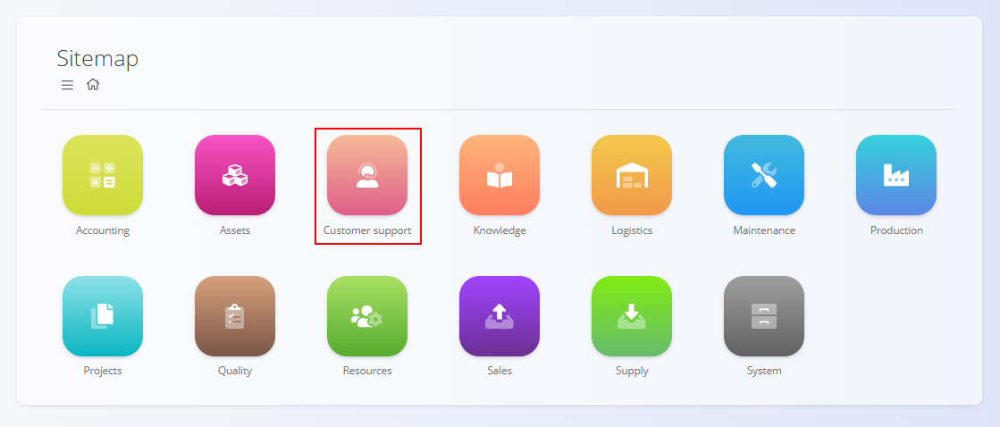
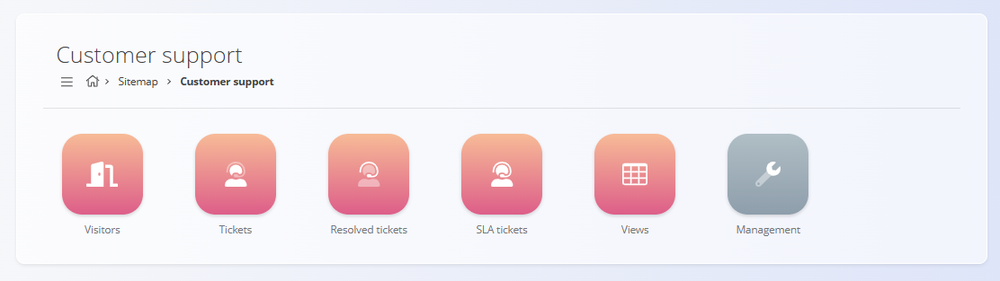
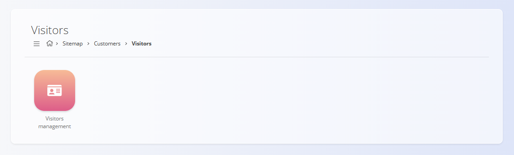
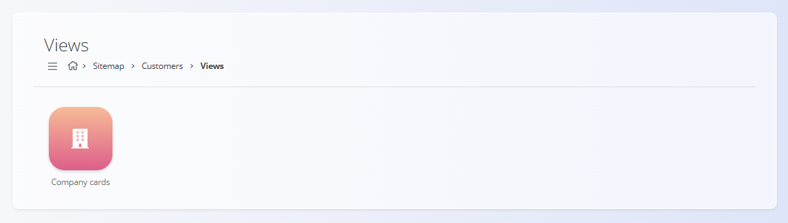
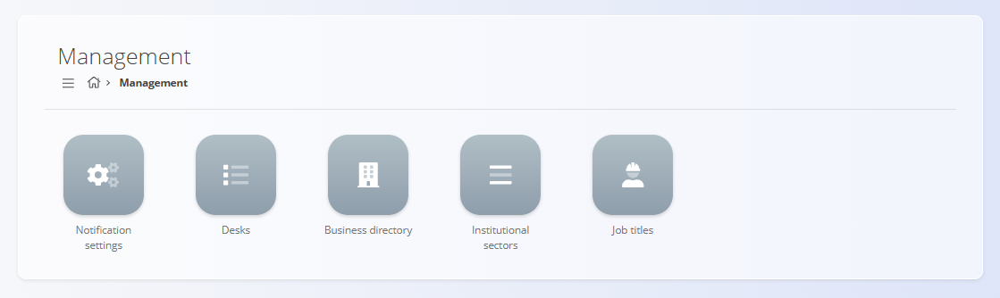

# Customer support

The **Customer support** domain provides tools for managing customer interactions, support requests, and service-related communication. It enables organizations to track incoming requests, resolve issues, monitor service levels, and maintain structured customer-related data.

Where the **[Sales](../../Sales/Domain/SalesDomain.md)** domain focuses on commercial transactions, the Customer support domain focuses on **post-sale communication, issue resolution, and customer assistance**.

To access this domain, navigate to **Customer support** from the main sitemap.

> [!NOTE]  
> The available domains and features depend on the company configuration and enabled modules.

## What is included in the Customer support domain?

The domain is organized into the following functional areas:

- **[Visitors](#visitors)** – management of external users and customer contacts  
- **[Tickets](#tickets)** – handling of support requests and service issues  
- **[Views](#views)** – analytical and summary views related to customer support  
- **[Management](#management)** – configuration and master data for customer support processes  

## Visitors

The **Visitors** section focuses on customers and partners physical visits to company locations.

The [**Visitors management**](../Visitors/VisitorsManagement.md) screen records physical visits to company locations with visitor details, date/time, status (Announced, On location, Completed, Cancelled), and target location.

## Tickets

The **Tickets** section contains all support-related records used to track customer requests and service issues.

It includes screens for:

- **[Tickets](../Tickets/Tickets.md)** – active and open support requests  
- **[Resolved tickets](../Tickets/ResolvedTickets.md)** – completed and closed support cases  
- **[SLA tickets](../Tickets/SLATickets.md)** – tickets monitored against defined service level agreements  

These screens represent the core operational area of the Customer support domain, allowing support agents to follow tickets from creation through resolution while maintaining visibility of response and resolution times.

## Views

The **Views** section provides read-only screens that present customer-related information in a structured and aggregated form.

Available views include:

- **[Company cards](../../Sales/Views/CompanyCards.md)** – overview of customers and their related activity across the system, including support-related information

Views do **not** create or modify data. They are intended for analysis, navigation, and decision support.

## Management

The **Management** section contains configuration screens and code lists required to support customer service processes.

Available configuration screens include:

- **[Notification settings](../Management/NotificationsSettings.md)** – personalization of ticket-related notifications per desk  
- **[Desks](../Management/Desks.md)** – definition of support desks and service channels  
- **[Business directory](../../Common/Management/BusinessDirectory.md)** – shared directory of companies and contacts used across domains  
- **[Institutional sectors](../Management/InstitutionalSectors.md)** – classification of customers by sector  
- **[Job titles](../../Common/Management/JobTitles.md)** – role definitions associated with customer contacts and users  

These elements define how customer support is structured and how users interact with tickets and notifications.

> [!TIP]
See all management entries in the **[Management Index](../../ManagementIndex.md)**.

## Customer support and Other Domains

The Customer support domain integrates with several other domains:

| Area | Interaction |
|------|-------------|
| **Sales** | Customer and company data shared with commercial processes |
| **Projects** | Tickets may relate to ongoing customer projects |
| **Maintenance** | Support tickets can be linked to maintenance orders or issues |
| **Resources** | Support workload and responsibility distribution |
| **Knowledge** | Documentation and knowledge base entries supporting issue resolution |

## Summary

The Customer support domain centralizes all customer-facing service activities.  
It enables organizations to:

- manage customer requests and issues  
- track resolution progress and service levels  
- configure notification and desk behavior  
- maintain structured customer classifications  
- gain visibility into customer-related activity  

By connecting operational support with customer, sales, and project data, the domain ensures consistent and efficient customer service workflows.

---