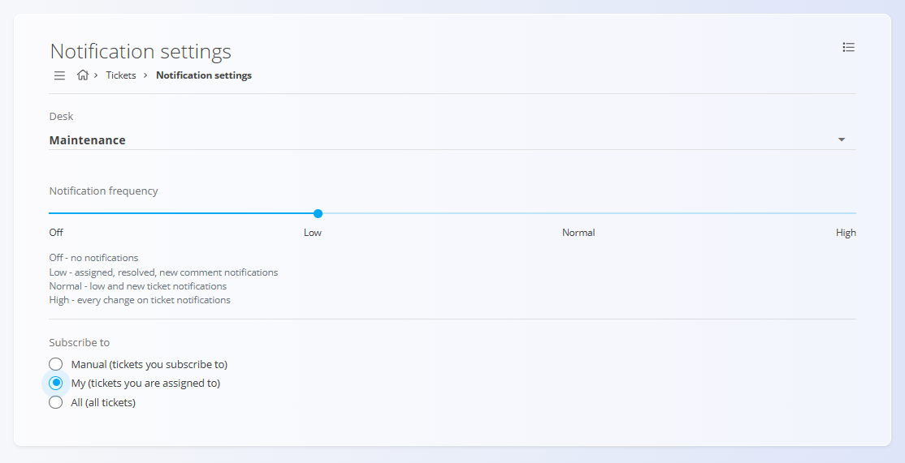

# Notification settings

The **Notification settings** screen allows users to personalize which ticket notifications they receive. Settings are configured **per desk**, meaning each desk can have different notification preferences.

To access this screen, go to **Customer support / Management / Notification settings** in the [**navigation**](../../Common/UI/Navigation.md).

## Schema

| Field | Description |
|------|-------------|
| **Desk** | Selects the desk for which notification settings are being configured. Each desk has its own independent settings. |
| **Notification frequency** | Defines how frequently notifications are sent for ticket changes. |
| **Subscribe to** | Determines which tickets the user is subscribed to for notifications. |

## Desk-specific behavior

Notification settings are **scoped to the selected desk**:

- Changing the **Desk** updates the displayed settings.
- Each desk can have different notification frequency and subscription rules.
- Adjustments only affect notifications related to the currently selected desk.

## Subscription options

The **Subscribe to** option controls which tickets generate notifications for the user:

- **Manual** – only tickets the user explicitly subscribes to  
- **My** – tickets assigned to the user  
- **All** – all tickets within the selected desk

## Notes

- Settings are **user-specific**.
- Changes are applied immediately.
- No additional confirmation is required after updating settings.