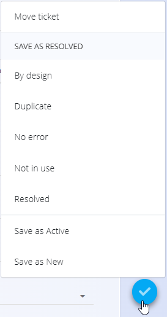

# Resolved tickets

The **Resolved tickets** screen provides an overview of tickets that have completed their lifecycle.  
It is used to review completed work, inspect ticket history, and optionally reopen tickets if further action is required.

To access this screen, go to **Customer support / Tickets / Resolved tickets** in the [navigation](../../Common/UI/Navigation.md).

## Schema

| Field | Description |
|-----|------------|
| **Subject** | Short title describing the resolved issue |
| **Number** | Unique ticket identifier |
| **[Desk](../Management/Desks.md)** | Desk the ticket belongs to |
| **Channel** | Origin of the ticket (**Web**, **Phone**, **Email**) |
| **Author** | User who created the ticket |
| **Assigned** | User who handled the ticket |
| **[Tags](Tickets.md#schema)** | Classification labels |
| **Priority** | Ticket priority level (**Low**, **Normal**, **High**) |
| **Created** | Ticket creation timestamp |
| **Activated** | Timestamp when ticket became active |
| **Resolved** | Timestamp when ticket was resolved |

## Resolved tickets list

The list displays all tickets with status **Resolved**.

Each ticket row shows:
- Ticket number and subject
- Resolution date
- Desk the ticket belongs to

Clicking on a ticket title opens the full ticket detail view.

### Filters

Resolved tickets can be filtered using the left panel:

- **Date**
- **Desk**
- **Tags**
- **Reason resolved**

## Reviewing a resolved ticket

Opening a resolved ticket displays the same detailed view as active tickets, including:
- Ticket metadata
- Description and attachments
- Full comment history
- Audit trail

Most fields are read-only; you can still update selected options (such as **Subject**, **Description**, **Priority**, etc.), add comments, and use actions via the [**action button**](../../Common/UI/ActionButton.md).

## Reopening a ticket

From the ticket detail view, the [**action button**](../../Common/UI/ActionButton.md) allows reopening a resolved ticket.

Available options include:
- **Save as New**
- **Save as Active**

When reopened:
- The ticket is removed from the **Resolved tickets** list
- It reappears in the **[Tickets](Tickets.md)** screen
- Its status is updated accordingly

---