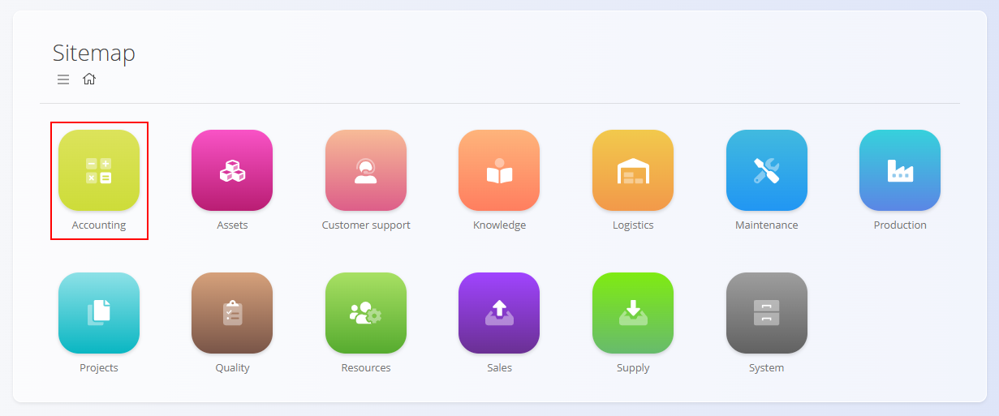
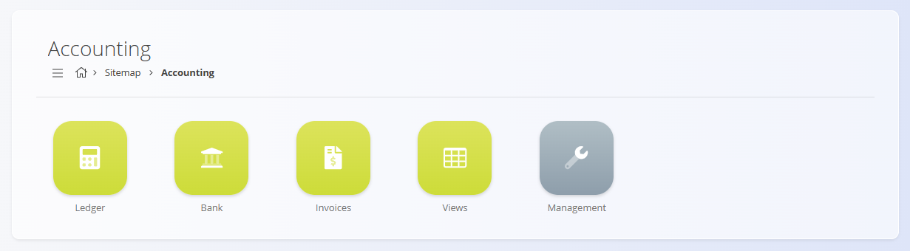
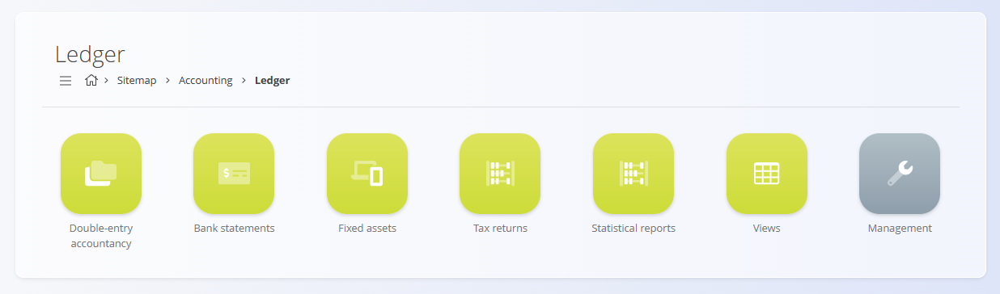
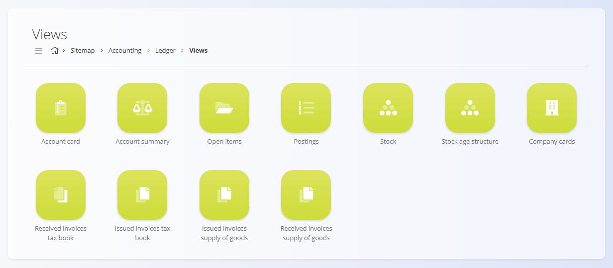
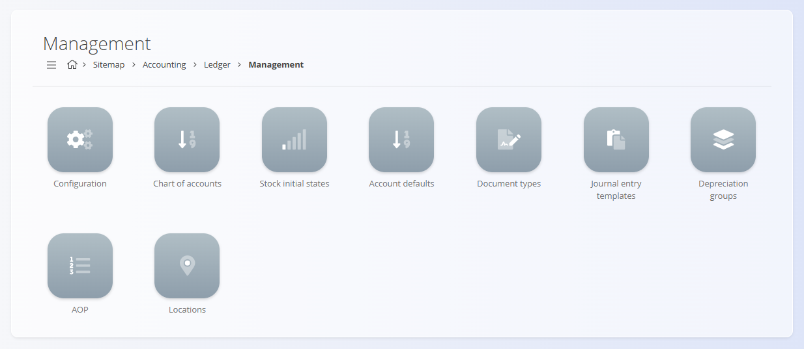
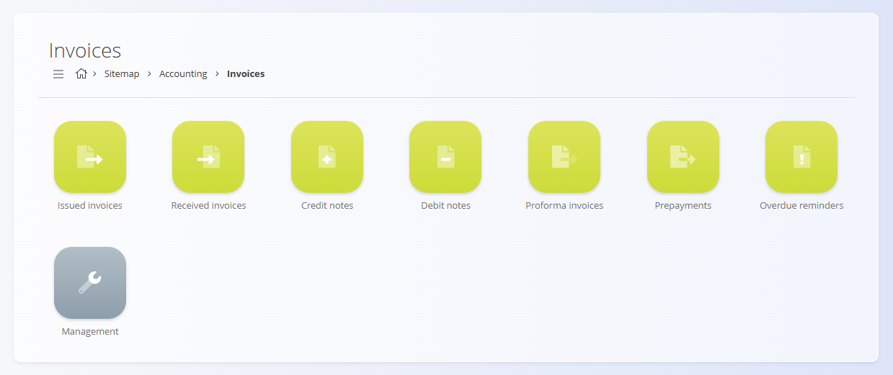
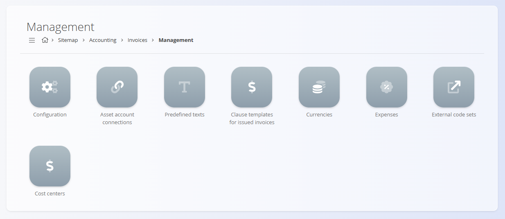
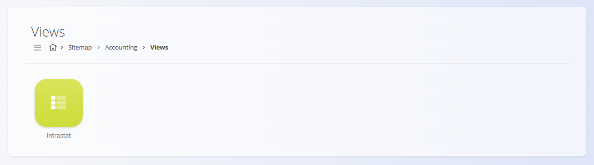
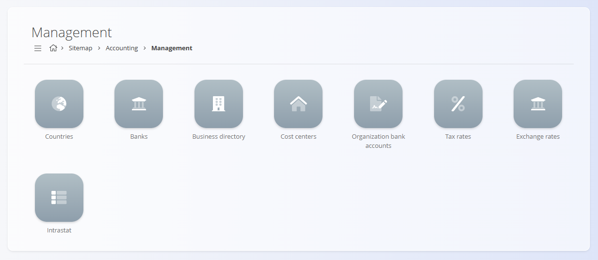

<!-- app_route: /sitemap/accounting -->
<!-- app_label: Accounting domain -->
<!-- canonical_source_url: https://github.com/Tom-PIT/Connected.Docs/blob/main/en/Domains/Accounting/README.md -->
<!-- canonical_source_title: Accounting domain -->

# Accounting

The **Accounting** domain contains all records, reports, and configuration required to **record, control, and analyze financial transactions**.  

It transforms operational documents created in other domains (such as [**Sales**](../Sales/SalesDomain.md), [**Supply**](../Supply/SupplyDomain.md), and [**Logistics**](../Logistics/README.md)) into **official accounting entries**, ensuring compliance, traceability, and accurate financial reporting.

To access this domain, navigate to **Accounting** in the [navigation](../../Common/UI/Navigation.md).

> [!NOTE]  
> The available sections and features depend on company configuration, enabled accounting modules, and local legislation.

## What is included in the Accounting domain?

The Accounting domain is **structurally denser than most other domains**. Several of its main areas (notably **Ledger** and **Invoices**) contain their own **Documents**, **Views**, and **Management** sections.

The domain is organized into the following major areas:

- **[Ledger](#ledger)** – core accounting records, postings, and statutory reporting  
- **[Bank](#bank)** – bank-related accounting operations  
- **[Invoices](#invoices-accounting)** – invoice documents from an accounting perspective  
- **[Views](#views)** – analytical, read-only accounting overviews  
- **[Management](#management)** – global accounting configuration and master data

## Ledger

The **Ledger** is the **core of the Accounting domain**.  
It stores all journal entries, postings, balances, and accounting reports derived from financial documents and operational transactions.

Within the Ledger, functionality is further divided into **Documents**, **Views**, and **Management**.

### Ledger – Documents

Ledger documents represent **formal accounting records** and statutory data.

Available ledger documents include:

- **[Double-entry accountancy](Documents/DoubleEntryAccountancy.md)** – Journal entries generated from accounting documents or created manually.
- **[Bank statements](Documents/BankStatements.md)** – Bank movements that generate journal entries when published.
- **[Fixed assets](Documents/FixedAssets.md)** – Asset records used for depreciation and long-term value tracking.
- **[Tax returns](Documents/TaxReturns.md)** – Periodic tax summaries used to prepare official tax submissions.
- **[Statistical reports](Documents/StatisticalReports.md)** – Generated financial reports such as balance sheets and income statements.
These documents **create or summarize accounting postings** and are the foundation of financial reporting.

### Ledger – Views

Ledger views provide **analytical and control-oriented overviews** of accounting data.  
They are **read-only** and do not create transactions.

Available views include:

- **[Account card](Views/AccountCard.md)** – Detailed debit and credit movements per account.
- **[Account summary](Views/AccountSummary.md)** – Aggregated balances showing initial state, turnover, and final state.
- **[Open items](Views/OpenItems.md)** – Outstanding receivables and payables by company.
- **[Postings](Views/Postings.md)** – Flat list of all accounting postings with filtering options.
- **[Ledger stock](Views/LedgerStock.md)** – Financial stock valuation by date.
- **[Stock age structure](Views/StockAgeStructure.md)** – Inventory aging analysis over time.
- **[Company cards](../Sales/Views/CompanyCards.md)** – Financial overview per business partner.

These views support **audit, reconciliation, and financial analysis**.

### Ledger – Management

Ledger management contains **technical and accounting configuration** that controls how postings are generated.

Available configuration includes:

- **[Ledger configuration](Management/Ledger/LedgerConfiguration.md)** – Global settings for ledger behavior.
- **[Chart of accounts](Management/Ledger/ChartOfAccounts.md)** – Definition of all general ledger accounts.
- **[Stock initial states](Management/Ledger/StockInitialStates.md)** – Opening balances for stock valuation.
- **[Account defaults](Management/Ledger/AccountDefaults.md)** – Default accounts used during posting.
- **[Document types](Management/Ledger/DocumentTypes.md)** – Rules defining how documents generate journal entries.
- **[Journal entry templates](Management/Ledger/JournalEntryTemplates.md)** – Posting templates for recurring entries.
- **[Depreciation groups](Management/Ledger/DepreciationGroups.md)** – Rules for asset depreciation.
- **[AOP](Management/Ledger/AOP.md)** – Accounting classification structure used by reports and summaries.
- **[Locations](Management/Ledger/LedgerLocations.md)** – Physical or organizational locations linked to assets and postings.

These elements define **how accounting logic behaves system-wide**.

## Bank

The **Bank** section covers accounting-related banking operations.

Available documents include:

- **[Payment orders](Documents/PaymentOrders.md)** – Instructions for outgoing and incoming payments processed through banks.

Bank documents often interact with **bank statements** and **journal entries** to ensure cash flow is fully reflected in the ledger.

## Invoices (Accounting)

The **Invoices** section in Accounting provides **invoice documents**, most of them shared with the Sales domain.

Available invoice documents include:

- [**Received invoices**](Documents/ReceivedInvoices.md)
- [**Issued invoices**](../Sales/Documents/IssuedInvoices.md)
- [**Credit notes**](../Sales/Documents/CreditNotes.md)
- [**Debit notes**](../Sales/Documents/DebitNotes.md)
- [**Proforma invoices**](../Sales/Documents/ProformaInvoices.md)
- [**Prepayments**](../Sales/Documents/Prepayments.md)
- [**Overdue reminders**](../Sales/Documents/OverdueReminders.md)

To avoid duplication, **document structure is described in the Sales domain**, while **accounting-specific behavior** (posting, settlement, tax handling) is documented here.

### Invoices – Management

Invoice-related configuration used by Accounting is grouped separately.

Available configuration includes:

- [**Configuration**](Management/Invoices/InvoicesConfiguration.md) – Invoice accounting behavior and defaults.
- [**Asset account connections**](Management/Invoices/AssetAccountConnections.md) – Links between invoices and asset accounting.
- [**Predefined texts**](../../Common/Management/PredefinedTexts.md) – Standard texts used on accounting documents.
- [**Clause templates for issued invoices**](../Sales/Management/ClauseTemplatesIssuedInvoices.md)
- [**Currencies**](../../Common/Management/Currencies.md)
- [**Expenses**](../Supply/Management/Expenses.md)
- [**External code sets**](../Sales/Management/ExternalCodeSets.md)
- [**Cost centers**](../../Common/Management/CostCenters.md)
These settings define **how invoice data integrates into accounting**.

## Views

The **Views** section at the Accounting domain level provides **direct access to analytical screens**, grouping together Ledger views and invoice-related reports.

These screens are **read-only** and intended for **financial monitoring and analysis**.

## Management

The **Management** section contains **global accounting master data** shared across Ledger, Invoices, and Bank operations.

Available configuration includes:

- [**Countries**](../../Common/Management/Countries.md)
- [**Banks**](../../Common/Management/Banks.md)
- [**Business directory**](../../Common/Management/BusinessDirectory.md)
- [**Cost centers**](../../Common/Management/CostCenters.md)
- [**Organization bank accounts**](../Sales/Management/OrganizationBankAccounts.md)
- [**Tax rates**](../../Common/Management/TaxRates.md)
- [**Exchange rates**](../Sales/Management/ExchangeRates.md)
- **Intrastat** - related code lists for EU trade reporting:
  - [**Nature of transactions**](Management/Intrastat/NatureOfTransactions.md)
  - [**Delivery terms**](../../Common/Management/DeliveryTerms.md)
  - [**Mode of transport**](../../Common/Management/ModeOfTransport.md)
  - [**Place of delivery**](Management/Intrastat/PlaceOfDelivery.md)
  - [**Supplementary units**](Management/Intrastat/SupplementaryUnits.md)
  - [**Tariffs**](Management/Intrastat/Tariffs.md)

These code lists ensure **consistent financial classification and reporting**.

## Accounting and Other Domains

Accounting integrates tightly with other operational domains:

| Domain | Interaction |
|------|-------------|
| **[Sales](../Sales/SalesDomain.md)** | Issued invoices, revenue recognition, receivables. |
| **[Supply](../Supply/SupplyDomain.md)** | Received invoices, procurement costs, liabilities. |
| **[Logistics](../Logistics/README.md)** | Stock movements and valuation. |
| **[Assets](../Assets/AssetsDomain.md)** | Fixed assets, depreciation, long-term value tracking. |
