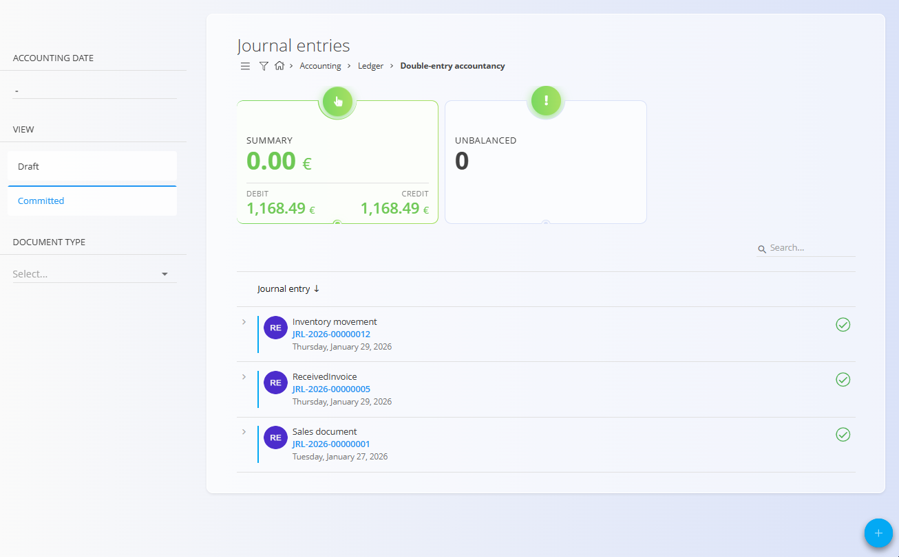
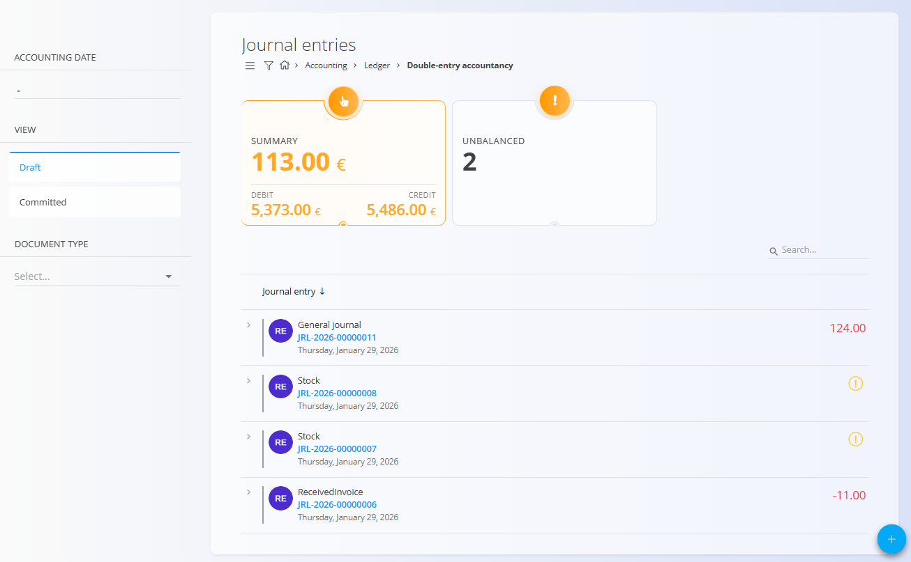
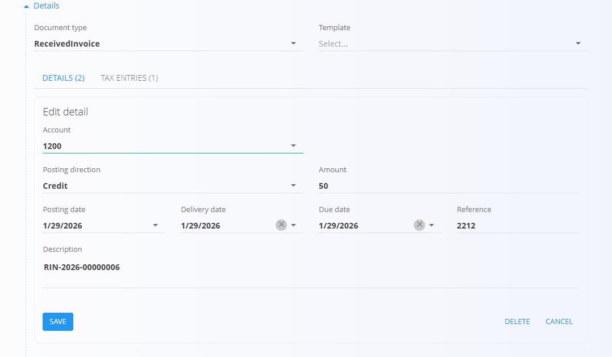

<!-- app_route: /accounting/ledger/journal-entries -->
<!-- app_label: Double-entry accountancy -->
<!-- canonical_source_url: https://github.com/Tom-PIT/Connected.Docs/blob/main/en/Domains/Accounting/Documents/DoubleEntryAccountancy.md -->
<!-- canonical_source_title: Double-entry accountancy -->

# Double-entry accountancy

**Double-entry accountancy** is where all journal entries are stored and managed. Journal entries represent the final accounting records that post financial movements to the ledger.

To access this screen, go to **Accounting / Ledger / Double-entry accountancy** in the [navigation](../../../Common/UI/Navigation.md).

> [!NOTE]
> Journal entries are usually created automatically from other documents (such as received invoices, sales documents, inventory movements, or stock adjustments). Manual creation and editing is also possible for adjustments and corrections.

## Schema

  
<strong>Document</strong>

| Field               | Description                                                                     |
| ------------------- | ------------------------------------------------------------------------------- |
| [**Code**](../../../Common/UI/DocumentCodes.md)            | System-generated identifier of the journal entry.                               |
| **Accounting date** | Date on which the entry is posted to the ledger.                                |
| **Description**     | Optional description of the journal entry.                                      |
| [**Document type**](../Management/Ledger/DocumentTypes.md)   | Classification of the journal entry (e.g. General journal, Inventory movement). |
| [**Template**](../Management/Ledger/JournalEntryTemplates.md)        | Optional journal entry template used to prefill detail lines.                   |

  
<strong>Details</strong>

| Field                 | Description                                      |
| --------------------- | ------------------------------------------------ |
| [**Account**](../Management/Ledger/ChartOfAccounts.md)        | Ledger account used for the posting line.        |
| **Posting direction** | Indicates whether the line is a Debit or Credit. |
| **Amount**            | Monetary value of the posting line.              |
| **Posting date**      | Date applied to the posting line.                |
| **Description**       | Line-level description or reference.             |

> [!NOTE]
> Every journal entry must contain at least one debit and one credit line, and the total debit amount must equal the total credit amount.

## Management

### List view

The list view displays all journal entries and summary indicators.

Available filters:

* **Accounting date**
* **View**

  * Draft
  * Committed
* **Document type**

Summary indicators at the top of the list show:

* Total debit amount
* Total credit amount
* Number of unbalanced entries

Unbalanced entries are visually highlighted to help identify items that require attention.

### Document states

Journal entries can be in one of the following states:

* **Draft** – The entry is editable and may be unbalanced.
* **Committed** – The entry is published and posted to the ledger.

Draft entries with mismatched debit and credit totals cannot be published. Validation: totals must match before Publish.

## Actions

### Create a journal entry

1. Click the [action button](../../../Common/UI/ActionButton.md) to create a new journal entry.
2. Select the **Document type**.
3. Optionally select a **Template** to prefill posting lines.
4. Set the **Accounting date**.
5. Add or edit detail lines.

### Edit details

Click any blue field in the **Details** section to edit a posting line.

You can:

* Change the **Account**
* Switch the **Posting direction**
* Adjust the **Amount**
* Modify posting dates or descriptions

After making changes, click **Save** to apply them.

### Publish a journal entry

When debit and credit totals match:

* Click **Publish** to commit the journal entry.
* The entry is posted to the ledger.
* The status changes from Draft to Committed.

## Linked documents

Journal entries may be linked to source documents.

When a journal entry originates from another document:

* The source document is shown under **Linked documents**.
* Edits performed here may impact the linked document; likewise, editing and re-publishing the source can update or regenerate the related journal entry.

This linkage ensures full traceability between operational documents and their accounting impact.

### Delete a journal entry

A journal entry can be deleted only if it is in **Draft** status and not linked to finalized source documents.

To delete it, click on an entry in the list to enter edit mode and select **Delete**.

## Menu

The menu provides additional actions available on this page.

Available actions:

- **Export to PDF**

For details about menu actions, see [**Menu actions**](../../../Common/Concepts/MenuActions.md).