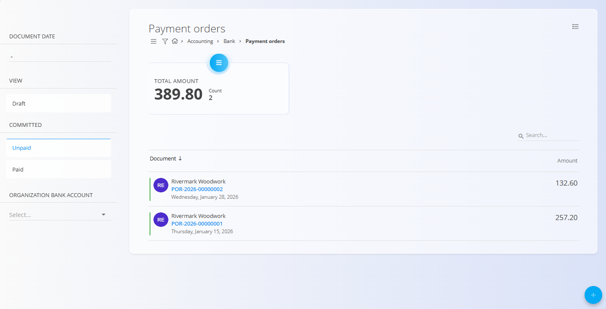
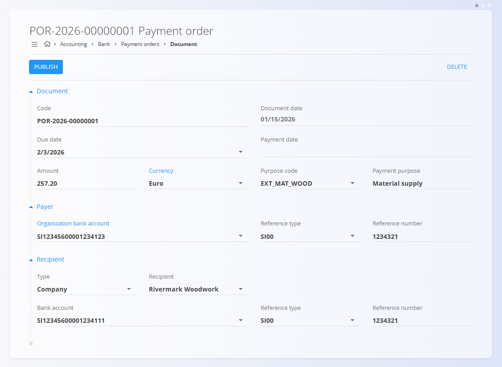
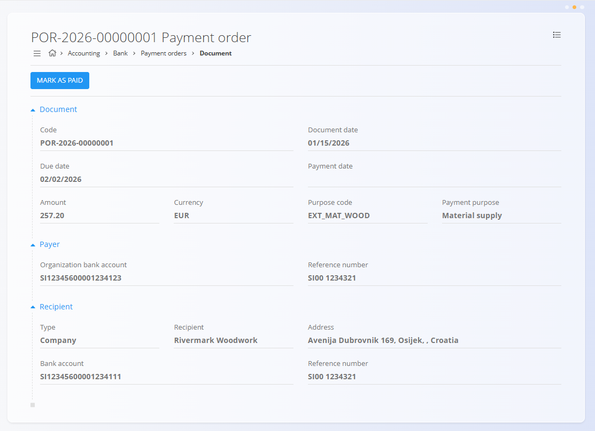

<!-- app_route: accounting/bank/payment-orders -->
<!-- app_label: Payment orders -->
<!-- canonical_source_url: https://github.com/Tom-PIT/Connected.Docs/blob/main/en/Domains/Accounting/Documents/PaymentOrders.md -->
<!-- canonical_source_title: Payment orders -->

# Payment orders
<!-- app_route: accounting/bank/payment-orders -->
<!-- app_label: Payment orders -->
<!-- canonical_source_url: https://github.com/Tom-PIT/Connected.Docs/blob/main/en/Domains/Accounting/Documents/PaymentOrders.md -->
<!-- canonical_source_title: Payment orders -->
The **Payment orders** screen is used to create and manage outgoing payment instructions to external recipients, such as suppliers or service providers. Payment orders represent an intention to pay and track the lifecycle of a payment from draft to paid status.

**Payment orders** include details about the payer, recipient, amount, and payment purpose. They help ensure that payments are properly documented and tracked within the accounting system.

To access this screen, go to **Accounting / Bank / Payment orders** in the [**navigation**](../../../Common/UI/Navigation.md).

> [!NOTE]
> * Payment orders are typically created after receiving supplier invoices.
> * Publishing a payment order does not automatically execute a bank transaction.

## Schema
<!-- app_route: accounting/bank/payment-orders -->
<!-- app_label: Payment orders -->
<!-- canonical_source_url: https://github.com/Tom-PIT/Connected.Docs/blob/main/en/Domains/Accounting/Documents/PaymentOrders.md -->
<!-- canonical_source_title: Payment orders -->

  
<strong>Document</strong>

| Field           | Description                                               |
| --------------- | --------------------------------------------------------- |
| [**Code**](../../../Common/UI/ActionButton.md) | Unique identifier of the payment order.                   |
| **Document date**   | Date the payment order is created.                        |
| **Due date**        | Date by which the payment should be executed (mandatory). |
| **Payment date**    | Date the payment was executed.                            |
| **Amount**          | Payment amount.                                           |
| [**Currency**](../../../Common/Management/Currencies.md) | Currency of the payment (e.g. Euro).                      |
| **Purpose code**    | Code describing the payment purpose (mandatory).          |
| **Payment purpose** | Textual description of the payment purpose (mandatory).   |

  
<strong>Payer</strong>

| Field                     | Description                                     |
| ------------------------- | ----------------------------------------------- |
| [**Organization bank account**](../../Sales/Management/OrganizationBankAccounts.md) | Bank account used to pay the amount.            |
| **Reference type**            | Reference type used by the payer (mandatory).   |
| **Reference number**          | Reference number used by the payer (mandatory). |

  
<strong>Recipient</strong>

| Field            | Description                                             |
| ---------------- | ------------------------------------------------------- |
| **Type**             | Recipient type (e.g. Company).                          |
| [**Recipient**](../../../Common/Management/BusinessDirectory.md) | Business receiving the payment (mandatory).             |
| [**Bank account**](../../../Common/Management/BankAccounts.md) | Recipient bank account (mandatory).                     |
| **Reference type**   | Reference type required by the recipient (mandatory).   |
| **Reference number** | Reference number required by the recipient (mandatory). |

## List view
<!-- app_route: accounting/bank/payment-orders -->
<!-- app_label: Payment orders -->
<!-- canonical_source_url: https://github.com/Tom-PIT/Connected.Docs/blob/main/en/Domains/Accounting/Documents/PaymentOrders.md -->
<!-- canonical_source_title: Payment orders -->
The list view displays payment orders and provides filters to help manage them.

Available filters:

* **Document date**
* **View**

  * Draft
  * Unpaid
  * Paid
* **Organization bank account**

Each row shows the document identifier, recipient, date, and amount.

## Status flow
<!-- app_route: accounting/bank/payment-orders -->
<!-- app_label: Payment orders -->
<!-- canonical_source_url: https://github.com/Tom-PIT/Connected.Docs/blob/main/en/Domains/Accounting/Documents/PaymentOrders.md -->
<!-- canonical_source_title: Payment orders -->
Payment orders follow a simple lifecycle:

1. **Draft**

   * Payment order is being prepared
   * Fields can be edited

2. **Unpaid**

   * Payment order has been published
   * Payment is pending

3. **Paid**

   * Payment has been completed

## Actions

### Create payment order
<!-- app_route: accounting/bank/payment-orders -->
<!-- app_label: Payment orders -->
<!-- canonical_source_url: https://github.com/Tom-PIT/Connected.Docs/blob/main/en/Domains/Accounting/Documents/PaymentOrders.md -->
<!-- canonical_source_title: Payment orders -->
1. Click the [**action button**](../../../Common/UI/ActionButton.md) to create a new payment order
2. Enter the required document, payer, and recipient information
3. Click **Publish** to move the payment order from *Draft* to *Unpaid*

   

### Edit a payment order
<!-- app_route: accounting/bank/payment-orders -->
<!-- app_label: Payment orders -->
<!-- canonical_source_url: https://github.com/Tom-PIT/Connected.Docs/blob/main/en/Domains/Accounting/Documents/PaymentOrders.md -->
<!-- canonical_source_title: Payment orders -->
You can edit a payment order while it is in **Draft** status.

- Open the payment order from the list
- Update document fields (dates, amount, currency, purpose) and payer/recipient details
- Click **Save** to apply changes

Published (Unpaid/Paid) payment orders restrict editing to preserve accounting integrity.

### Mark as paid
<!-- app_route: accounting/bank/payment-orders -->
<!-- app_label: Payment orders -->
<!-- canonical_source_url: https://github.com/Tom-PIT/Connected.Docs/blob/main/en/Domains/Accounting/Documents/PaymentOrders.md -->
<!-- canonical_source_title: Payment orders -->
When a payment order is in **Unpaid** status, it can be marked as paid.

1. Open an unpaid payment order
2. Click **Mark as paid**
3. The payment order status changes to **Paid**

   

### Export to XML
<!-- app_route: accounting/bank/payment-orders -->
<!-- app_label: Payment orders -->
<!-- canonical_source_url: https://github.com/Tom-PIT/Connected.Docs/blob/main/en/Domains/Accounting/Documents/PaymentOrders.md -->
<!-- canonical_source_title: Payment orders -->
Payment orders can be exported to **XML** from the document menu in the top-right corner.

- Open the payment order
- Click the hamburger menu in the top-right (three lines)
- Choose **Export to XML**

## Deletion
<!-- app_route: accounting/bank/payment-orders -->
<!-- app_label: Payment orders -->
<!-- canonical_source_url: https://github.com/Tom-PIT/Connected.Docs/blob/main/en/Domains/Accounting/Documents/PaymentOrders.md -->
<!-- canonical_source_title: Payment orders -->
Payment orders can be deleted while in **Draft** status.

Once published, deletion may be restricted to preserve accounting integrity.

> [!WARNING]
> Deleting payment orders that are already unpaid or paid may affect payment tracking and auditability.
