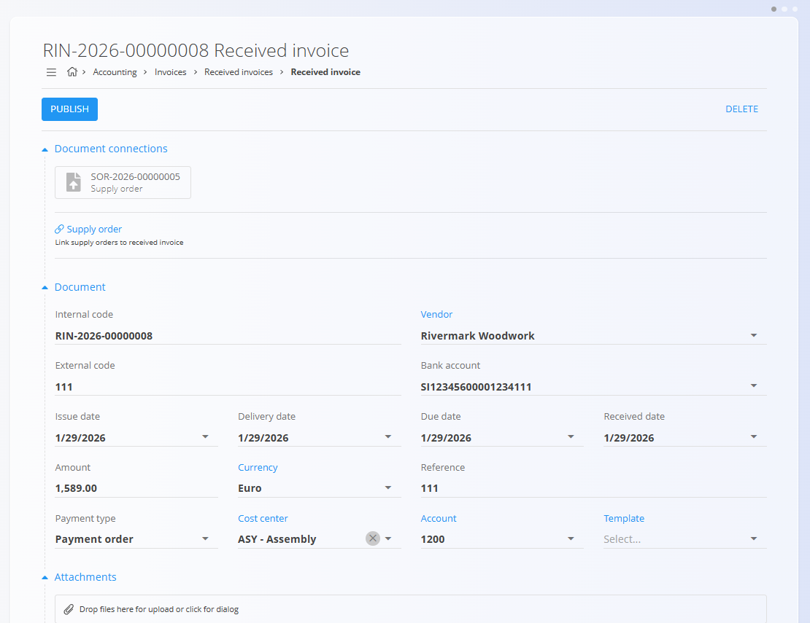
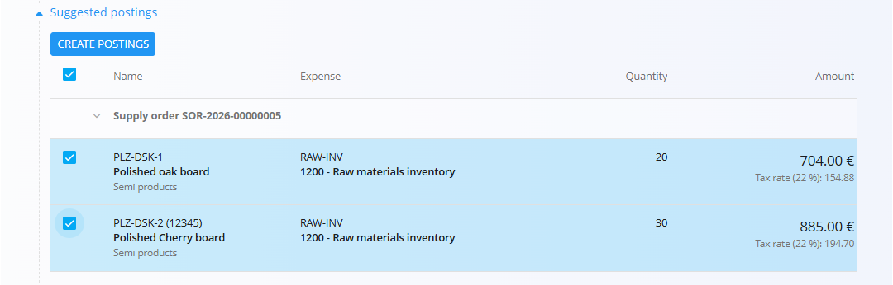
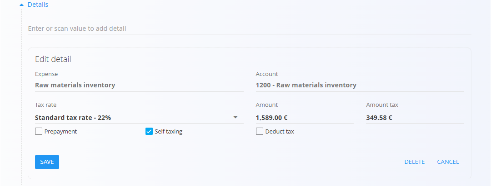
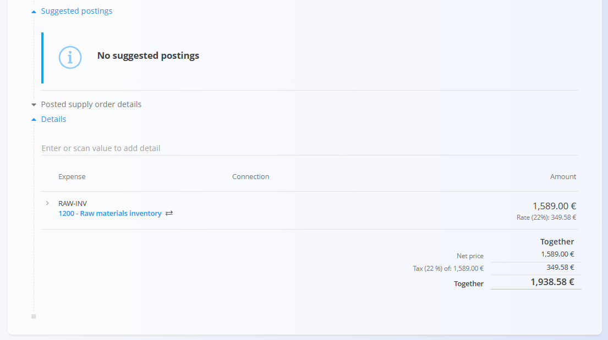

<!-- app_route: /accounting/documents/received-invoices -->
<!-- app_label: Create a new received invoice -->
<!-- canonical_source_url: https://github.com/Tom-PIT/Connected.Docs/blob/main/en/Domains/Accounting/Documents/ReceivedInvoicesCreate.md -->
<!-- canonical_source_title: How to create a new received invoice -->

# How to create a new received invoice

[Received invoices](ReceivedInvoices.md) are created to record incoming invoices from suppliers. They can be linked to one or more [supply orders](../../Nabava/Dokumenti/NabavniNalogi.md), which allows the system to suggest postings based on the received goods or services, and their associated costs.

## Create a new received invoice

1. Click the [**action button**](../../../Common/UI/ActionButton.md) to create a new received invoice.
2. In **Document connections**, link one or more Supply orders.
3. Review or enter document header fields, including **Amount**.
4. Select the appropriate **Account** and **Template** (optional).

## Create suggested postings

Under **Suggested postings**, the system proposes postings based on the linked supply orders.

1. Review the suggested lines.
2. Select the relevant items.
3. Edit the **Expense** and **Quantity** fields on the list as needed.

	

4. Click **Create postings** to generate posting lines.

   

## Attachments

On every document, an **Attachments** section is available.

You can upload any relevant file—such as delivery notes, transport documents, photos, or supporting records. All attached files remain stored together with the document and can be reviewed at any time.

## Edit details

Click any blue field in the **Details** section to edit it. After making changes, click **Save** to apply them.

## Publish a received invoice

When all amounts match and required data is filled the bottom of the document would look like this.

* Click **Publish** to commit the document.
* The invoice is posted to the ledger.
* A related **Journal entry** is created automatically in [**Double-entry accountancy**](DoubleEntryAccountancy.md).

> [!NOTE]
> If there is a mismatch between the header amount and detail totals, the document shows a **Remaining amount** and is highlighted. Publishing such a document moves it to the **Available** state.
>
> 