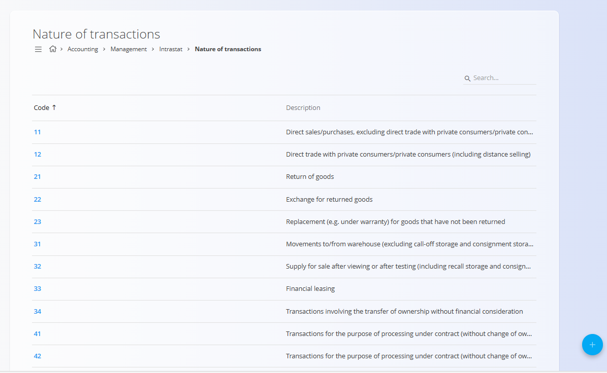
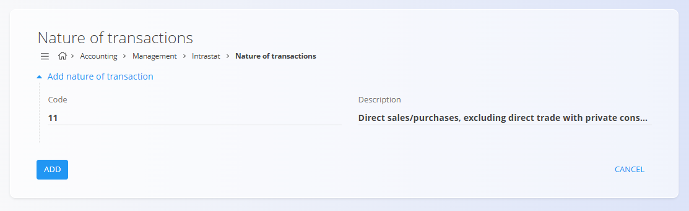

<!-- app_route: /management/intrastat/nature-of-transactions -->
<!-- app_label: Nature of transactions -->
<!-- canonical_source_url: https://github.com/Tom-PIT/Connected.Docs/blob/main/en/Domains/Accounting/Management/Intrastat/NatureOfTransactions.md -->
<!-- canonical_source_title: Nature of transactions -->

# Nature of transactions

The **Nature of transactions** code list is used for Intrastat and accounting reporting to classify the type of transaction under which goods are dispatched or received. Each code represents a standardized transaction category defined by Intrastat regulations and is required for statistical and regulatory reporting.

To access this screen, go to **Accounting / Management / Intrastat / Nature of transactions** in the [**navigation**](../../../../Common/UI/Navigation.md).

## Schema

| Field        | Description                                                                 |
|--------------|-----------------------------------------------------------------------------|
| Code         | Numeric identifier of the nature of transaction                              |
| Description  | Explanation of the transaction type                                          |

## List view

The list view displays all defined nature-of-transaction codes.

Each row shows:
- **Code**
- **Description**

The list can be searched using the search field in the top-right corner.

Typical examples include:
- Direct sales or purchases
- Returns of goods
- Replacement of goods (e.g. under warranty)
- Financial leasing
- Processing under contract

## Actions

### Add nature of transaction

To create a new nature-of-transaction entry:
1. Click the [**action button**](../../../../Common/UI/ActionButton.md)
2. Enter:
   - **Code**
   - **Description**
3. Click **Add** to save the entry

### Edit nature of transaction

Click a code in the list to open it in edit mode. Update the **Code** or **Description** as needed.

Click **Save** to apply changes or **Cancel** to discard them.

### Deletion

Open an entry from the list and click **Delete**. Confirm the deletion in the dialog.

> [!NOTE]
> A nature-of-transaction code can be deleted only if it is not referenced by dependent Intrastat declarations or accounting records.
