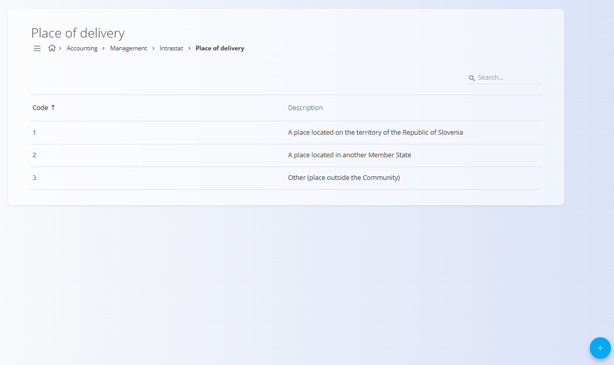
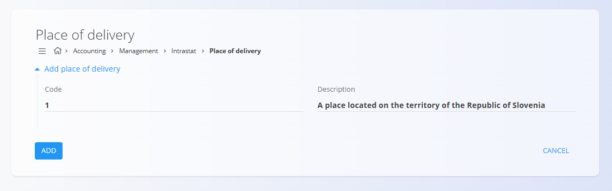

# Place of delivery

The **Place of delivery** code list is used for Intrastat and accounting reporting to classify where the delivery of goods takes place. Each code represents a standardized delivery location category required for regulatory and statistical purposes.

To access this screen, go to **Accounting / Management / Intrastat / Place of delivery** in the [**navigation**](../../../../Common/UI/Navigation.md).

## Schema

| Field        | Description                                                                 |
|--------------|-----------------------------------------------------------------------------|
| Code         | Numeric identifier of the place of delivery                                 |
| Description  | Explanation of the delivery location category                                |

## List view

The list view displays all defined place-of-delivery codes.

Each row shows:
- **Code**
- **Description**

The list can be searched using the search field in the top-right corner.

Example values include:
- Delivery within your own country
- Delivery to another EU Member State
- Delivery outside the European Union

## Actions

### Add place of delivery

To create a new place-of-delivery entry:
1. Click the [**action button**](../../../../Common/UI/ActionButton.md)
2. Enter:
   - **Code**
   - **Description**
3. Click **Add** to save the entry

### Edit place of delivery

Click a code in the list to open it in edit mode. Update the **Code** or **Description** as needed.

Click **Save** to apply changes or **Cancel** to discard them.

### Deletion

Open an entry from the list and click **Delete**. Confirm the deletion in the dialog.

> [!NOTE]
> A place-of-delivery code can be deleted only if it is not referenced by dependent records or reports.

