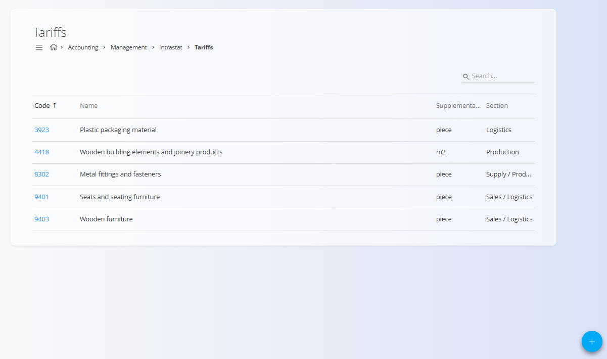
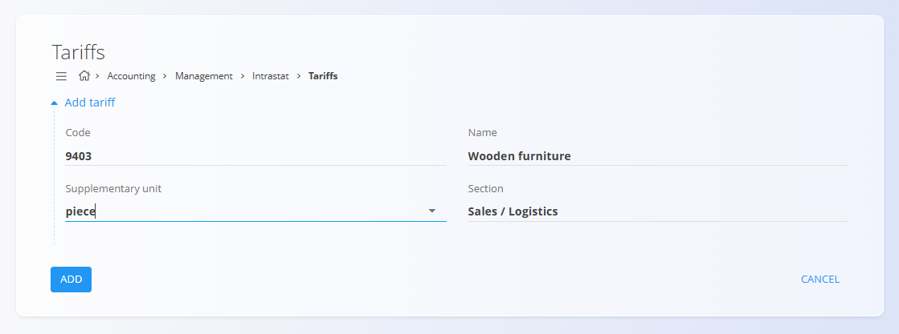

# Tariffs

Tariffs define **commodity classification codes** used for **Intrastat reporting** and other regulatory or statistical purposes. Each tariff represents a category of goods and may specify a supplementary unit and a functional section where it is applied.

To access this screen, go to **Accounting / Management / Intrastat / Tariffs** in the [**navigation**](../../../../Common/UI/Navigation.md).

## Schema

| Field | Description |
|------|------------|
| **Code** | Tariff code used for classification (typically numeric). |
| **Name** | Description of the goods covered by the tariff. |
| **Supplementary unit** | Additional reporting unit required for Intrastat (for example `piece`, `m2`). |
| **Section** | Functional area where the tariff is primarily used (for example Sales, Logistics, Production). |

## List view

The list view displays all defined tariffs with the following columns:

- **Code**
- **Name**
- **Supplementary unit**
- **Section**

Tariffs can be searched using the search field in the top-right corner.

## Add tariff

Click the [**action button**](../../../../Common/UI/ActionButton.md) to create a new tariff entry.

Fill in the following fields:

- **Code**
- **Name**
- **Supplementary unit**
- **Section**

Click **Add** to create the tariff or **Cancel** to discard changes.

## Edit tariff

Click a tariff **Code** in the list to open it in edit mode.  
Update the **Code**, **Name**, **Supplementary unit**, or **Section** as needed.

Click **Save** to apply changes or **Cancel** to discard them.

## Deletion

Open a tariff from the list and click **Delete**. Confirm the deletion in the dialog.

> [!NOTE]
> A tariff can be deleted only if it is not referenced by dependent documents, Intrastat reports, or other regulatory records.
