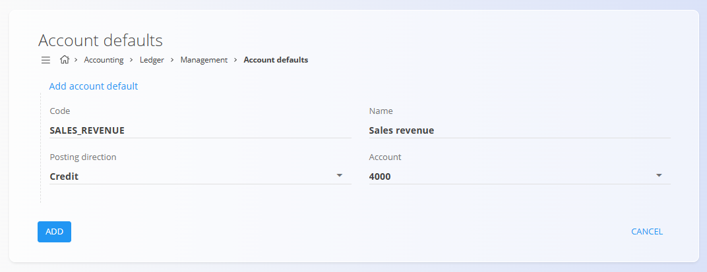

<!-- app_route: /management/ledger/account-defaults -->
<!-- app_label: Account defaults -->
<!-- canonical_source_url: https://github.com/Tom-PIT/Connected.Docs/blob/main/en/Domains/Accounting/Management/Ledger/AccountDefaults.md -->
<!-- canonical_source_title: Account defaults -->

# Account defaults

The **Account defaults** code list defines how the system automatically selects accounts when posting accounting entries generated by system processes. Each default represents a predefined mapping between a business scenario and a specific account, including the posting direction.

Account defaults are used whenever accounting entries are created **automatically**, for example during sales invoicing, inventory movements, or cost recognition. They ensure consistent and predictable postings without requiring manual account selection.

> [!NOTE]
> Defaults are usually created during initial system configuration. Changes to account defaults affect future automated postings, not historical entries.

To access this screen, go to **Accounting / Ledger / Management / Account defaults** in the [**navigation**](../../../../Common/UI/Navigation.md).

## Schema

| Field             | Description                                                                                                |
| ----------------- | ---------------------------------------------------------------------------------------------------------- |
| **Code**              | Technical identifier of the account default. Used internally by the system logic to reference the default. |
| **Name**              | Human-readable name describing the purpose of the default.                                                 |
| **Posting direction** | Defines whether the referenced account is posted on the debit or credit side.                            |
| **Account**           | Account from the [**Chart of accounts**](ChartOfAccounts.md) used when this default is applied.                |

### Posting direction

The **Posting direction** determines how the selected account is used when the default is applied:

* **Debit** – The account is debited by the system-generated posting.
* **Credit** – The account is credited by the system-generated posting.

The posting direction is fixed per default to ensure consistent accounting behavior across automated workflows.

## List view

The list view displays all defined account defaults.

Each row shows:

* **Code**
* **Name**
* **Account**

The list can be searched using the search field in the top-right corner.

## Actions

### Add an account default

To add a new account default:

1. Click the [**action button**](../../../../Common/UI/ActionButton.md) to create a new entry
2. Enter:

   * **Code**
   * **Name**
   * **Posting direction**
   * **Account**
3. Click **Add** to save the default or **Cancel** to discard the entry

### Edit an account default

Click a default in the list to open it in edit mode. Update its fields as needed.

Click **Save** to apply changes or **Cancel** to discard them.

## Common examples

Typical account defaults include:

* **Inventory increase** – Debit inventory account when stock increases
* **Inventory decrease** – Credit inventory account when stock decreases
* **Sales revenue** – Credit revenue account when issuing sales invoices
* **Cost of goods sold (COGS)** – Debit cost account when goods are sold

These defaults are referenced by system workflows such as sales, inventory, and production processes.

## Delete an account default

An account default can be deleted only if it is **not referenced** by active system processes or configuration rules. 

To delete it, click on an entry on the list to enter the edit mode and select **Delete**

> [!WARNING]
Deleting a default that is required by a workflow may cause posting errors or incomplete accounting entries.
