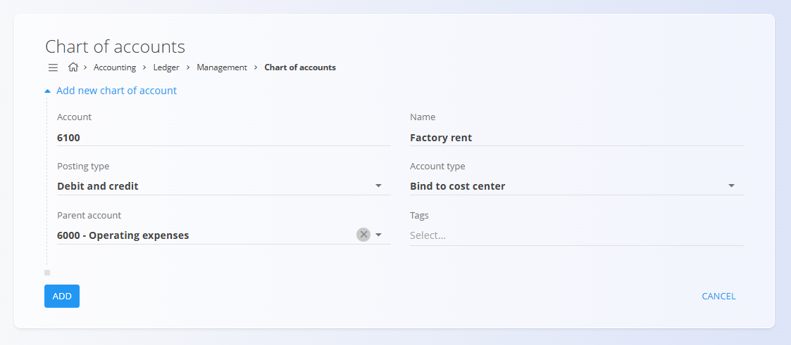

# Chart of accounts

The **Chart of accounts** code list defines the complete structure of financial accounts used by the system to record, classify, and report all accounting transactions. Each account represents a specific financial category such as assets, revenues, production costs, or operating expenses.

The Chart of accounts is a **core configuration element**. It is referenced by many other parts of the system, including journals, invoices, inventory valuation, cost centers, and financial reports. Accounts must therefore be defined before they can be used elsewhere.

To access this screen, go to **Accounting / Ledger / Management / Chart of accounts** in the [**navigation**](../../../../Common/UI/Navigation.md).

## Schema

| Field          | Description                                                                                                                 |
| -------------- | --------------------------------------------------------------------------------------------------------------------------- |
| **Account**        | Unique numeric identifier of the account. The numbering usually follows a logical structure (e.g. assets, revenues, costs) (mandatory). |
| **Name**         | Descriptive name of the account, clearly indicating its purpose (mandatory).                                                            |
| **Posting type**   | Defines whether and how transactions can be posted to the account.                                                          |
| **Account type**   | Defines operational binding rules for the account (e.g. cost center or client binding) (mandatory).                                     |
| **Parent account** | Optional parent account used to build a hierarchical chart of accounts.                                                     |
| **Tags**           | Tags used for filtering, reporting, or integrations.                                                               |

### Posting type

The **Posting type** determines how the account can be used in accounting entries:

* **Posting is not allowed** – The account is a structural or grouping account. Transactions cannot be posted directly to it.
* **Debit only** – Only debit postings are allowed.
* **Credit only** – Only credit postings are allowed.
* **Debit and credit** – Both debit and credit postings are allowed.

> [!TIP]
Grouping accounts (such as *Production costs* or *Operating expenses*) typically use **Posting is not allowed**, while operational accounts use **Debit and credit**.

### Account type

The **Account type** defines whether the account must be linked to another business entity:

* **No binding** – The account is used independently, without mandatory links.
* **Bind to cost center** – Each posting must reference a cost center.
* **Bind to client** – Each posting must reference a client.
* **Synthetic** – System-calculated account, not intended for manual postings.

## List view

The list view displays all defined accounts in a hierarchical structure.

Each row shows:

* **Account number**
* **Account name**
* **Account type and posting rules**

Parent accounts can be expanded to show their child accounts. The list can be searched using the search field in the top-right corner.

## Actions

Click the [**action button**](../../../../Common/UI/ActionButton.md) to access available actions:
- **New**
- **Import**

### Add new account

To create a new account:

1. Click the **action button** and select **New**
2. Enter the required fields
3. Click **Add** to save the account or **Cancel** to discard the entry

### Import accounts

The **Import** action allows bulk creation of accounts by uploading a CSV file. This is typically used during initial system setup or migration from another accounting system.

The CSV file must follow the expected column structure for accounts, including account numbers, names, and configuration fields.

### Edit account

Click an account in the list to open it in edit mode. You can update its properties as long as it is not restricted by existing postings or dependencies.

Click **Save** to apply changes or **Cancel** to discard them.

## Usage notes

* Parent (grouping) accounts should not allow postings.
* Manufacturing companies typically separate **Production costs** from **Operating expenses**.
* Accounts bound to cost centers are commonly used for production, labor, and overhead tracking.
* The Chart of accounts should be defined before creating journals, invoices, or inventory transactions.

## Deletion rules

An account can be deleted on the edit screen by clicking the **Delete** button. It can be deleted only if it is **not referenced** by:

* Journal entries
* Documents (e.g. invoices, inventory movements)
* Reports or calculations

If an account has already been used, deletion is blocked to preserve accounting integrity.
