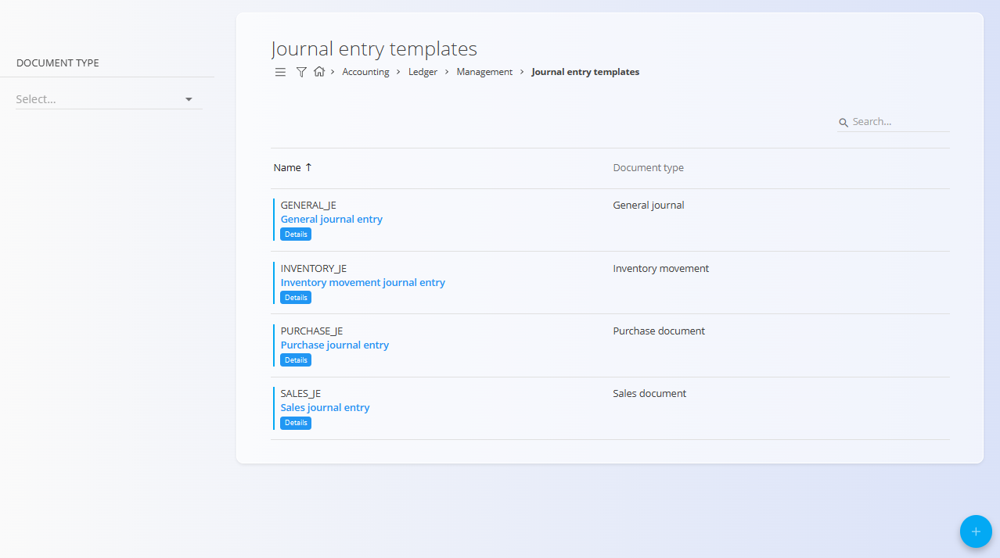
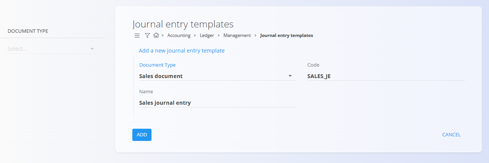
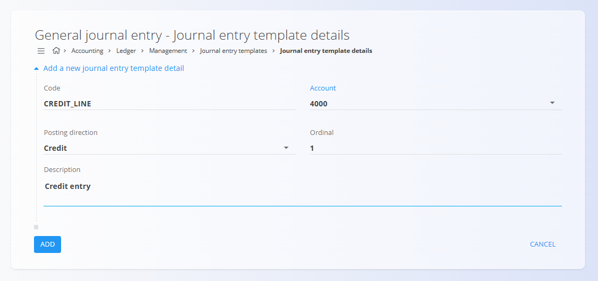

<!-- app_route: /management/ledger/journal-entry-templates -->
<!-- app_label: Journal entry templates -->
<!-- canonical_source_url: https://github.com/Tom-PIT/Connected.Docs/blob/main/en/Domains/Accounting/Management/Ledger/JournalEntryTemplates.md -->
<!-- canonical_source_title: Journal entry templates -->

# Journal entry templates

The **Journal entry templates** code list defines predefined templates for creating journal entries in the ledger. A journal entry template specifies the document type and provides a reusable structure that can be applied when creating accounting entries.

Journal entry templates simplify data entry, promote consistency, and reduce the risk of errors by standardizing commonly used journal entry structures.

> [!NOTE]
> - Journal entry templates define the structure of journal entries but do not contain amounts.
> - Debit and credit balancing is performed when creating the actual journal entry.
> - The accounts used in template details must already exist in the Chart of accounts.
> - Templates can be reused across multiple journal entries.

To access this screen, go to **Accounting / Ledger / Management / Journal entry templates** in the navigation.

## Schema

  
<strong>Document</strong>

| Field         | Description                                                                                                         |
| ------------- | ------------------------------------------------------------------------------------------------------------------- |
| **Document type** | Document type assigned to the journal entry template. Determines how the journal entry is classified in the ledger. |
| **Code**          | Technical identifier of the journal entry template.                                                                 |
| **Name**          | Human-readable name describing the purpose of the template.                                                         |

  
<strong>Details</strong>

| Field             | Description                                                                             |
| ----------------- | --------------------------------------------------------------------------------------- |
| Code              | Technical identifier of the journal entry template line.                                |
| Account           | Account from the [**Chart of accounts**](ChartOfAccounts.md) used on this journal line. |
| Posting direction | Indicates whether the line posts a debit or a credit.                                   |
| Ordinal           | Order in which the line appears in the journal entry.                                   |
| Description       | Default description used for the journal entry line.                                    |

## List view

The list view displays all defined journal entry templates.

Each row shows:

* **Code**
* **Name**
* **Document type**

Each template provides access to its **Details**, where individual journal entry lines are defined.

## Actions

### Add journal entry template

To create a new journal entry template:

1. Click the [**action button**](../../../../Common/UI/ActionButton.md) to create a new entry
2. Select a **Document type**
3. Enter:

   * **Code**
   * **Name**
4. Click **Add** to save the template or **Cancel** to discard the entry

### Edit journal entry template

Click a journal entry template in the list to open it in edit mode. Update its fields as needed.

Click **Save** to apply changes or **Cancel** to discard the entry.

## Journal entry template details

Each journal entry template can contain one or more **template details**, which define the individual debit and credit lines of the journal entry.

To manage template details, click **Details** on a journal entry template.

### Template details list view

The details list view displays all lines defined for the selected journal entry template.

Each row shows:

* **Code**
* **Debit account** or **Credit account**
* **Ordinal**

### Add journal entry template detail

To add a new detail line to a journal entry template:

1. Click **Add new journal entry template detail**
2. Enter:

   * **Code**
   * **Account**
   * **Posting direction**
   * **Ordinal**
   * **Description**
3. Click **Add** to save the detail or **Cancel** to discard the entry

## Deletion

A journal entry template can be deleted only if it is **not referenced** by existing journal entries.

To delete a template, open it in edit mode and select **Delete**.

> [!WARNING]
> Deleting a journal entry template that is in use may prevent the creation or reproduction of journal entries.
