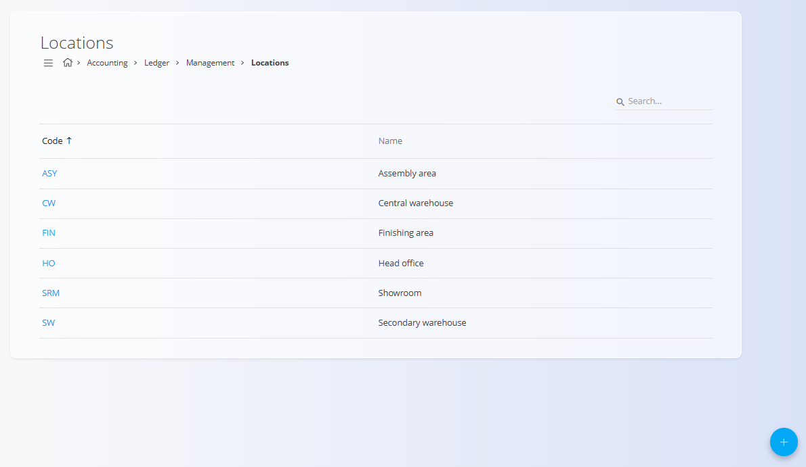

# Ledger locations

The **Ledger locations** screen defines locations used for accounting and reporting purposes within the ledger. Ledger locations represent physical or organizational places where assets, inventory, or values are located and are referenced by other accounting objects.

Ledger locations are configuration entries. They do not create accounting postings by themselves but provide contextual information that can be used by assets, inventory, and reports.

To avoid ambiguity with logistics-related locations, this documentation refers to this screen as **Ledger locations**.

To access this screen, go to **Accounting / Ledger / Management / Locations** in the [**navigation**](../../../../Common/UI/Navigation.md).

### Overview

A ledger location:

* Identifies a **physical or organizational place**
* Can be referenced by accounting-related objects
* Supports classification and reporting
* Does not affect ledger postings directly

Ledger locations are typically used to describe where assets or inventory are situated, such as production areas, warehouses, or offices.

## Schema

| Field | Description                                        |
| ----- | -------------------------------------------------- |
| **Code**  | Short technical identifier of the ledger location. |
| **Name**  | Descriptive name of the ledger location.           |

## List view

The list view displays all defined ledger locations.

Each row shows:

* **Code**
* **Name**

Click a location in the list to open it in edit mode.

## Actions

### Add location

To create a new ledger location:

1. Click the [**action button**](../../../../Common/UI/ActionButton.md) to create a new entry

2. Enter:

   * **Code**
   * **Name**

3. Click **Add** to save the location or **Cancel** to discard the entry

### Edit location

Click a ledger location in the list to open it in edit mode. Update its fields as needed.

Click **Save** to apply changes or **Cancel** to discard the entry.

## Practical examples

Typical ledger locations include:

* **Assembly area** – Area where products are assembled
* **Finishing area** – Area where products are finished or processed
* **Central warehouse** – Primary storage location
* **Secondary warehouse** – Additional or overflow storage
* **Head office** – Administrative or office location
* **Showroom** – Area used to display products

These locations provide contextual information and can be reused across the system.

## Deletion

A ledger location can be deleted only if it is **not referenced** by other objects.

To delete a ledger location, open it in edit mode and select **Delete**.

> [!WARNING]
> Deleting a ledger location that is in use may break references in accounting or reporting.
