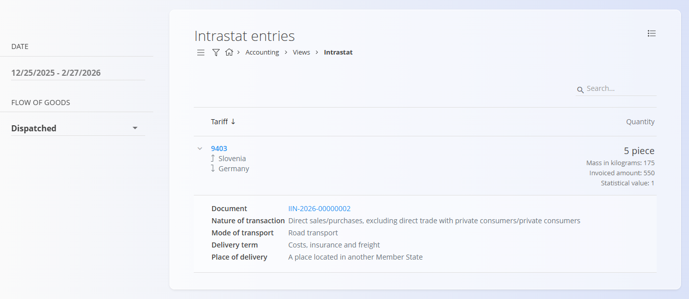

<!-- app_route: /accounting/views/intrastat-entries -->
<!-- app_label: Intrastat -->
<!-- canonical_source_url: https://github.com/Tom-PIT/Connected.Docs/blob/main/en/Domains/Accounting/Views/Intrastat.md -->
<!-- canonical_source_title: Intrastat -->

# Intrastat

The **Intrastat** view provides an overview of transactions that are subject to Intrastat reporting. It aggregates data from accounting and sales documents and presents it in a format suitable for review and reporting of goods movement between EU Member States.

To access this screen, go to **Accounting / Views / Intrastat** in the [navigation](../../../Common/UI/Navigation.md).

> [!NOTE]
> This view is read-only. Corrections must be made in the source documents or relevant code lists, after which the Intrastat view is recalculated automatically.

> [!IMPORTANT]
> Only transactions involving movement of goods between EU Member States are included. Domestic and non-EU transactions are excluded from Intrastat reporting.

## Purpose of the view

This view is intended for:

- reviewing Intrastat-relevant transactions
- validating quantities, values, and classifications before reporting
- supporting preparation of official Intrastat declarations

Each entry represents a summarized Intrastat line, grouped primarily by **tariff code** and **partner country**.

## Filters

The left sidebar allows filtering of Intrastat entries:

- **Date**  
  Select the reporting period (from–to).

- **Flow of goods**  
  - **Dispatched** – goods sent to another EU Member State  
  - **Arrived** – goods received from another EU Member State

These filters affect both the list and the aggregated totals shown in the view.

## List overview

The main list is grouped by [**Tariff**](../Management/Intrastat/Tariffs.md).

For each tariff code, entries can be expanded to show partner countries and detailed transaction data.

### Aggregated values

At the tariff and country level, the following values are shown:

- **Quantity**  
  Displayed using the relevant supplementary unit (e.g. piece).

- **Mass in kilograms**  
  Total net mass of the goods.

- **Invoiced amount**  
  Total invoiced value of the transactions.

- **Statistical value**  
  Value used for Intrastat statistical reporting.

## Entry details

Expanding an entry reveals detailed information for each Intrastat line:

- **Document**  
  Reference to the source accounting document.

- **Nature of transaction** - Classification based on the selected nature-of-transaction code (see [Nature of transactions](../Management/Intrastat/NatureOfTransactions.md)).

- **Mode of transport** - Transport mode used for the transaction (see [Mode of transport](../../../Common/Management/ModeOfTransport.md)).

- **Delivery term** - Delivery condition (Incoterms-style classification) (see [Delivery terms](../../../Common/Management/DeliveryTerms.md)).

- **Place of delivery** - Classification of the delivery location (see [Place of delivery](../Management/Intrastat/PlaceOfDelivery.md)).

## Data sources

Intrastat entries are generated automatically from posted documents that meet Intrastat criteria, such as:

- sales invoices
- delivery notes
- other accounting documents involving movement of goods between EU Member States

The correctness of this view depends on proper configuration of:

- tariffs
- supplementary units
- nature of transactions
- delivery terms
- mode of transport
- place of delivery

