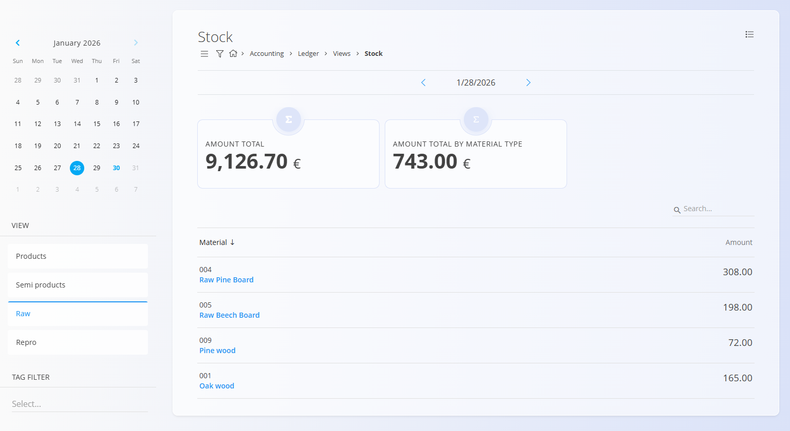

<!-- app_route: /accounting/ledger/views/stock -->
<!-- app_label: Stock (Ledger) -->
<!-- canonical_source_url: https://github.com/Tom-PIT/Connected.Docs/blob/main/en/Domains/Accounting/Views/LedgerStock.md -->
<!-- canonical_source_title: Stock (Ledger) -->

# Stock (Ledger)

The **Stock** view provides a **financial snapshot of inventory value** at a specific point in time, based on **posted stock-related journal entries**. It shows the **monetary value of stock**, not physical quantities.

This is a **read-only analytical view** intended for accounting and reporting purposes.

To access this view, go to **Accounting / Ledger / Views / Stock** in the [**navigation**](../../../Common/UI/Navigation.md).

> [!NOTE]  
This view represents **ledger-based stock valuation** and is separate from stock views in the Logistics domain.

## How this view is used

The Ledger Stock view is typically used to:

- Review the **financial value of inventory** on a specific date
- Validate stock-related postings in the general ledger
- Support period-end reporting and reconciliation
- Compare stock valuation across different dates

The amounts shown are derived from **posted inventory movements** and their corresponding journal entries.

## Date-based valuation

The calendar at the top of the screen allows you to select a specific date.

- The selected date determines the **valuation cut-off**
- Changing the date recalculates stock value **as of that day**
- Only postings **up to and including the selected date** are considered

This allows you to view historical stock values and perform period comparisons.

## Filters

The filters on the left side allow you to refine the view:

- **Date selector (calendar)** – Sets the valuation date for stock amounts.
- **View** – Filters by material category:
  - Products
  - Semi products
  - Raw
  - Repro
- **Tag filter** – Filters materials by assigned tags.

## Summary cards

At the top of the view, summary cards display:

- **Amount total** – Total inventory value for the selected date.
- **Amount total by material type** – Aggregated value grouped by material category.

## List content

The list displays:

- **Material** – Material code and name.
- **Amount** – Ledger value of the material on the selected date.

Clicking on a **material name** opens the related [**Stock view by material**](../../Logistics/Views/Stock.md#stock-view-by-material) record.

> [!NOTE]  
> Because this view is ledger-based, values may differ from logistics stock if postings are missing, delayed, or not yet committed.

## Menu

The **Menu** in the top-right corner provides options to:
- **Print** – Print the current view.
- **Export CSV** – Export the data to a CSV file for further analysis.