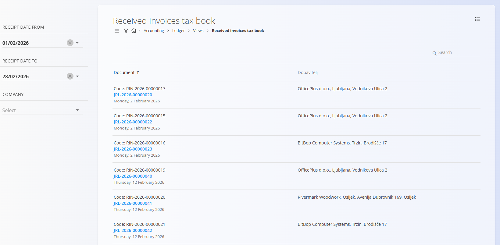

<!-- app_route: /accounting/ledger/received-invoices-tax-book -->
<!-- app_label: Received invoices tax book -->
<!-- canonical_source_url: https://github.com/Tom-PIT/Connected.Docs/blob/main/en/Domains/Accounting/Views/ReceivedInvoicesTaxBook.md -->
<!-- canonical_source_title: Received invoices tax book -->

# Received invoices tax book

The **Received invoices tax book** view provides a **filtered overview of received invoices that contain tax amounts**, together with links to their related journal entries.

This is a **read-only analytical view** used for tax reporting and review. No data can be edited from this screen.

To access this view, go to **Accounting / Ledger / Views / Received invoices tax book** in the [navigation](../../../Common/UI/Navigation.md).

> [!NOTE]  
> This view displays only **received invoices that generate tax entries**. It is intended for tax review and reporting purposes and does not replace official VAT reports.

## How this view is used

The Received invoices tax book is typically used to:

- Review **received invoices with calculated tax**
- Verify **supplier and document details**
- Access the related **journal entry**
- Support **input VAT reporting and reconciliation**

Clicking on a **blue journal entry code** opens the corresponding **journal entry document**.

## Filters

The filters on the left side allow you to narrow down the results:

- **Receipt date from / Receipt date to** – Limits invoices to a specific receipt date range.
- **Company** – Shows invoices related to the selected company.

## Columns

Each row represents a single received invoice and includes:

- **Document** – Invoice code and related journal entry.
- **Supplier** – Supplier name and address.
- **Date** – Invoice or receipt date (depending on configuration).

## Menu

Use the menu (top right corner) to **Export to PDF** and generate a PDF of the filtered list.
