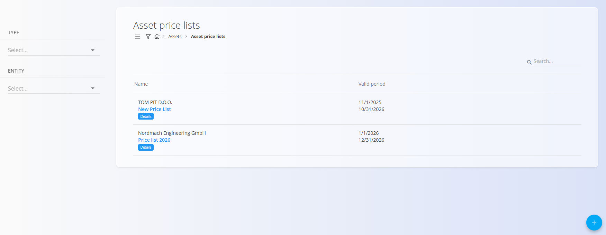
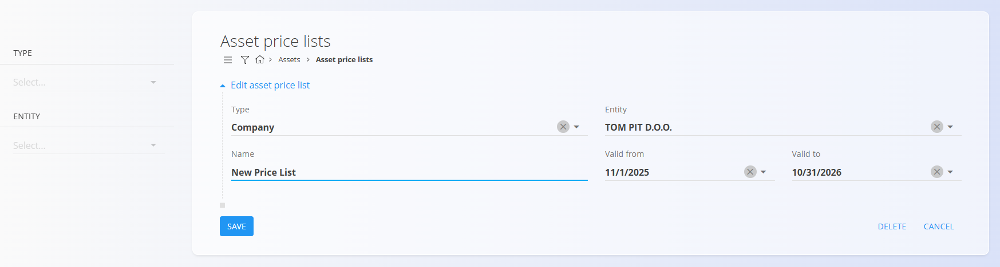
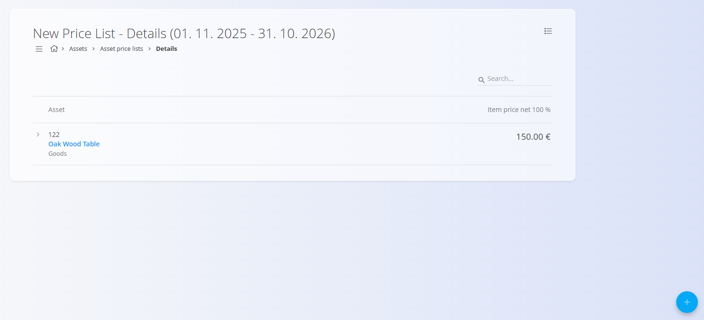
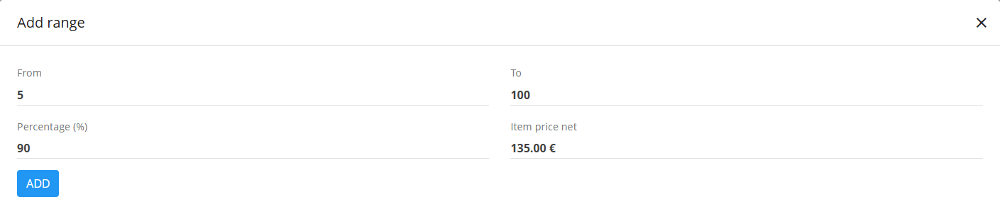

# Asset price lists

**Asset price lists** define how much a specific customer (or other business entity) pays for your [assets](Assets.md).  They allow you to set **customer-specific pricing**, valid for a defined date range, and optionally include **volume-based discounts** (price ranges).

To access this screen, go to **Assets / Asset price lists** in the [**navigation**](../../../Common/UI/Navigation.md).

## Schema

| Field | Description |
|-------|-------------|
| **Type** | Classification of the price list (e.g., *Company*). |
| [**Entity**](../../../Common/Management/BusinessDirectory.md) | Customer or other partner to whom the price list applies. |
| **Name** | Display name of the price list (mandatory). |
| **Valid from** | Start date when the price list becomes active. |
| **Valid to** | End date of the price list's validity period. |
| [**Asset**](Assets.md) | Selected asset for which a price is defined in the list. |
| **Item price net 100%** | Base net price of the asset before discounts. |
| **Ranges** | Optional volume-based rules that adjust the net price based on quantity purchased. Includes **From**, **To**, **Percentage (%)**, and **Item price net**. |

## Management

To access the list of price lists, navigate to **Assets / Asset price lists**.

The list displays:
- All existing price lists  
- Their valid periods  
- A **Details** button to open price list contents  

The list can be filtered by:
- **Type** (e.g., Company)
- **Entity** (e.g., Customer)

Clicking the **price list name** opens the *Edit* screen.  

Clicking the **Details** button opens the page where assets and discount ranges are maintained.

## Actions

Depending on which page you are, the the [action button](../../../Common/UI/ActionButton.md) displays different actions:

On the **Asset price lists** page:
- **New**
- **Copy**

On the **Details** page:
- **Import**
- **New**

### New
On the **Asset price lists** page, it creates a new price list. You must specify:
- **Type**
- **Entity**
- **Name**
- **Valid from**
- **Valid to**

On the **Details** page, it creates a new details list. You must specify:
- **Asset**

After saving, click **Details** to add assets and pricing rules.

### Copy
Creates a duplicate of an existing price list, including its validity range and contents.

### Import

The **Import** screen allows you to import a CSV file with the list of details.

## Creating a new price list

Follow these steps to create a functional price list:

1. Click **New**.
2. Enter the fields as required: **Type**, **Entity**, **Name**, **Valid from**, **Valid to**.
3. Click **Add** to save the price list header.
4. Click the **Details** button to open the pricing page.
   
   

5. Add one or more **Assets** to the list using the action button.
  
   

6. (Optional) Add **Ranges** to define quantity-based discounts. In the example below, if the customer buys between 5 and 100 assets, the percentage of the price will be 90% (10% discount).

   

7. Save the details. The price list is now active for the selected customer during the specified period.

## Menu

Exports the asset detail table—including ranges—to a **CSV** file.

## Deletion

Asset price lists can be deleted on the edit screen, but only if they contain **no assets**.

If the draft still includes assets in the **Details** section:

1. Click **Details** to open the section.
2. Click on an asset to open its detail screen.  
3. Click **Delete** inside detail screen to remove the asset.  
4. Repeat this for all remaining assets.

Once the document contains no assets, you can click **Delete** to remove the price list.

