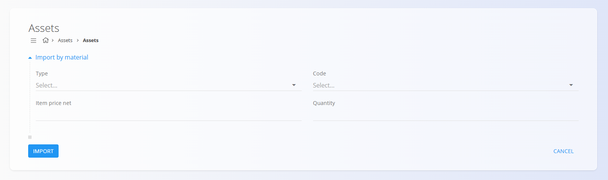

# Assets

An **Asset** represents an item or service that can be *sold* or *invoiced* within the system. Unlike **materials**—which are used for stock tracking, logistics, or production—**assets are commercial items** intended for pricing, offering, and billing.

Assets may represent:

- **Goods** (e.g., a finished product offered to customers)  
- **Services** (e.g., installation, transport, consulting)

Assets do **not** participate in stock movements. Instead, they define sales-ready items with their own price, tax rate, and properties. An asset may optionally reference materials when the sold product is also tracked in stock.

To access this screen, go to **Assets / Assets** in the [**navigation**](../../../Common/UI/Navigation.md).

## Schema

<strong>Asset</strong>

| Field | Description |
|-------|-------------|
| **Code** | Unique identifier for the asset (mandatory). |
| **Name** | Display name of the asset (mandatory). |
| **Type** | Whether the asset is a *Good* or a *Service* (mandatory). |
| [**Tax rate**](../../../Common/Management/TaxRates.md) | Applicable tax rate (optional). |
| [**Measure unit**](../../../Common/Management/MeasureUnits.md) | Unit used to display and price the asset (mandatory). |
| **Item price net** | Net unit price of the asset. |
| **Net weight (kg)** | Weight of the item, if applicable (default = 0). |
| **EAN** | Barcode number (optional). |
| **Tags** | Optional classification labels. |

<strong>Intrastat and Ledger</strong>

| Field | Description |
|-------|-------------|
| [**Tariff**](../../Accounting/Management/Intrastat/Tariffs.md) | Customs tariff code used for statistical and customs reporting. |
| [**Country origin**](../../../Common/Management/Countries.md) | Country of origin used on trade and customs documents. |
| **Mass converter** | Factor used to convert the base measure unit to mass (e.g., kg). Applied in Intrastat or analytics when weight is required. |
| **Domestic revenue account** | Revenue account used for domestic sales. |
| **Revenue account in Europe markets** | Revenue account used for sales within EU markets. |
| **Revenue account in non-Europe markets** | Revenue account used for sales outside EU markets. |
| [**Stock account**](../../Accounting/Management/Ledger/ChartOfAccounts.md) | Balance-sheet account for stock value when linking assets to stock-tracked materials. |

<strong>Additional and Details</strong>

| Field | Description |
|-------|-------------|
| **Description** | Additional text explaining the asset. |
| **Details** | List of asset components (e.g., linked materials or quantities). |
| **Add new asset detail** | Action to add a new asset detail. |
| **Type** | Type of [material](../Domain/Materials.md) of the detail (e.g., Products). |
| **Entity** | Selected material or item to link as part of the asset. |
| **Quantity** | Quantity of the linked entity. |

## Actions

### Adding a new asset

Click the **action button** to create a new asset. The following fields must be entered before saving:

- **Code**  
- **Name**  
- **Type**  
- **Measure unit**

Optional fields such as **Tax rate**, **Item price net**, **EAN**, **Tags**, and **Additional** information may also be filled in.

#### Intrastat and Ledger
Use these sections to enter Intrastat and customs details used for EU trade reporting, and other accounting details.

> [!WARNING]
> Enter correct accounts in the **Ledger** section (e.g., stock and expense accounts). Wrong or missing values will cause posting errors later in accounting.

#### Details section

After saving the asset, you may add **asset details**. These allow linking the asset to other entities such as materials (for example, when a sold product corresponds to a stock-tracked item).

Each detail includes:

- **Type** (e.g., Products)  
- **Entity** (selected material or item)  
- **Quantity**

  

### Import

The **Import** action opens the *Import by material* form, allowing quick creation of assets based on existing materials.

Users can select:

- **Type**  
- **Material code**  
- **Item price net**  
- **Quantity**

Click **Import** to create asset entries or **Cancel** to exit without changes.

## Filters

You can filter the Assets list using:

- **View**: Enabled / Disabled  
- **Type**: Goods / Service  
- **Tags**  

These filters help locate specific assets and simplify management of large asset catalogs.

## Deletion

Click **Delete** on the edit screen to remove the selected asset.

A confirmation dialog appears:

**Are you sure you want to delete the record?**

If confirmed, the asset is permanently removed. If the asset is referenced in other documents or records, deletion may be blocked until dependencies are resolved.
