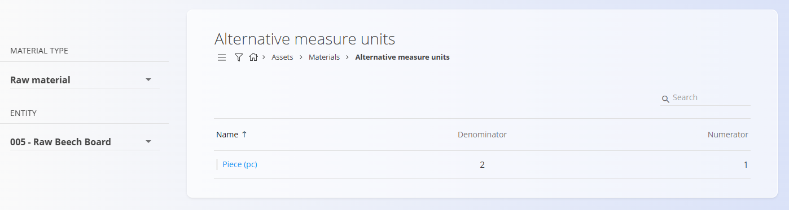
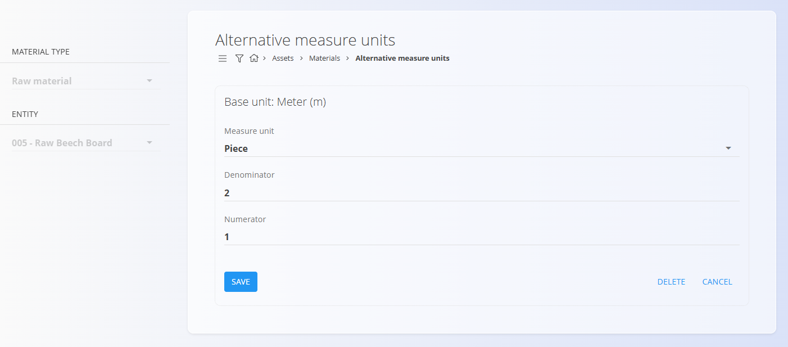
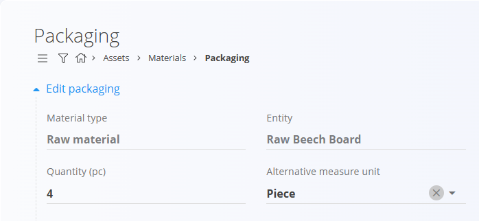

# Alternative measure units

**Alternative measure units** allow a material to be handled using a unit different from its base unit.  
This is useful when materials are stored, packaged, or received in practical units (for example, pieces) while stock is tracked in a physical unit (for example, meters).

To access this page, go to **Assets / Materials / Alternative measure units**.

> [!TIP]
> For a full demonstration, see the **[Alternative measure units](https://www.youtube.com/watch?v=wPmLquFm8fY)** video tutorial.

### How alternative measure units work

Each alternative measure unit defines a fixed conversion to the material’s base unit.
The conversion is defined using two mandatory values:

Numerator alternative units = Denominator base units

**Example:**

If **1 piece = 2 meters**, enter:
- **Denominator**: `2`
- **Numerator**: `1`

## Schema

| Field | Description |
|------|-------------|
| **Material type** | Type of material (for example, raw material or finished product). |
| **Entity** | Specific material for which the alternative measure unit is defined. |
| **Base unit** | Default unit of measure defined on the material (read-only). |
| **Measure unit** | Alternative unit of measure (for example, piece). |
| **Denominator** | Quantity expressed in the **base unit**. |
| **Numerator** | Quantity expressed in the **alternative measure unit**. |

## Management

Alternative measure units are defined **per material**.

Use the left sidebar to select:
- **Material type**
- **Entity**

Only alternative measure units for the selected material are displayed.

### List view

The list shows:
- **Name** (alternative measure unit)
- **Denominator**
- **Numerator**

### Creating a new alternative measure unit

1. Select a **Material type** and **Entity**.
2. Click the [**action button**](../../../Common/UI/ActionButton.md).
3. Choose the alternative **Measure unit**.
4. Enter the **Denominator** and **Numerator**.
5. Click **Save**.

### Editing and deletion

- Click an existing entry to edit it.
- Use **Save** to apply changes.
- Use **Delete** to remove the alternative measure unit.

## Usage in other features

### Packaging

Alternative measure units are used in **Packaging** to define package quantities in an alternative unit, while the system automatically calculates the corresponding base unit quantity.

### Receive documents

In **Receive** documents, quantities entered in an alternative measure unit are automatically converted to the base unit when updating stock.

> [!IMPORTANT]
>
> - Alternative measure units are material-specific
> - The base unit cannot be changed from this screen
> - Conversion ratios are applied consistently across the system
> - Changing or removing an alternative measure unit may affect packaging and receiving workflows
