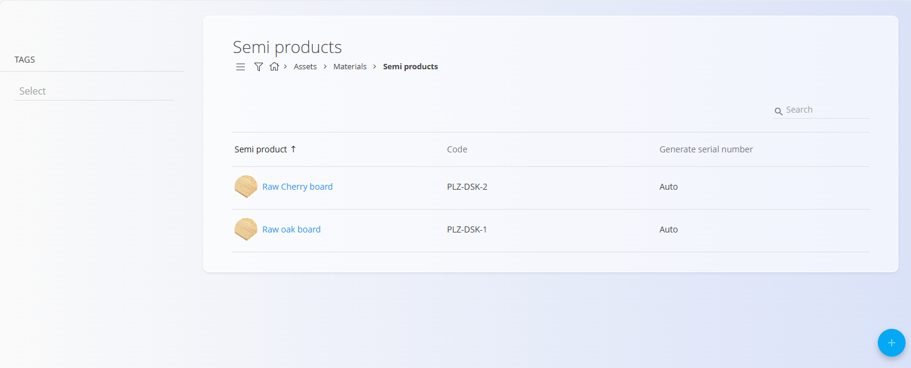
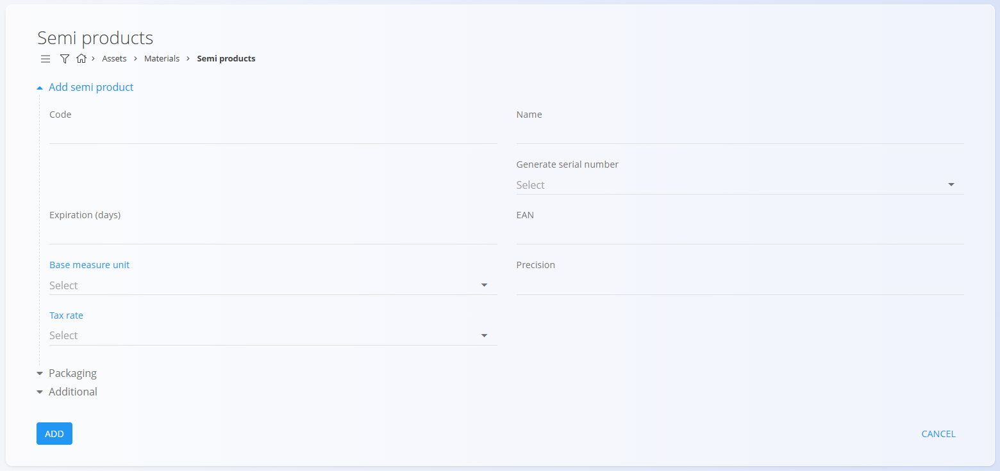
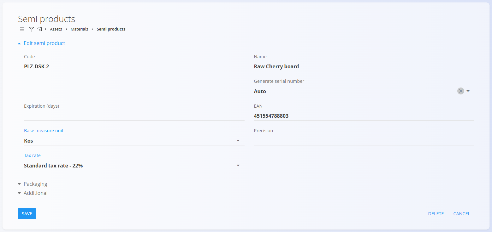

<!-- app_route: /management/materials/semi-products -->
<!-- app_label: Semi products -->
<!-- canonical_source_url: https://github.com/Tom-PIT/Connected.Docs/blob/main/en/Domains/Assets/Materials/SemiProducts.md -->
<!-- canonical_source_title: Semi products -->

# Semi products

**Semi products** are intermediate materials used in the production of finished goods. They are created from raw materials and then used as components in other items. Examples include Tabletop panel, Metal frame, Wooden leg, or Circuit module.

Each semi product includes key information—like  [measure units](../../../Common/Management/MeasureUnits.md), [tax rate](../../../Common/Management/TaxRates.md), serial number behavior, or expiration period—to support consistent handling across production, inventory, and warehouse operations. This code list contains all semi-finished items used in your production process.

> [!TIP]
> For a full demonstration, see the **[Semi product materials](https://www.youtube.com/watch?v=Ox2OF8_IwOQ)** video tutorial.

> [!NOTE]  
> **Prerequisites**  
> Before managing semi products, ensure that the following code lists are properly configured:  
> - [**Measure units**](../../../Common/Management/MeasureUnits.md)  
> - [**Tax rates**](../../../Common/Management/TaxRates.md)

To access the **Semi products** code list, go to **Assets / Materials / Semi products** in the [**navigation**](../../../Common/UI/Navigation.md).

## Schema

<strong>Semi product</strong>

| Field | Description |
|-------|-------------|
| **Code** | Unique identifier of the semi product within the list of materials. The code must be unique across all materials. (required) |
| **Name** | Name of the semi product shown in lists and documents. (required) |
| **Generate serial number** | Determines how serial numbers and material records are handled: • **Auto** – each item receives a unique ascending serial number. • **Same** – all items share the same serial number but remain separate records. • **Identical** – all items share the same serial number and are treated as one identical record. |
| **Expiration (days)** | Number of days before expiration, used for perishable or time-sensitive materials. |
| **EAN** | Barcode value used for scanning. |
| **[Base measure unit](../../../Common/Management/MeasureUnits.md)** | Measure unit used to express quantities, such as **piece** or **meter**. (required) |
| **Precision** | Default number of decimal places used for values in this measure unit. For example **3** for **1.255**, or **1** for **2.5**. |
| **[Tax rate](../../../Common/Management/TaxRates.md)** | Default tax rate used in business documents. |

<strong>Packaging</strong>

A packaging definition describes the physical properties of a material and the alternative units used when handling it in the warehouse. This can also be set in [**Packaging**](Packaging.md).

| Field | Description |
|-------|-------------|
| **Material type** | Classification of the material (e.g., product, semi-product) used for packaging context. |
| **Products / Entity / Beech Table** | Example reference to the product/entity this packaging applies to. |
| **EAN** | Packaging barcode. |
| **Quantity (pc)** | Quantity represented by the packaging unit (e.g., 6 pcs per box). |
| **Alternative measure unit** | Alternative unit for handling or reporting (e.g., pack). |
| **Weight** | Enter both net and gross weight for the packaging unit. |
| **Dimensions** | Enter width, height, and depth of the packaging unit. |

<strong>Additional</strong>

| Field | Description |
|-------|-------------|
| **Description** | Short internal description explaining the use or specifications of the semi product. |
| **Tags** | Tags used for categorization and filtering. |
| **Info link URL** | URL linking to external material information or documentation. |
| **Image URL** | Public URL pointing to the material image. |
| **External key** | Identifier in an external system used for cross-system record linking. |
| **Active** | Indicates whether the semi product is available for use in new documents. Inactive items cannot be used in new entries but remain visible in the history. |

<strong>Ledger and Intrastat</strong>

| Field | Description |
|-------|-------------|
| [**Stock account**](../../Accounting/Management/Ledger/ChartOfAccounts.md) | Balance sheet account where the value of this material’s inventory is recorded. Use this to override the default stock account for this specific material. |
| [**Account expense**](../../Accounting/Management/Ledger/ChartOfAccounts.md) | Profit & loss account used when this material is consumed, issued from stock, or sold (e.g., Cost of Goods Sold). Use this to override the default expense account for this material. |
| [**Tariff**](../../Accounting/Management/Intrastat/Tariffs.md) | Customs tariff code used for statistical and customs reporting. |
| [**Country origin**](../../../Common/Management/Countries.md) | Country of origin used on trade and customs documents. |
| **Mass converter** | Factor used to convert the base measure unit to mass (e.g., kg). Applied in Intrastat or analytics when weight is required. |

## Management

### List of semi products

The user interface contains a list of semi products. If no record exists yet, the list is empty.

The list displays each semi product’s name, code, and serial number generation method.

A filter for **Tags** is available on the left side of the screen. A search field in the upper-right corner helps filter the list.

## Actions

Click on the [action button](../../../Common/UI/ActionButton.md) to display the following actions:

- **Import**
- **Copy existing**
- **New**

### Import

The **Import** action allows you to import multiple semi products at once by preparing and uploading a correctly structured spreadsheet.  

See the [**Import materials**](ImportMaterials.md) documentation for full details.

### Copy existing

Click **Copy existing semi product** to create a new semi product based on an existing one. A selection list appears with the available base semi products.

After selecting the base semi product, all fields are pre-filled and can be edited before saving.

### New

Click **New** to open the input form for adding a new semi product. The form includes fields such as **Code**, **Name**, **Generate serial number**, **Base measure unit**, **Tax rate**, and others depending on the configuration.

Additional collapsible sections are available:

#### Packaging

This section allows you to review or add one or more [packaging](Packaging.md) definitions specific to the material. Each entry represents a packaging unit with its own quantity and identification.  

These packaging records can later be used in warehouse operations such as [Receives](../../Logistics/Documents/Receives.md), [Issues](../../Logistics/Documents/Issues.md), and [Inter warehouse](../../Logistics/Documents/InterWarehouse.md) transfers.

#### Additional

This section contains optional descriptive fields, such as a material description, tags, images, links, or external identifiers. These fields help provide extra context or references but do not affect stock calculations.

After entering the required information, click **Add** to save the semi product or **Cancel** to return to the list view.

#### Intrastat and Ledger

Use these sections to enter Intrastat and customs details used for EU trade reporting, and other accounting details.

> [!WARNING]
> Enter correct accounts in the **Ledger** section (e.g., stock and expense accounts). Wrong or missing values will cause posting errors later in accounting.

## Editing

To edit an existing semi product, click the semi product’s **Name** in the list.  
The interface switches to edit mode, displaying all fields for modification.

Click **Save** to apply changes or **Cancel** to discard them.

## Deletion

Click **Delete** on the edit screen to open a confirmation dialog: 

**Are you sure you want to delete this record?**  

If confirmed, the semiproduct is permanently removed; otherwise, the system keeps the record unchanged.

> [!NOTE]
> A semi product can be deleted only if it is not referenced by dependent entries, such as stock movements, documents, production structures, or other material relationships.
