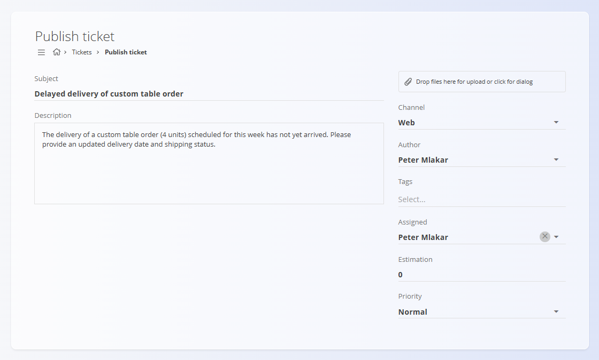
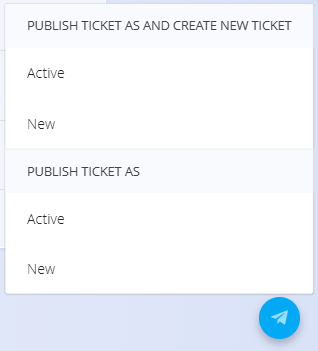
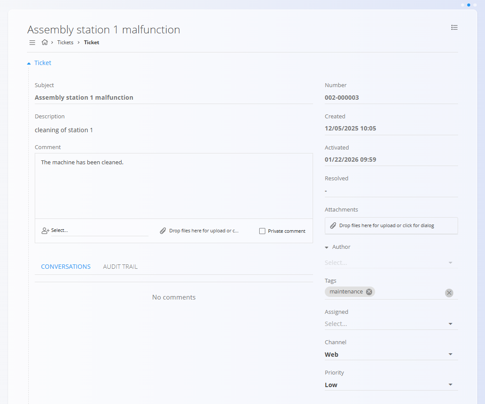
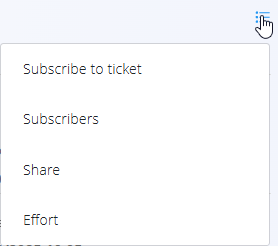

<!-- app_route: /customer-support -->
<!-- app_label: Tickets -->
<!-- canonical_source_url: https://github.com/Tom-PIT/Connected.Docs/blob/main/en/Domains/Customers/Tickets/Tickets.md -->
<!-- canonical_source_title: Tickets -->

# Tickets

The **Tickets** screen is the core workspace of the Customer Support domain. It is used to create, track, update, and resolve support requests submitted by customers, partners, or internal users.

Tickets are organized by **Desk** (for example Maintenance, Sales support, Technical support) and move through different states during their lifecycle.

To access this screen, go to **Customers / Tickets** in the [**navigation**](../../../Common/UI/Navigation.md).

## Schema

| Field | Description |
|-----|------------|
| **Subject** | Short title describing the issue |
| **Description** | Detailed description of the ticket |
| **[Desk](../Management/Desks.md)** | Support desk the ticket belongs to |
| **Channel** | Origin of the ticket (**Web**, **Phone**, **Email**) |
| **Author** | User who created the ticket |
| **Assigned** | User responsible for resolving the ticket |
| **Tags** | Classification labels |
| **Priority** | Ticket priority level (**Low**, **Normal**, or **High**) |
| **Estimation** | Estimated effort |
| **Created** | Ticket creation timestamp |
| **Activated** | Timestamp when ticket becomes active |
| **Resolved** | Timestamp when ticket is resolved |
| **Attachments** | Files attached to the ticket |

## Tickets list

The list displays **New** and **Active** tickets. At the top of the list, summary cards show:
- **My tickets**
- **Unassigned tickets**
- **High priority tickets**

 Each ticket is shown as a row that can be expanded to reveal quick actions. Available actions include:

- **Activate**
- **Resolve**
- **Delete**
- **Change priority**
- **Assign a user**

### Filters

Tickets can be filtered using the left panel:

- **Desk**
- **View**
  - New
  - Active
- **Tags**
- **Last activity**
- **Days ago**

## Ticket statuses

Tickets move through the following main statuses:

- **New** – ticket has been created but not yet activated
- **Active** – ticket is being worked on
- **Resolved** – ticket is completed and moved to [**Resolved tickets**](ResolvedTickets.md)

## Creating a new ticket

To create a new ticket, click the [**action button**](../../../Common/UI/ActionButton.md) in the bottom-right corner.

### Step 1: Select desk

The first step is selecting the **Desk** the ticket belongs to. Select the desk, then click on the **action button** to proceed to the next step.

### Step 2: Ticket details

In the second step, ticket details are entered or edited.

Click the [**action button**](../../../Common/UI/ActionButton.md) to:
- Published as **New**
- Published as **Active**
- Published as **New** or **Active**, and immediately **create a new ticket**

## Working with tickets

### Opening a ticket

Clicking on a ticket title opens the full ticket view.

The ticket view shows:
- Ticket information
- Status timestamps
- Attachments
- Author, tags, assignment, and priority

### Comments and conversations

Tickets support ongoing communication through comments.

When adding a comment:
- It can be directed to a specific user
- It can be marked as **Private**
- Files can be attached

To save a comment, the ticket must be updated by:
- Saving it as **New** or **Active**
- Or changing its status (for example, resolving it)

### Audit trail

The audit trail tracks all changes made to the ticket on a timeline. To open it, click the **Audit trail** tab in the ticket view, under the **Comment** section.

### Menu actions

Additional actions are available through the ticket menu, located on the top-right side of the ticket view.

Available options include:
- **Subscribe to ticket**
- **View subscribers**
- **Share**
- **Record effort**

> [!NOTE]
 Manage your per‑desk notification preferences in [**Notification settings**](../Management/NotificationsSettings.md).

## Resolving tickets

Click on the [**action button**](../../../Common/UI/ActionButton.md) to open the menu and select a resolution option: 

- **By design** - the issue is intentional and expected
- **Duplicate** - the ticket is a copy of another one
- **No error** - there is no issue to resolve
- **Not in use** - the ticket is not relevant
- **Resolved** - the issue has been fixed

When a ticket is resolved:
- Its status is set to **Resolved**
- It is removed from the active list
- It appears in the **[Resolved tickets](ResolvedTickets.md)** screen
