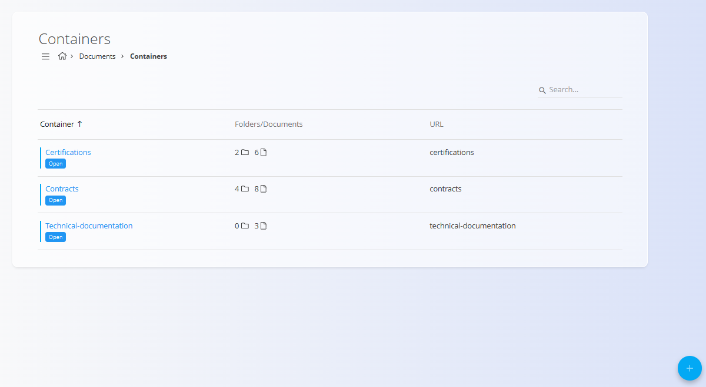
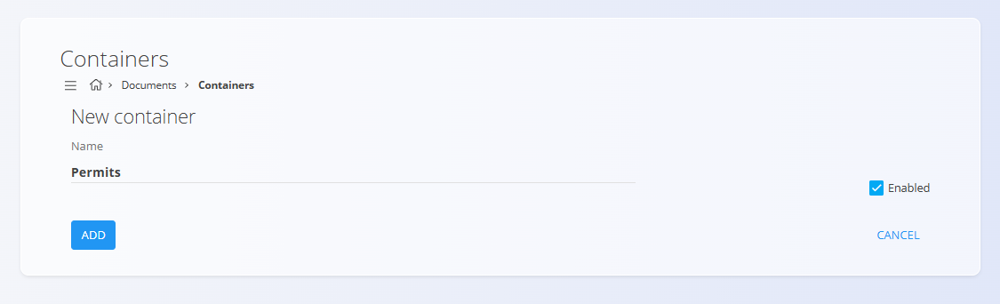
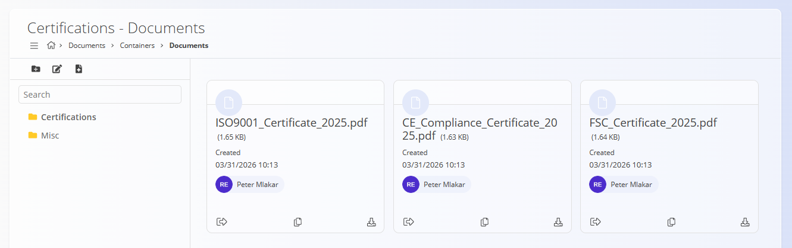
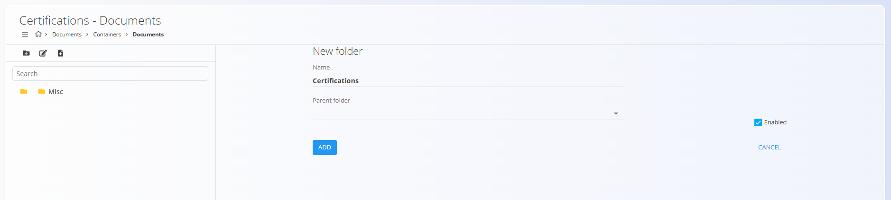
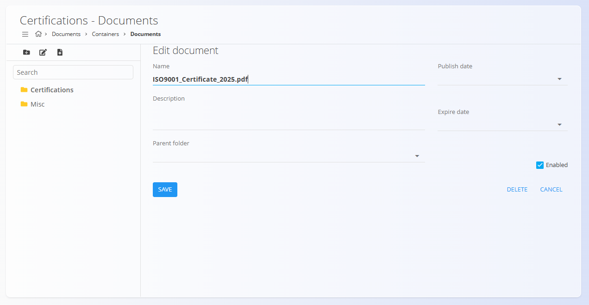

# Containers

The **Containers** screen defines the main **document repositories** used in the **Documents** domain.

Containers are used to organize externally uploaded documents such as:
- certifications  
- permits  
- contracts  
- technical documentation  

Each container acts as a root structure where documents can be grouped into folders and managed.

To access this screen, navigate to **Documents / Containers** in the [**navigation**](../../../Common/UI/Navigation.md).

## Schema

| Field | Description |
|------|-------------|
| **Name** | Name of the container (mandatory). |
| **Enabled** | Indicates whether the container is active and available. |

## Containers list

The list view displays all configured containers.

Each row shows:
- **Container name**
- **Number of folders and documents**
- **URL** – identifier used for access
- **Open** – opens the container content

Containers can be searched using the **Search** field.

Each record includes a status indicator to the left of its name:
- **Blue** indicates the container is active  
- **Gray** indicates the container is inactive  

> [!NOTE]
> Containers define the **top-level structure** for document organization.

## Actions

### Add new container

Click the [**action button**](../../../Common/UI/ActionButton.md) to add a new container and fill in the **Name** field.

The checkbox **Enabled** controls whether the container is active.

Click **Add** to create the container.

Once created, the container appears in the list and can be opened to manage its content.

## Managing container content

Click **Open** on a container to view its contents.

Content inside a container is organized using a **folder structure**, similar to [**Resources**](../Resources/Resources.md).

The left sidebar displays folders, while the main area shows documents.

### Toolbar actions

The following actions are available:

- **New folder** – Creates a folder to organize documents  
- **Edit folder** – Modifies the selected folder  
- **Upload document** – Uploads a new file into the selected folder  

### Folder structure

- Folders are displayed in a **tree view**
- Documents can be stored inside folders or at the root level
- Folders are optional but recommended for better organization

### Creating a folder

1. Click **New folder**
2. Enter:
   - **Name**
   - **Parent folder** (optional)
   - **Enabled**
3. Click **Add**

### Uploading documents

To upload a document, first select a folder in the sidebar, click **Upload document** and select the file from your device. The file will be uploaded to the selected folder and will be visible on the screen.

The uploaded document will be added to the list. The following actions are available for each document:
- **Checkout** – locks the document for editing. Other users cannot modify the document until it is checked in again.
- **Copy** - creates a duplicate of the document in the same folder.
- **Download** - downloads the document to your device.

### Editing documents

After uploading a document, click on the file name to edit its metadata.

Available fields:

| Field | Description |
|------|-------------|
| **Name** | File name (mandatory). |
| **Description** | Optional description. |
| **Parent folder** | Folder where the document is stored. |
| **Publish date** | Date when the document becomes valid/visible. |
| **Expire date** | Date when the document is no longer valid. |
| **Enabled** | Indicates whether the document is active. |

Click **Save** to confirm changes.

Click **Delete** to remove the document. A confirmation dialog will appear to prevent accidental deletion. Note that deleted documents cannot be recovered.
