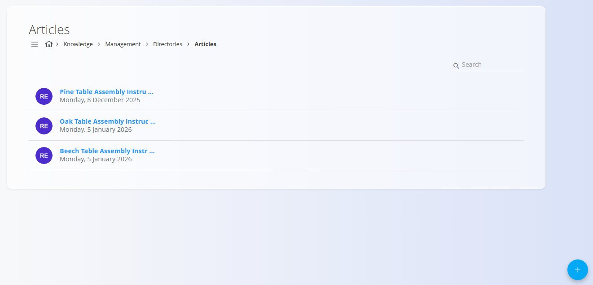

# Articles

**Articles** are the main content units of the [**Knowledge base**](../KnowledgeBase/KnowledgeBase.md). They contain written documentation such as instructions, guidelines, procedures, and reference information.

Articles belong to a **directory** and can be organized and navigated using the directory’s [table of contents](TableOfContents.md).

To manage articles, go to **Knowledge / Management / Directories** in the [**navigation**](../../../Common/UI/Navigation.md) and click **Articles** under the desired directory. See [Directories](Directories.md).

## Schema

| Field | Description |
|------|-------------|
| **Title** | Display title of the article (mandatory). |
| **Key** | Short unique identifier for the article (mandatory). |
| **Content** | Main article text edited using the text editor. |
| **Attachments** | Optional files attached to the article. |
| **Tags** | Tags used to categorize and filter the article. |
| **Publish date** | Date from which the article becomes visible. |
| **Expiration date** | Date after which the article is no longer visible. |
| **Collaboration** | Enables or disables comments on the article. |
| **Auto save** | Automatically saves changes while editing. |

## Management

### Articles list

The list view displays all articles belonging to the selected directory.

Each row shows:
- **Article title**
- **Last modified date**

Articles can be searched using the **Search** field in the top-right corner.

Clicking an article opens it for editing.

## Actions

Click the **action button** to create a new article.

### Add new article

When creating or editing an article, the fields described in the [Schema](#schema) section above are available.

While editing an article, click **View** in the top-left corner to preview how the article will appear in the [**Knowledge base**](../KnowledgeBase/KnowledgeBase.md).

Changes are saved automatically when **Auto save** is enabled.

## Text editor

The article content is written using a built-in **text editor**.

The editor provides common formatting features found in most text editors, including:

- Text formatting (headings, bold, italics, lists)
- Text alignment
- Links and images
- Fullscreen editing

The editor is designed to support clear, structured documentation without requiring technical knowledge.

## Attachments

Articles can include **file attachments** such as documents or images.

Attachments are uploaded using the **drop zone** in the article edit screen and are displayed with the article content in the [**Knowledge base**](../KnowledgeBase/KnowledgeBase.md).

## Tags

Tags are used to categorize articles and make them easier to find in the system.

Tags are selected from **[Directory tags](DirectoryTags.md)** and can be reused across multiple articles.

## Publishing and validity

Articles can be scheduled using:

- **Publish date** – defines when the article becomes visible
- **Expiration date** – defines when the article is no longer visible

If no dates are set, the article is visible immediately and indefinitely.

## Collaboration

When **Collaboration** is enabled, users can add comments to the article.

This allows feedback, clarification, and discussion directly on the documentation.

## Deletion

Click **Delete** on the article edit screen to open a confirmation dialog:

**Are you sure you want to delete this record?**

If confirmed, the article is permanently removed.

> [!NOTE]
> Deleting an article also removes it from the directory’s table of contents.

## Related

- **[**Knowledge base**](../KnowledgeBase/KnowledgeBase.md)** – browse and read published articles
- **[Directories](Directories.md)** – manage directories that group articles
- **[Table of contents](TableOfContents.md)** – define navigation for a directory
- **[Directory tags](DirectoryTags.md)** – categorize and filter articles
