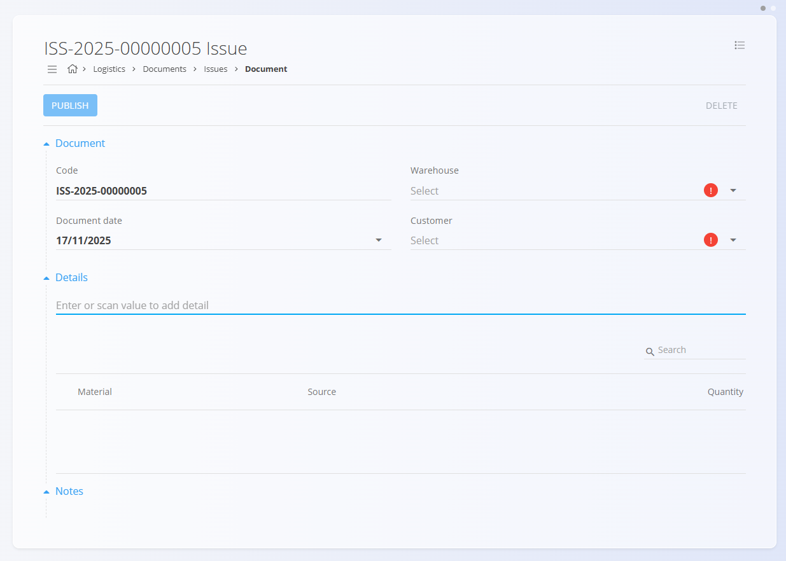
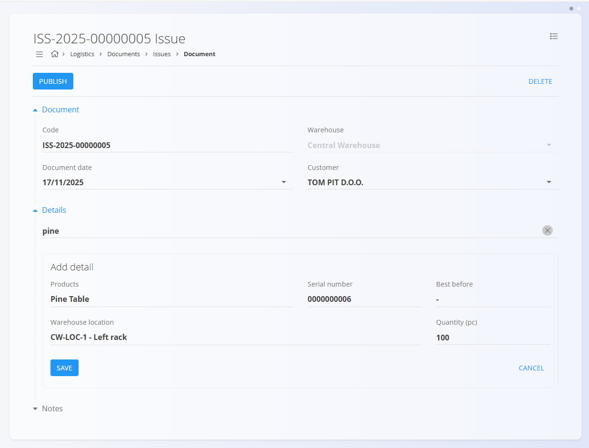

<!-- app_route: /warehouse/documents/issues --> 
<!-- app_label: Issues --> 
<!-- canonical_source_url: https://github.com/Tom-PIT/Connected.Docs/blob/main/en/Domains/Logistics/Documents/Issues.md --> 
<!-- canonical_source_title: Issues -->

# Issues

An **Issue** document is used to record goods that come out your warehouse, for example, to be delivered to a customer. When finished products, materials, or packaged items leave the warehouse as part of a customer delivery, the Issue document captures all relevant details. Examples include issuing **furniture to a customer**, **shipping spare parts**, or **delivering packaged goods** as part of a sales order.

During the issuing process, you scan or search for the items being delivered, confirm the correct serial numbers or batches, and enter the quantity being dispatched. This ensures that stock levels are updated accurately and that each delivery is fully traceable.

> [!TIP]
> For a full demonstration, see the **[Issue](https://www.youtube.com/watch?v=SrVyblBiLmQ)** video tutorial.

To access Issues, go to **Logistics / Documents / Issues** in the [navigation](../../../Common/UI/Navigation.md).

## Schema

  
<strong>Document</strong>

| Field | Description |
|-------|-------------|
| [**Code**](../../../Common/UI/DocumentCodes.md) | System-generated unique identifier for the issue document. |
| **Document date** | Date when the issue document is created. |
| [**Warehouse**](../Management/Warehouses.md) | Warehouse from which the materials are issued (mandatory). |
| **Customer** | Customer receiving the goods , selected from the [Business directory](../../../Common/Management/BusinessDirectory.md) (mandatory). |
| **Notes** | Additional remarks related to the document. |

  
<strong>Details</strong>

| Field | Description |
|-------|-------------|
| [**Material**](../../Assets/Domain/Materials.md) | Material being issued ([product](../../Assets/Materials/Products.md), [semi product](../../Assets/Materials/SemiProducts.md), [raw material](../../Assets/Materials/RawMaterials.md), or [repro material](../../Assets/Materials/ReproMaterials.md)). |
| **Serial number** | Selected serial number of the material being issued. |
| **Best before** | Expiration date (if the material has shelf life). |
| [**Warehouse location**](../Management/Locations.md) | Current storage location of the selected item. |
| **Quantity (pc)** | Quantity being issued. |

## List of issue documents

The Issues page displays all issue documents. You can search for a specific document using the search bar, or filter the list using the left sidebar, which includes:

- **Document dates**
- **View:**  
  - *Drafts* — documents not yet published  
  - *Committed* — published and finalized documents
- **Author**
- **Warehouse**

A color indicator next to each document shows its status:

- **Green** — committed  
- **Gray** — draft

You can click any document to open and review its details.

## Actions

### Create an issue document

1. Click the [action button](../../../Common/UI/ActionButton.md) to create a new document draft, then select the **Warehouse** and **Customer**.

	

2. Type or scan a **serial number**, **EAN**, or **material name** into the Details bar.  
   - The system displays **all matching materials and serial numbers**.  
3. Select the correct material from the results list.  
4. The system automatically fills in all known details (material, serial number, location, best before).  

	

5. Enter the **quantity** you want to issue — this is the only editable field.  
6. Click **Save** to add the line to the document.  Add more items starting from step 2 if needed. 
7. Click **Publish** to commit the document.

A newly created issue document appears in the **Drafts** view. Once published, it moves to **Committed**.

#### Attachments

Use the **Attachments** section to upload and manage files related to the document, such as photos, PDFs, certificates, or supporting records.

For detailed instructions, see [**Attachments**](../../../Common/Concepts/Attachments.md).

#### Notes

Each document includes a **Notes** section where you can enter any comments or additional information related to the transaction. Notes are saved together with the document and remain visible both in draft and committed versions.

### Edit an issue document

Click an issue document code in the main list to open its details:

- You see the **Document** section (header information)  
- You see all **Details** representing the issued items  
- You can edit documents in **Draft** status  
- You can print or export draft or committed documents
- Published (Committed) documents are read-only except for reversal creation

### Delete an issue document

Draft documents can be deleted on the edit screen, but only if they contain **no material entries**.

If the draft still includes materials in the **Details** section:

1. Click the material serial number to open the **Edit detail** screen.  
2. Click **Delete** inside the Edit detail window to remove the material.  
3. Repeat this for all remaining materials.

Once the document contains no materials, you can click **Delete** to remove the draft.

> [!NOTE]
> Committed documents **cannot** be deleted — only [reversed](Reversals.md).

## Menu

The menu provides additional actions available on this page.

Available actions:

- **Print**
- **Export to PDF**
- **Delete all details** (only for draft documents)
- **Reverse issue** (only for committed documents)

For details about menu actions, see [**Menu actions**](../../../Common/Concepts/MenuActions.md).
