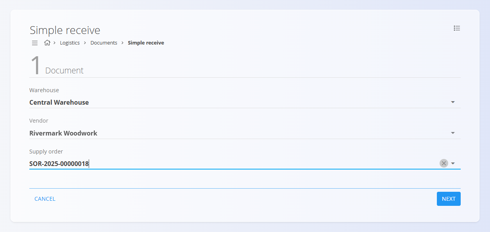

<!-- app_route: /warehouse/documents/simple-receive --> 
<!-- app_label: Simple receive --> 
<!-- canonical_source_url: https://github.com/Tom-PIT/Connected.Docs/blob/main/en/Domains/Logistics/Documents/SimpleReceive.md --> 
<!-- canonical_source_title: Simple receive -->

# Simple receive

The **Simple receive** workflow provides a fast way to record incoming materials based on an existing [**Supply order**](../../Supply/Documents/SupplyOrders.md).  It guides the user through three clear steps: selecting the document header, confirming the materials to receive, and editing each detail before finishing.

Simple receive is ideal for quick warehouse operations where materials arrive exactly as ordered, without the need for advanced receiving features.

To access Simple receive, go to **Logistics / Documents / Simple receive** in the [**navigation**](../../../Common/UI/Navigation.md).

## Overview

Simple receive consists of three steps:

1. **Document** — Select warehouse, vendor, and supply order  
2. **Details** — Confirm incoming materials from the supply order  
3. **Edit detail** — Review and complete each material line  

Each completed simple receive creates a standard [**Receive**](Receives.md) document in the system.

## Create a simple receive

### Step 1 — Document

In the first step, the user selects the header information for the receive document.

Fields include:

- **Warehouse** — Where the materials will be received  
- **Vendor** — Automatically suggested if linked to the supply order  
- **Supply order** — Enter or scan the supply order number (e.g. *SOR-2025-00000018*)  

Click **Next** to continue.

### Step 2 — Details

In this step, the system displays all **expected materials and quantities** from the selected supply order.

The user must now **scan or manually enter the packaging code** (EAN / barcode) of the item being received.

- If the scanned code matches **multiple supply order lines** (e.g., same material across different batches or orders), the system displays **all matching items**.
- The user must **select the correct line** that corresponds to the received packaging.

Once the correct item is selected, the workflow automatically advances to **Step 3 — Edit detail**.

### Step 3 — Edit detail

In the final step, the user completes the information for each material line.

For each received item, you can review or adjust:
 
- **Warehouse location**  
- **Number of packets**  

You can also **delete** the line if it should not be received.

When all details are confirmed, click **Finish** to complete the simple receive.

## Completethe receive

After clicking **Finish**:

- The system creates a standard completed [**Receive**](Receives.md) document  
- All confirmed materials are posted to stock  
- The supply order is updated with the received quantities  

For more advanced receiving workflows (serial numbers, best-before dates, packaging, attachments, reversals, etc.), see the full [Receives documentation](Receives.md).

