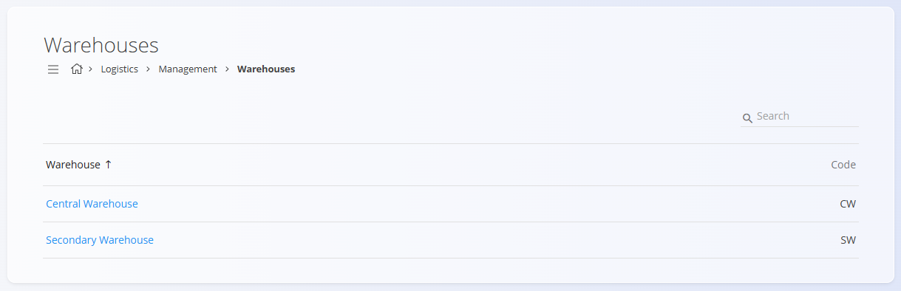
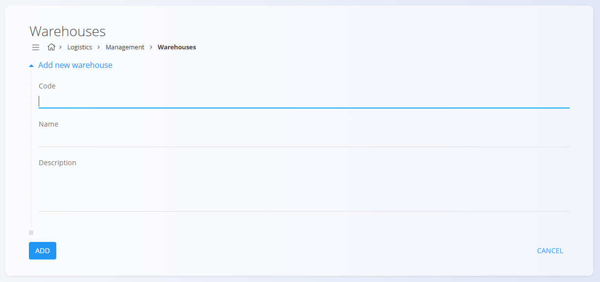

# Warehouses

This code list represents the warehouses used across the digital contents of the system. Each warehouse defines a physical or logical storage location that supports material handling, inventory operations, and logistical processes. 

To access this code list, go to **Logistics / Management / Warehouses** in the [**navigation**](../../../Common/UI/Navigation.md).

> [!TIP]
> For a full demonstration, see the **[Warehouses and warehouse locations](https://www.youtube.com/watch?v=3sEE9Mrtx6M)** video tutorial.

## Schema

| Field | Description |
|-------|-------------|
| **Code** | Unique identifier of the warehouse. The code must be unique within the entire list. |
| **Name** | Name of the warehouse. |
| **Description** | Optional short description of the warehouse. |
| **Active** | Indicates whether the warehouse is active. Inactive warehouses cannot be used in new entries, but they remain visible in history. |

## Management

### List of warehouses

The interface contains a list of warehouses. If no record exists yet, the list is empty.

The list displays the basic warehouse details, including the warehouse code and name.

## Actions

Click on the [action button](../../../Common/UI/ActionButton.md) to add a new warehouse.

The form includes the following fields:
- **Code**
- **Name**
- **Description**
- **Active**

After entering the required information, click **Add** to save the warehouse or **Cancel** to return to the list view.

## Editing

To edit an existing warehouse, click the warehouse’s **Name** in the list. The interface switches to edit mode, displaying the existing values for modification. 

Click **Save** to confirm changes or **Cancel** to discard them.

## Deletion

Click **Delete** on the edit screen to open a confirmation dialog: 

**Are you sure you want to delete this record?**  

If confirmed, the warehouse is permanently removed; otherwise, the system keeps the record unchanged.

> [!NOTE]
>A warehouse can be deleted only if it is not used in any dependent records, such as inventory transactions or material movements.