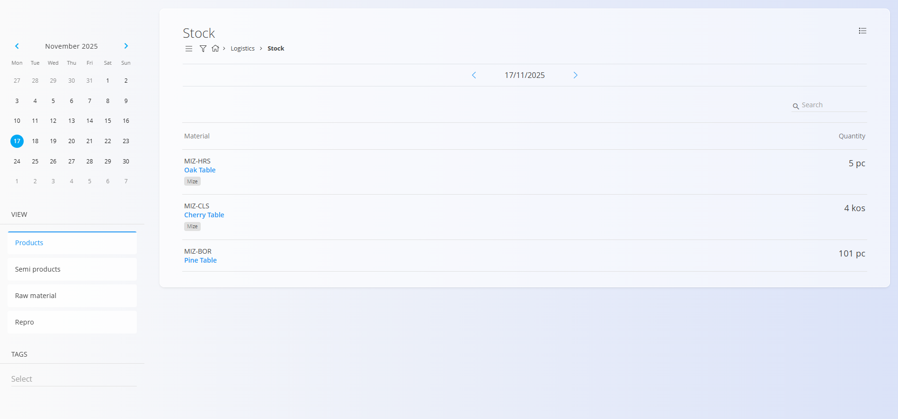

<!-- app_route: /sitemap/logistics -->
<!-- app_label: Logistics domain -->
<!-- canonical_source_url: https://tom-pit.github.io/Connected.Docs/en/Domains/Logistics/ -->
<!-- canonical_source_title: Logistics domain -->

# Logistics

The **Logistics** domain covers all warehouse-related operations within your organization. It includes stock handling processes, warehouse structures, material movements, and all documentation needed to track the physical flow of goods.

Where the **[Materials](../Assets/Materials/README.md)** domain defines *what* exists in stock, the Logistics domain defines *where it is stored*, *how it moves*, and *how it is controlled*.

To access this domain, navigate to **Logistics** in the [navigation](../../Common/UI/Navigation.md).

> [!NOTE]  
> The available domains depend on each company’s configuration and business model.

## What is included in the Logistics domain?

The domain is organized into several functional areas:

- [**Dashboard**](Views/Dashboard.md) – high-level overview of warehouse activity (read-only KPIs)  
- [**Stock**](Views/Stock.md) – provides a real-time overview of warehouse stock (read-only; filters by warehouse, location, material, batch/serial)  
- [**Documents**](#documents) – all stock-affecting logistics transactions  
- [**Views**](#views) – analytical screens for consumption, issuing, and stock distribution  
- [**Management**](#management) – code lists and configuration for warehouses and locations

## Dashboard

The [**Dashboard**](Views/Dashboard.md) provides a high-level overview of logistics performance and warehouse activity. It presents operational indicators (e.g., inbound/outbound counts, open inventories, discrepancies) that help users understand current workload, stock movements, and active warehouse processes.

The dashboard serves as the entry point for warehouse supervisors and operators who need immediate insight into the state of logistics operations.

## Stock

The **[Stock](Views/Stock.md)** section provides operational insight into warehouse materials and their current quantities. It offers a detailed overview of all materials stored across warehouses and locations. It displays available quantities, batches, serials, and physical positions. This view is read-only.

## Documents

The **Documents** section contains all logistics-related transactions that **change stock quantities** or **track warehouse activity**.

Available logistics documents include:

- **[Receives](Documents/Receives.md)** – Register goods entering the warehouse (procurement, production outputs, customer returns). Increases stock.
- **[Simple receive](Documents/SimpleReceive.md)** – A lightweight alternative for quick inbound registrations.
- **[Issues](Documents/Issues.md)** – Register goods leaving the warehouse (consumption, delivery, production input). Decreases stock.
- **[Inter warehouse](Documents/InterWarehouse.md)** – Transfer goods between distinct warehouses or sites.
- **[Move serial](Documents/MoveSerial.md)** – Relocate serial-numbered or batch materials across locations (does not change quantity).
- **[Inventories](Documents/Inventories.md)** – Perform stock counts and reconcile discrepancies.
- **[Writeoffs](Documents/Writeoffs.md)** – Adjust stock for damaged, lost, or expired materials. Decreases stock.
- **[Loans](Documents/Loans.md)** – Track materials temporarily issued to personnel or external partners.
- **[Consumptions](Documents/Consumptions.md)** – Record material consumption events. Decreases stock.
- **[Productions](Documents/Productions.md)** – Receive finished or semi-finished goods from production. Increases stock.
- **[Reversals](Documents/Reversals.md)** – Reverse previous logistics documents and restore prior stock state.
- **[Containers](Documents/Containers.md)** – Manage logistics containers, pallets, or grouped items.
- **[Disassemblies](Documents/Disassemblies.md)** – Break down products into components returned to stock. Increases component stock.
- **[Corrections](Documents/Corrections.md)** – Manual corrections of stock records (restricted permissions; audit trail).
- **[Move container](Documents/MoveContainer.md)** – Relocate containerized goods as units.
- **[Material analysis](Documents/MaterialAnalysis.md)** – Perform diagnostics or quality checks on materials.

Each of these documents contributes to the traceability and accuracy of warehouse operations.

## Views

The **Views** section provides analytical tools for understanding stock movements, consumption patterns, and location-based distribution.

Available views include:

- **[Consumption details](Views/ConsumptionDetails.md)** – Insight into material consumption trends and usage patterns; filter by date, material, warehouse, user, cost center.
- **[Issue details](Views/IssueDetails.md)** – Breakdown of issue transactions by material, document, warehouse, location, or user; shows quantities and totals.
- **[Stock view by location](Views/StockViewByLocation.md)** – Hierarchical representation of stock quantities by warehouse, zone, location (and containers where applicable); includes available vs reserved quantities.

These screens do **not** create transactions—they are analytical tools meant to support operational decisions.

## Management

The **Management** section contains configuration and master data required by all logistics processes.

Available code lists and configuration screens:

- **[Configuration](Management/LogisticsConfiguration.md)** – Logistics-wide settings and process behavior.
- **[Business directory](../../Common/Management/BusinessDirectory.md)** – Defines internal and external business entities related to logistics.
- **[Warehouses](Management/Warehouses.md)** – Definitions of physical warehouses or distribution sites.
- **[Countries](../../Common/Management/Countries.md)** – Geographic data supporting warehouse and partner records.
- **[Locations](Management/Locations.md)** – Storage positions inside warehouses (aisles, racks, bins).
- **[Stock boundaries](Management/StockBoundaries.md)** – Logical constraints and special handling rules (e.g., quarantine, temperature) for selected materials or locations.
- **[Measure units](../../Common/Management/MeasureUnits.md)** – Unified measurement units used across logistics documents.
- **[Material analysis setup](Management/MaterialAnalysisManagement.md)** – Configuration supporting material inspection or validation processes.

These elements define how logistics operations behave and how data is structured.

> [!TIP]
> See all management entries in the **[Management Index](../../ManagementIndex.md)**.

## Logistics Processes

Logistics operations follow a consistent lifecycle:

### **1. Receiving goods**
- Goods enter the warehouse through [receives](Documents/Receives.md) or [production outputs](Documents/Productions.md).

### **2. Moving and organizing**
- Goods are stored, relocated, or distributed across warehouses using [inter warehouse](Documents/InterWarehouse.md), [move serial](Documents/MoveSerial.md), [move container](Documents/MoveContainer.md), and [locations](Management/Locations.md).

### **3. Issuing and consuming**
- Stock leaves the warehouse for production, sales, or internal use via [issues](Documents/Issues.md) and [consumptions](Documents/Consumptions.md).

### **4. Inventory and reconciliation**
- Accuracy is maintained through [inventories](Documents/Inventories.md), [writeoffs](Documents/Writeoffs.md), and [corrections](Documents/Corrections.md).

### **5. Reporting and analysis**
- Views provide insight into stock usage, availability, and discrepancies (see [Views](#views)).

## Logistics and Other Domains

Logistics integrates tightly with other operational areas:

| Area | Interaction |
|--------|------------|
| **[Materials](../Assets/Materials/README.md)** | Defines materials stored and moved in logistics. |
| **[Assets](../Assets/README.md)** | Sales visibility and availability calculations rely on logistics stock. |
| **[Production](../Production/README.md)** | Issues and receives connect logistics with production orders. |
| **[Maintenance](../Maintenance/README.md)** | Spare parts and maintenance stock flow through logistics. |
| **[Sales](../Sales/README.md)** / **[Supply](../Supply/README.md)** | Logistics ensures availability and correct warehouse fulfillment. |

