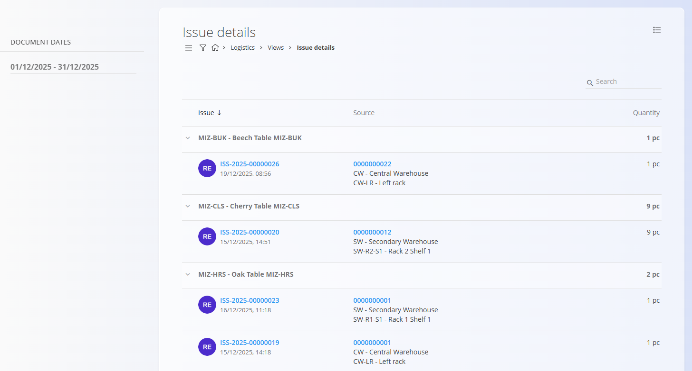

# Issue details

The **Issue details** view provides an analytical overview of all **materials and finished products issued from stock** within a selected time period. Instead of focusing on issue documents themselves, this view aggregates **issued items** and shows exactly **which [issue documents](../Documents/Issues.md)** were used and **from which warehouse locations** the items were issued.

To access this view, go to **Logistics / Views / Issue details** in the [**navigation**](../../../Common/UI/Navigation.md).

## Issue details list

The list displays **all issued materials and products**, grouped by item. Each row shows the **total quantity issued** for that item in the selected date range.

You can expand an item row to view the **individual issue documents** that contributed to the total.

### Hierarchy

The list is structured as follows:

- **Item** – material or finished product and total quantity issued  
  - **Issue document** – individual issue entry  
    - **Source** – warehouse and location where the item was issued from  
    - **Quantity** – quantity issued in that document  

When expanded, each issue document shows:

- **Document number** – clickable, opens the [Issue document](../Documents/Issues.md)  
- **Document date and time**  
- **Source** – warehouse and location (clickable)  
- **Issued quantity**

## Source navigation

The **Source** column shows:

- **Warehouse**
- **Exact warehouse location**

Clicking the source opens the **[Stock view by location](StockViewByLocation.md)** screen, filtered to the location from which the item was issued. This allows you to review stock availability and other materials stored at that location.

## Filters

The left sidebar contains the following filter:

- **Document dates** – limits the view to issue documents within the selected date range

Once the date range is selected, the list reloads automatically.

## Search

Use the **search bar** in the top-right corner to quickly filter results. The search works across:

- Item codes  
- Item names  
- Document numbers  
- Warehouse and location codes  

This makes it easy to find issues related to a specific material, product, document, or storage location.

## Purpose

The **Issue details** view is useful for:

- Analyzing stock issued to customers or internal processes  
- Tracing which items were issued and from where  
- Auditing issued quantities by item  
- Investigating outbound stock movements  

This view is **analytical only**. It does not allow creating, editing, or deleting documents.

> [!NOTE]
> - Quantities are displayed in the item’s base unit of measure (e.g. pcs, meters).  
> - This view focuses on **stock issues** (e.g. sales deliveries, internal issues).  
> - Production-related material usage is shown in **[Consumption details](ConsumptionDetails.md)**, not here.

## Related views

- **[Consumption details](ConsumptionDetails.md)** – review materials consumed during production  
- **[Stock view by location](StockViewByLocation.md)** – review stock stored in a specific warehouse location  
- **[Stock view by material](../Documents/Stock.md#stock-view-by-material)** – review stock movements and balances by material  
- **[Issue documents](../Documents/Issues.md)** – create and review stock issue documents
