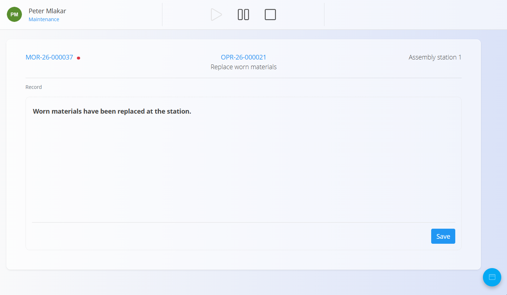
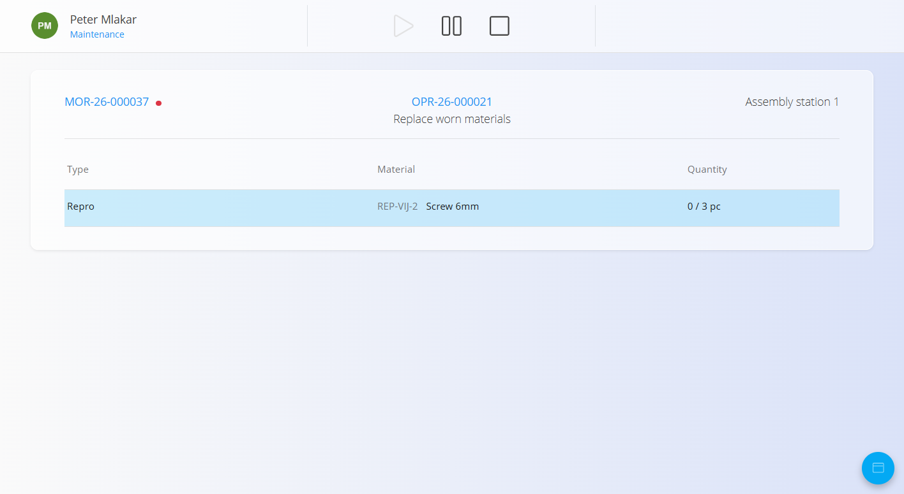
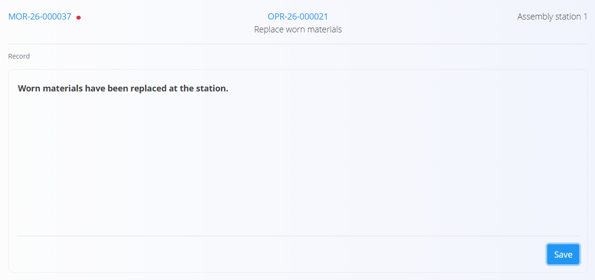

<!-- app_route: maintenance-orders/execution -->
<!-- app_label: Maintenance execution -->
<!-- canonical_source_url: https://tom-pit.github.io/Connected.Docs/en/Domains/Maintenance/Documents/MaintenanceExecution/ -->
<!-- canonical_source_title: Maintenance execution -->

# Maintenance execution

The **Maintenance execution** screen is used to perform and record work on maintenance orders.

It provides a central workspace for carrying out maintenance operations, recording the work performed, completing quality controls, tracking effort, and viewing instructions.

To access this page, go to **Maintenance / Execution** in the [navigation](../../../Common/UI/Navigation.md).

> [!NOTE]
> The **Maintenance execution** screen automatically displays active maintenance orders assigned to the **organization unit** selected at the top of the screen.
>
> To work with maintenance orders assigned to a different organization unit, change the selected organization unit.

## Execution interface overview

The **Maintenance execution** screen provides all controls and information required to perform the current maintenance operation.

1. **User and organization unit** – shows the currently logged-in user and organization unit.
2. **Execution controls** – start, pause, or complete the current operation.
3. **Maintenance order** – shows the current maintenance order. Click it to select a different active maintenance order. If the maintenance order has a high priority, it will display a red marker.
4. **Operation** – shows the current operation and its name.
5. **Equipment** – shows the equipment associated with the maintenance order.
6. **Execution area** – displays the currently selected execution activity, such as Record or Inputs.
7. **Action button** – opens the available execution activities.

### Select a maintenance order

Click the **maintenance order** shown in the top-left corner of the execution screen to switch to a different active maintenance order.

A dialog opens with the available active maintenance orders, including:

- **Priority**
- **Code**
- **Equipment**

Select the required maintenance order and click **Select**.

## Start maintenance

Press **Start** to begin the current maintenance operation.

Once started, the operation becomes active and the execution time begins to be recorded.

## Pause maintenance

Press **Pause** to temporarily pause the current maintenance operation.

The operation remains incomplete and can be resumed by pressing **Start**.

## Execution activities

Use the [action button](../../../Common/UI/ActionButton.md) in the bottom-right corner to switch between the activities available during maintenance execution.

The available activities depend on the configuration of the current operation. If input materials are assigned to the operation, **Inputs** is also displayed.

Available activities can include:

- **Inputs** – view and record materials used during maintenance
- **Record** – enter a free-text record of the maintenance work performed
- **Quality** – review and complete quality checklists
- **Effort** – review and record working time
- **Instructions** – view instructions for the current operation

### Inputs

If input materials are assigned to the current operation, select **Inputs** to view and record the materials used during maintenance.

For each material, the screen shows its type, material, and consumption quantity.

The quantity indicates how much of the required material has already been consumed compared to the planned quantity. For example, **0 / 3 pc** indicates that 0 of the 3 required pieces have been consumed.

To record consumption:

1. Select the required material.
2. Enter the quantity used during maintenance.
3. Click **Save**.

The recorded quantity is added to the material consumption for the current operation.

### Record

Select **Record** to open the maintenance record screen.

Use the free-text field to enter information about the maintenance work performed, then click **Save**.

The saved record is also displayed on the corresponding maintenance order.

### Quality

Use **Quality** to review and complete quality checklists assigned to the maintenance process or operation.

Depending on their configuration, quality checklists may also open automatically at specific stages of execution, such as when starting, pausing, or completing an operation.

For details about completing quality checklists during execution, see [**Quality in Production execution**](../../Production/Documents/Execution.md#quality).

### Effort

Use **Effort** to review and record working time for the current maintenance operation.

Effort works in the same way as in Production execution.

For details about effort recording, see [**Effort in Production execution**](../../Production/Documents/Execution.md#effort).

### Instructions

Use **Instructions** to view instructions associated with the current maintenance operation.

Instructions work in the same way as in Production execution.

For details, see [**Instructions in Production execution**](../../Production/Documents/Execution.md#instructions).
## Complete maintenance

Press **Stop** to complete the current maintenance operation.

When the operation is completed:

- The completion time is recorded.
- The operation is marked as **Completed**.
- If additional operations remain, maintenance can continue with the next operation.
- When all operations are completed, the maintenance order moves to **Closed**.

> [!NOTE]
> A completed operation cannot be reactivated from the **Maintenance execution** screen. To reopen it, open the corresponding maintenance order and select **Reactivate** for the operation.