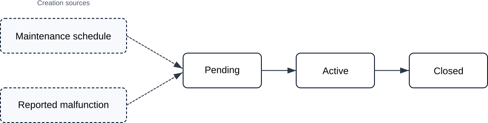
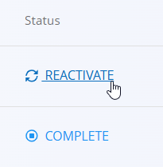

<!-- app_route: /maintenance-orders/list -->
<!-- app_label: Maintenance orders -->
<!-- canonical_source_url: https://tom-pit.github.io/Connected.Docs/en/Domains/Maintenance/Documents/MaintenanceOrders/ -->
<!-- canonical_source_title: Maintenance orders -->

# Maintenance orders

Maintenance orders define the work required to perform **planned or curative maintenance** on equipment, based on a selected **maintenance process** and version.  

They move through the life cycle **Pending → Active → Closed**, and include operations, resources, inputs, and quality checks defined by the selected process.

> [!NOTE]
> **Prerequisites**
>
> Before creating a maintenance order, ensure that the following are configured:
> - At least one [**maintenance process**](../../Production/Management/Processes.md) with an active version
> - Equipment definitions
> - Assigned [**organization units**](../../Production/Management/OrganizationUnits.md)
> - Optional supporting definitions such as [**resources**](../../Resources/Management/Resources.md), [**checklists**](../../Quality/Management/Checklists.md), and [**measure units**](../../../Common/Management/MeasureUnits.md), depending on your maintenance workflow

To access maintenance orders, go to **Maintenance / Maintenance Orders** in the [navigation](../../../Common/UI/Navigation.md).

## List of maintenance orders

The Maintenance Orders page displays all maintenance orders grouped by status.  
Use the filters on the left to refine the list.

### Status overview

At the top of the page, summary cards show the number of orders:

- **My** – Orders assigned to the current user
- **Unassigned** – Orders without an assigned resource
- **All** – Total number of maintenance orders

Clicking a card updates the list accordingly.

### Visual indicators in the list

Maintenance orders may display visual indicators to provide quick status information:

- **Red dot** – Curative maintenance order
- **Late indicator** – Indicates that the maintenance order is overdue
- **Priority arrows**
  - **Red arrow** pointing up – High priority
  - **No arrow** – Normal priority
  - **Blue arrow** pointing down – Low priority

### Available filters

- **Planned start** – Filter orders by planned start date range
- **View** – Filter by life cycle status:
  - **Pending** — Created and ready to activate
  - **Active** — Currently being executed
  - **Closed** — Completed maintenance orders
- **Order type**
  - **Planned** — Scheduled preventive maintenance
  - **Curative** — Corrective maintenance
- **Priority**
- **Organization unit**
- **Resource categories**

The search bar allows filtering by maintenance order code or equipment name.

## Create a maintenance order

To create a maintenance order, use the [guided wizard](MaintenanceOrderCreate.md).

## Pending maintenance orders

A newly created maintenance order starts in **Pending** state.

In this state, the order can be:

- Reviewed
- Edited (equipment, priority, planned dates, process and version)
- Deleted
- Prepared for execution

From this state, you can:

- Review operations
- Review required resources
- Add attachments or notes

When ready to execute, click **Activate**.

### Deleting maintenance orders

Only **Pending** maintenance orders can be deleted. Once an order is activated, deletion is no longer possible.

## Active maintenance orders

Once activated, the maintenance order becomes **Active**.

The order displays:

- Equipment and priority
- Planned start and end
- Process and version
- All operations defined by the selected process

### Operations execution

Operations are executed according to the process definition.

Two execution flows are possible:

- **Quick completion** – Click **Complete** directly on the maintenance order.
- **Detailed execution** – Perform the operation through the [**Maintenance execution**](MaintenanceExecution.md) screen.

The **Maintenance execution** screen provides the controls and activities required to perform the maintenance work, including:

- Starting, pausing, and completing an operation
- Recording maintenance notes
- Recording input material consumption, when inputs are required
- Completing quality checklists
- Recording effort
- Viewing instructions

For detailed information about performing maintenance operations, see [**Maintenance execution**](MaintenanceExecution.md).

Completed operations are displayed with a **green indicator**, providing a clear visual status.

If a completed operation needs to be reopened, click **Reactivate** for the corresponding operation.

After confirmation, the operation becomes active again and can be executed again through the **Maintenance execution** screen.

> [!TIP]
> You can complete the entire maintenance order at once by clicking **Complete maintenance order** in the [menu](#menu).

> [!NOTE]
> Material consumption of **inputs** can be recorded automatically when an operation is completed, if automatic consumption is enabled. Otherwise, input materials can be recorded manually during [**Maintenance execution**](MaintenanceExecution.md#inputs).

## Closed maintenance orders

When all operations are completed, the maintenance order moves to **Closed** state.

Closed maintenance orders:

- Are read-only
- Provide a full execution history
- Serve as maintenance records for the equipment

They remain visible in the list under the **Closed** view.

## Menu

The menu provides additional actions available on this page for **active** maintenance orders.

Available actions:

- **Complete maintenance order**

Click **Complete maintenance order** to complete all operations in the maintenance order. After confirmation, the order moves to the **Closed** status.

For details about menu actions, see [**Menu actions**](../../../Common/Concepts/MenuActions.md).