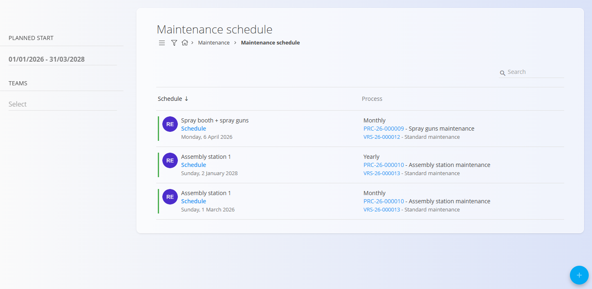

<!-- app_route: /maintenance-orders/schedule -->
<!-- app_label: Maintenance schedule -->
<!-- canonical_source_url: https://tom-pit.github.io/Connected.Docs/en/Domains/Maintenance/Documents/MaintenanceSchedule/ -->
<!-- canonical_source_title: Maintenance schedule -->

# Maintenance schedule

The **Maintenance schedule** defines how **planned maintenance orders** are generated automatically over time or usage based on a defined execution pattern.

Maintenance schedules are created as part of planned maintenance and ensure that preventive maintenance is executed regularly without manual intervention.

To access maintenance schedules, go to **Maintenance / Maintenance schedule** in the [navigation](../../../Common/UI/Navigation.md).

## Relation to maintenance orders

Maintenance schedules work in close relation with maintenance orders:

- Each schedule automatically generates **pending maintenance orders**
- Generated orders appear in:
  - [**Maintenance orders**](MaintenanceOrders.md)
  - [**Maintenance calendar**](MaintenanceCalendar.md)
- After a maintenance order is completed, the schedule continues generating the next execution according to its configuration

This ensures that preventive maintenance is continuous and does not rely on manual task creation—whether based on time or usage counts.

## List of maintenance schedules

The Maintenance Schedule page displays all existing schedules created from planned maintenance orders.

Each entry represents a **recurring maintenance definition** linked to:
- A specific piece of equipment
- A maintenance process and version
- A recurring execution pattern (time-based or count/usage-based)

Click the [action button](../../../Common/UI/ActionButton.md) to create a **new** maintenance schedule or **copy an existing** schedule.

From there, you can define the order details and choose whether the maintenance should be executed **once** or generate a **recurring maintenance schedule**.

### Information shown in the list

For each schedule, the list displays:
- **Equipment**
- **Schedule** (link to edit the schedule)
- **Next execution date** (for time-based schedules) or **Next execution count threshold** (for count-based schedules)
- **Execution pattern**
- **Process and version**

Clicking **Schedule** opens the schedule edit screen.

### Available filters

Use the filters on the left to narrow down the list:

- **Planned start** – Filter schedules by date range
- **Teams** – Filter by assigned teams

The search bar allows filtering by equipment name or process.

## Create a maintenance schedule

Click the [action button](../../../Common/UI/ActionButton.md) and choose one of the following:

- **New** – create a new maintenance schedule.
- **Copy existing** – create a new version based on an existing maintenance schedule.

### Create a new schedule

Select **New** to create a maintenance schedule from scratch.

The creation process follows the same workflow as creating a maintenance order.

For detailed instructions, see [**How to create a maintenance order**](MaintenanceOrderCreate.md).

Maintenance schedules can also be created automatically when a planned maintenance order is configured with a **recurring execution pattern**.

Supported recurring execution patterns include:

- **Time-based** patterns (e.g., monthly, yearly, every X days)
- **Count/usage-based** patterns (e.g., every X pieces, meters, grams, hours), using the relevant equipment counters and measure units

> [!NOTE]
> For configuring usage counters on resources and equipment, see **[Resource work hours & counters](ResourceWorkHours&Counters.md)**.

### Copy an existing schedule

Select **Copy existing** to create a new version of an existing maintenance schedule.

When a schedule is copied:

- The configuration of the existing schedule is copied to the new version.
- The **author**, **validity**, and **version** are updated for the new schedule.
- The previous schedule is automatically deactivated.

This allows changes to a maintenance schedule while preserving the history of previous versions, for example when reviewing how maintenance was scheduled for a specific piece of equipment over time.

Once created, the active schedule generates future maintenance orders according to its defined interval or usage threshold.

## Edit a maintenance schedule

To edit a maintenance schedule, click on **Schedule** under an entry in the Maintenance Schedule list.

This opens the **Maintenance schedule – Edit** screen, where you can modify how and when maintenance orders are generated.

### Schedule an interval

The **Schedule interval** section defines the recurrence logic for the maintenance schedule.

Here you can configure:
- The **start date** of the schedule
- The **execution pattern** (for example monthly, yearly, interval-based, or count/usage-based)
- Whether the schedule is **active**

The available fields and options change dynamically depending on the selected execution pattern.

### Maintenance order generation

When a maintenance order generated from the schedule is completed, the next maintenance order is created automatically.

The planned execution date of the new order is determined by the interval and execution pattern configured in the schedule. This allows upcoming maintenance orders to be available in advance for planning and resource assignment.

The current order is displayed under **Active maintenance orders**. Completed orders remain available under **Closed maintenance orders**.

### Working hours

The **Working hours** section defines the time window in which generated maintenance orders are planned to start and end.

This allows maintenance activities to align with operational or shift-based constraints.

### Execution range

The **Execution range** controls how long the schedule remains valid, such as:
- Running indefinitely
- Ending after a defined number of executions
- Ending on a specific date

### Related maintenance orders

At the bottom of the screen, the schedule shows:
- **Active maintenance orders** generated by this schedule
- **Closed maintenance orders**, representing completed executions

This provides traceability between the schedule and all maintenance orders created from it.

Click **Save** to apply changes to the schedule.

> [!NOTE]
> Changes to a maintenance schedule affect **future maintenance orders only**.  
> Maintenance orders that have already been created are not modified.