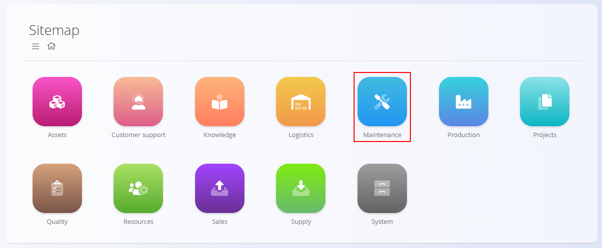
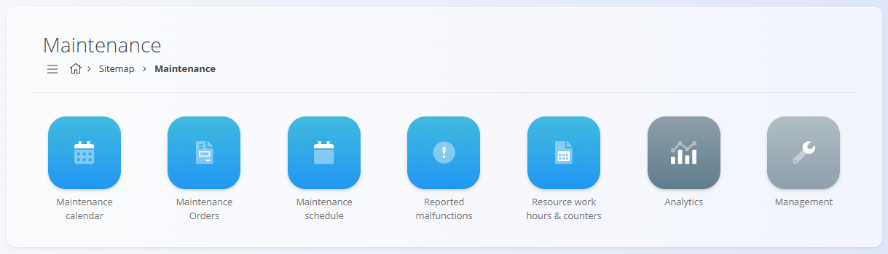

<!-- app_route: /sitemap/maintenance -->
<!-- app_label: Maintenance -->
<!-- canonical_source_url: https://github.com/Tom-PIT/Connected.Docs/blob/main/en/Domains/Maintenance/MaintenanceDomain.md -->
<!-- canonical_source_title: Maintenance -->

# Maintenance

The **Maintenance** domain provides a dedicated workspace to plan, execute, and analyze equipment maintenance. It centralizes how maintenance processes are defined, how orders are created and carried out, and how performance is measured for continuous improvement.

Use this domain to:
- Plan preventive maintenance and schedule recurring work
- Execute curative maintenance for reported malfunctions
- Track operations, resources, inputs, and checklists during maintenance
- Review indicators to assess reliability and responsiveness

To access the Maintenance domain, navigate to **Maintenance** in the [navigation](../../Common/UI/Navigation.md).

> [!NOTE]
> The available domains depend on each company’s configuration and business model.

## What is included in the Maintenance domain?

The domain is structured into functional areas for daily work and analysis:

- **Documents** – Create and manage maintenance activities and their lifecycle
  - **[Maintenance orders](Documents/MaintenanceOrders.md)** — Define and execute planned or curative maintenance based on a selected maintenance process and version. Supports operations, resources, inputs, and quality checks.
  - **[Maintenance schedule](Documents/MaintenanceSchedule.md)** — Configure recurring execution patterns (time- or counter-based) that automatically generate maintenance orders.
  - **[Reported malfunctions](Documents/ReportedMalfunctions.md)** — Capture equipment issues from the field; curative maintenance orders are created from reported malfunctions.
  - **[Maintenance calendar](Documents/MaintenanceCalendar.md)** — Calendar view of planned and active maintenance, with filters by organization unit, resource, and order status.
  - **[Resource work hours & counters](Documents/ResourceWorkHours&Counters.md)** — Configure working hours windows and usage counters (e.g., pieces, meters, grams, hours) used by schedules and count-based maintenance.

> [!TIP]
> See [**How to create a maintenance order**](Documents/MaintenanceOrderCreate.md) for a step-by-step guide of the creation of these documents.

## Management

Configure shared structures used by maintenance. The Maintenance domain leverages common code lists that are shared with [**Production**](../Production/README.md).

- **[Processes](../Production/Management/Processes.md)** — Define process steps and versions used to execute maintenance operations.
- **[Organization units](../Production/Management/OrganizationUnits.md)** — Define operational units (e.g., maintenance departments, service teams).
- **[Resources](../Resources/Management/Resources.md)** — Manage human and non-human resources (technicians, tools, equipment).
- **[Checklists](../Quality/Management/Checklists.md)** — Create and categorize checklists used during maintenance operations.

Use these code lists to drive maintenance workflows and execution across orders and schedules.

> [!TIP]
> See all management entries in the **[Management Index](../../ManagementIndex.md)**.

## Analytics

Monitor performance and reliability using built-in analytics.

- **[Maintenance KPIs](Analytics/MaintenanceKPIs.md)** — KPI cards and detailed lists for MTBF, detection time, repair time, effort, and workload breakdown.

## Lifecycle and execution

- Status flow: **Pending → Active → Closed**
- Execution: Operators execute operations per the selected process.
- Traceability: Effort, inputs, non-human resources, and checklists are recorded.
- Triggers: Reported malfunctions initiate curative work; schedules generate planned orders automatically.

> [!NOTE]
> Detailed chapters for each page (orders, schedule, malfunctions, calendar, indicators) are available and provide step-by-step guidance. This page serves as the domain overview.
