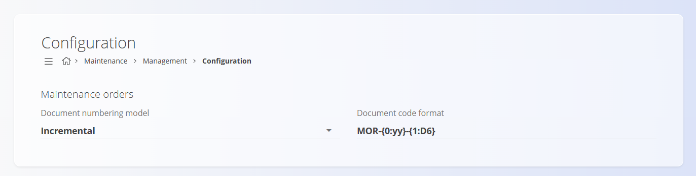

<!-- app_route: /management/maintenance/configuration -->
<!-- app_label: Maintenance configuration -->
<!-- canonical_source_url: https://tom-pit.github.io/Connected.Docs/en/Domains/Maintenance/Management/MaintenanceConfiguration/ -->
<!-- canonical_source_title: Maintenance configuration -->

# Maintenance configuration

Configure **Maintenance** settings affecting document numbering. Any changes are saved automatically.

To access this page, go to **Maintenance / Management / Configuration** in the [navigation](../../../Common/UI/Navigation.md).

## Document numbering settings

Choose the numbering model and format for maintenance order documents.

| Field | Description |
|-------|-------------|
| **Document numbering model** | • **Incremental for each year:** sequence resets annually.   • **Incremental:** a global sequence that never resets.  |
| **Document code format** | Pattern defining structure (e.g., PREFIX‑YEAR-NUMBER). |